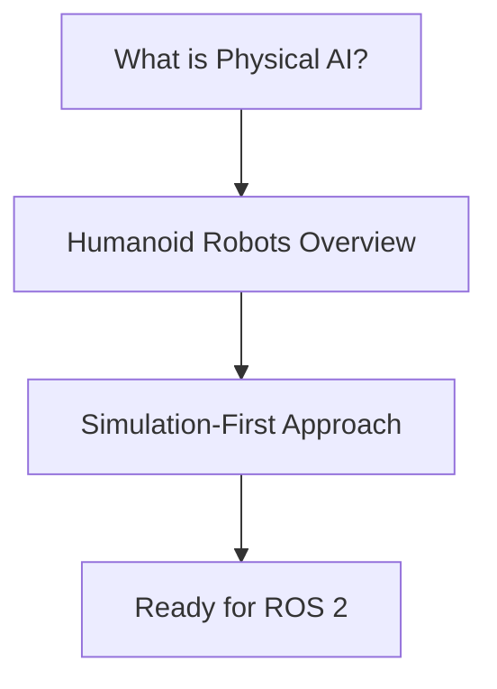

# Chapter 1: Introduction to Physical AI

Welcome to the world of Physical AI and humanoid robotics. This chapter establishes the foundational concepts you'll build upon throughout the book.

## Learning Objectives

By the end of this chapter, you will:

- Understand what Physical AI is and how it differs from traditional AI
- Know the landscape of humanoid robotics and major platforms
- Appreciate why simulation-first development is essential
- Have a clear roadmap for the rest of the book

## Chapter Roadmap

| Section | Topic | Key Takeaway |
|---------|-------|--------------|
| 1.1 | [What is Physical AI?](./what-is-physical-ai) | Physical AI = AI + embodiment + real-world interaction |
| 1.2 | [Humanoid Robots Overview](./humanoid-robots-overview) | The current state and challenges of humanoid robotics |
| 1.3 | [Simulation-First Approach](./simulation-first-approach) | Why we develop in simulation before hardware |

## Prerequisites

**None** - this is the entry point to the book. Basic programming knowledge in Python is helpful but not required for this conceptual chapter.

## Estimated Reading Time

**30-45 minutes** for thorough reading and reflection.

## What's Next?

After completing this chapter, you'll move to [Chapter 2: ROS 2 Fundamentals](/docs/chapter-2-ros2) where we dive into the practical tools for building robot software.
