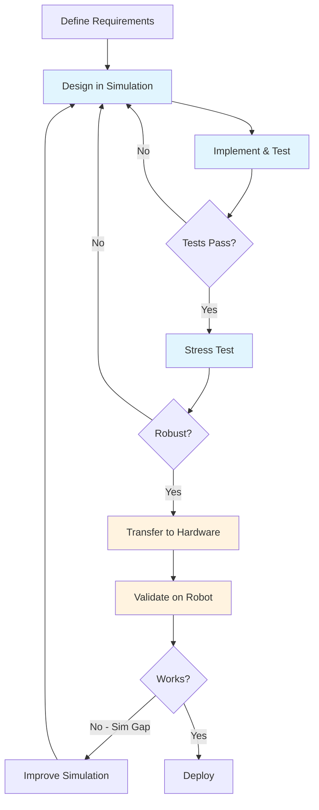

# Simulation-First Approach

The simulation-first approach is a development methodology where robot software is primarily developed, tested, and validated in simulation before deployment to physical hardware. This chapter explains why this approach is essential for humanoid robotics.

## What is Simulation-First Development?

**Simulation-first development** means:

1. **Design** robot behaviors in simulation
2. **Implement** control algorithms against simulated sensors/actuators
3. **Test** extensively in varied simulated conditions
4. **Validate** safety properties before any hardware contact
5. **Transfer** only proven code to physical robots

This contrasts with **hardware-first** approaches where code is developed directly on robots—a dangerous and expensive practice for complex systems like humanoids.

## Benefits of Simulation-First

### 1. Safety

Physical robots can cause harm:
- A falling humanoid can injure people or itself
- Uncontrolled motions can damage expensive hardware
- Real-world testing has irreversible consequences

In simulation:
- Crashes have no physical consequence
- You can test dangerous edge cases freely
- Reset to known states instantly

### 2. Cost Reduction

Hardware development is expensive:

| Cost Factor | Hardware-First | Simulation-First |
|-------------|----------------|------------------|
| Robot damage | $10,000s per incident | $0 |
| Development cycles | Limited by repair time | Unlimited parallel runs |
| Environment setup | Physical construction | Digital assets |
| Iteration speed | Hours to days | Seconds to minutes |

### 3. Iteration Speed

Simulation enables rapid experimentation:
- Run thousands of trials overnight
- Test rare conditions on demand
- Parallelize across compute clusters
- Headless simulation faster than real-time

### 4. Reproducibility

Physical testing suffers from variability:
- Battery levels change
- Wear affects joint friction
- Environmental conditions vary
- Sensor calibration drifts

Simulation provides:
- Exact state resets
- Deterministic replay (when needed)
- Consistent testing conditions
- Version-controlled environments

### 5. Data Generation

Modern AI requires large datasets:
- Synthetic data for perception training
- Diverse scenarios for policy learning
- Labeled ground truth automatically
- Domain randomization for robustness

## Simulation Tools Overview

This book covers three major simulation platforms:

### Gazebo Sim (Ignition)

**Best for**: ROS 2 integration, physics accuracy

- Open source, industry standard
- Tight ROS 2 integration
- Multiple physics engines (DART, Bullet, ODE)
- Sensor simulation (cameras, LiDAR, IMU)
- Plugin architecture for customization

*Covered in [Chapter 3: Simulation](/docs/chapter-3-simulation)*

### Unity with ROS-TCP-Connector

**Best for**: Visual fidelity, HRI scenarios

- High-quality rendering
- Large asset ecosystem
- Strong VR/AR support
- ROS integration via TCP bridge
- Good for perception training data

*Covered in [Chapter 3: Simulation](/docs/chapter-3-simulation)*

### NVIDIA Isaac Sim

**Best for**: AI training, synthetic data

- Photorealistic rendering (RTX)
- GPU-accelerated physics (PhysX)
- Built-in domain randomization
- Integration with Isaac SDK
- Omniverse ecosystem

*Covered in [Chapter 4: NVIDIA Isaac](/docs/chapter-4-isaac)*

## The Simulation-First Development Cycle

### Phase 1: Simulation Development (Blue)

Most time is spent here:
- Algorithm development
- Parameter tuning
- Edge case testing
- Performance optimization

### Phase 2: Hardware Validation (Orange)

Minimal time, maximum caution:
- Careful initial tests
- Gradual capability expansion
- Reality gap identification
- Feedback to improve simulation

## Sim-to-Real Transfer

The **reality gap** is the difference between simulation and the real world. Key techniques to bridge it:

### Domain Randomization

Vary simulation parameters during training:
- Physics properties (friction, mass, damping)
- Sensor noise levels
- Visual appearance (lighting, textures)
- Environmental conditions

This creates policies robust to real-world variation.

### System Identification

Measure real robot properties and match in simulation:
- Joint friction curves
- Actuator dynamics
- Sensor characteristics
- Latency profiles

### Progressive Transfer

Gradually move from simulation to reality:
1. Pure simulation training
2. Simulated perturbations
3. Hardware-in-the-loop
4. Supervised real-world
5. Autonomous deployment

## When Simulation is Sufficient vs Hardware Needed

### Simulation Sufficient

- Algorithm prototyping
- Parameter tuning
- Failure mode analysis
- Perception model training
- Most software development

### Hardware Required

- Final system validation
- Real sensor calibration
- Human interaction studies
- Deployment qualification
- Edge cases simulation can't capture

:::tip Rule of Thumb
If you're debugging **logic**, use simulation. If you're debugging **physics** or **sensors**, you may need hardware.
:::

## Summary

The simulation-first approach is essential for humanoid robotics because:

1. **Safety**: Test dangerous scenarios without risk
2. **Speed**: Iterate faster than real-time
3. **Cost**: Avoid expensive hardware damage
4. **Scale**: Generate massive training datasets
5. **Reproducibility**: Consistent, version-controlled testing

Throughout this book, we'll develop all capabilities in simulation before considering hardware deployment.

## What's Next?

Now that you understand the foundations, it's time to get practical. [Chapter 2: ROS 2 Fundamentals](/docs/chapter-2-ros2) introduces the Robot Operating System 2—the middleware that ties our entire system together.
