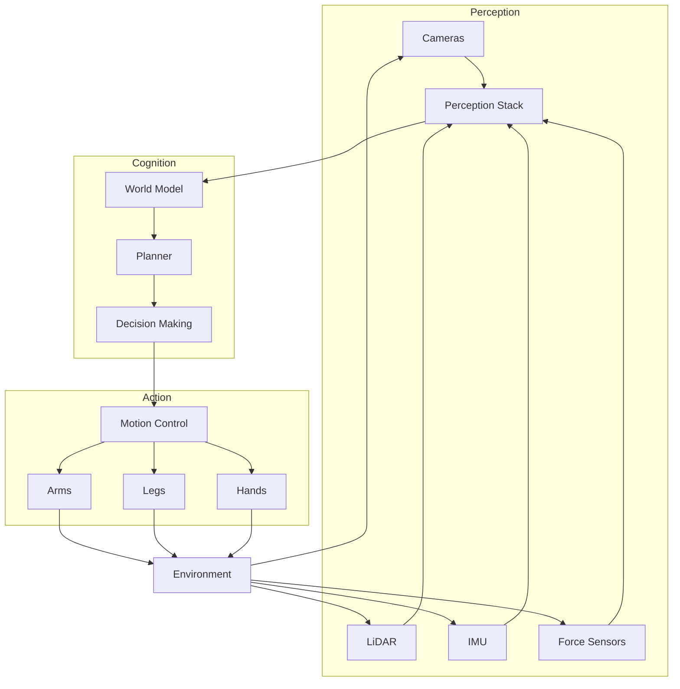

# What is Physical AI?

Physical AI represents a paradigm shift in artificial intelligence—moving from systems that process information in isolation to systems that interact with and learn from the physical world.

## Defining Physical AI

**Physical AI** is artificial intelligence designed to perceive, reason about, and act within the physical world through an embodied agent (robot). Unlike traditional AI that operates purely in the digital realm, Physical AI must:

- Process real-world sensor data (cameras, LiDAR, IMUs, force sensors)
- Make decisions under uncertainty and time constraints
- Execute actions that have real physical consequences
- Learn from physical interactions and adapt

## Embodied Intelligence

**Embodied intelligence** is the concept that true intelligence emerges from the interaction between an agent's body and its environment. Key principles:

1. **Morphological computation**: The body itself performs computation (a ball rolls without a computer)
2. **Sensorimotor coupling**: Perception and action are tightly linked
3. **Environmental scaffolding**: Intelligence is distributed between agent and environment
4. **Developmental learning**: Skills emerge through physical exploration

## Digital AI vs Physical AI

| Aspect | Digital AI | Physical AI |
|--------|-----------|-------------|
| **Environment** | Structured data, APIs | Unstructured physical world |
| **Time** | Can pause, retry | Real-time constraints |
| **Consequences** | Reversible | Often irreversible |
| **Uncertainty** | Known distributions | Sensor noise, partial observability |
| **Latency** | Milliseconds acceptable | Microseconds for control |
| **Safety** | Software bugs | Physical damage, injury |
| **Learning** | Large datasets | Limited physical trials |

## Why Robots Need Different AI Than Chatbots

A language model can generate text character by character. A robot arm can't move joint by joint with the same luxury of time and reversibility.

**Key differences:**

1. **Continuous control**: Robots output smooth trajectories, not discrete tokens
2. **Multi-modal fusion**: Combining vision, proprioception, touch, sound
3. **Closed-loop feedback**: Actions affect observations in real-time
4. **Physical constraints**: Torque limits, collision avoidance, balance
5. **Safety criticality**: Wrong output = potential physical harm

## Key Components of Physical AI Systems

### 1. Perception Stack
Transforms raw sensor data into meaningful representations:
- Object detection and tracking
- Pose estimation
- Scene understanding
- State estimation

### 2. World Model
Maintains an internal representation of the environment:
- Spatial mapping
- Object relationships
- Physics predictions
- Belief state over uncertainties

### 3. Planning & Decision Making
Converts goals into action sequences:
- Task planning (what to do)
- Motion planning (how to move)
- Reactive policies (immediate responses)

### 4. Motor Control
Executes planned motions on hardware:
- Trajectory following
- Balance control
- Compliance and force control
- Fault detection

## Summary

Physical AI is fundamentally different from digital AI because it must:
- Operate in continuous time with real consequences
- Handle uncertainty from sensors and environment
- Maintain safety while achieving goals
- Learn efficiently with limited physical trials

In the next section, we'll explore the specific challenges of applying Physical AI to humanoid robots.
