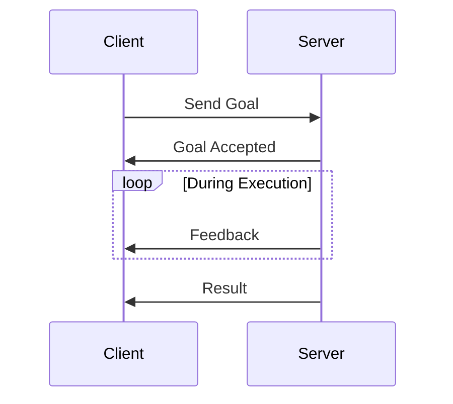
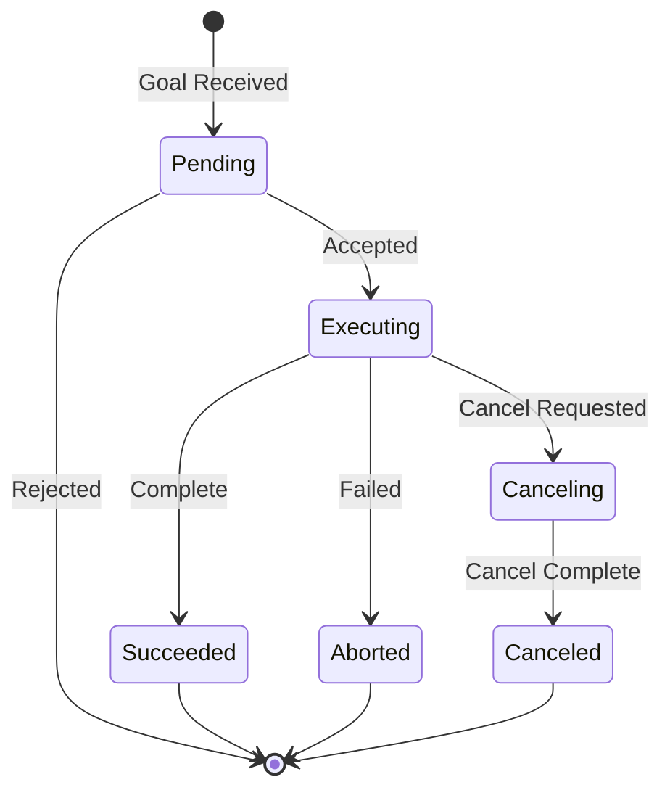

# Actions and rclpy

Actions are the ROS 2 pattern for long-running tasks that provide feedback during execution. This section covers action implementation and deeper rclpy patterns.

## Actions: Long-Running Tasks

**Actions** combine the best of topics and services:

- **Goal**: What the action should achieve (like a service request)
- **Feedback**: Progress updates during execution (like topic streaming)
- **Result**: Final outcome when complete (like a service response)
- **Cancelable**: Can be preempted by the client



### When to Use Actions

| Pattern | Duration | Feedback | Cancelable | Example |
|---------|----------|----------|------------|---------|
| Service | Instant | No | No | Get parameter |
| Topic | Continuous | N/A | N/A | Sensor stream |
| Action | Extended | Yes | Yes | Navigate to goal |

Actions are ideal for:
- Navigation goals
- Arm motion planning
- Speech recognition
- Any task that takes > 1 second

## Action State Machine



## Action Server Implementation

```python
#!/usr/bin/env python3
"""ROS 2 Action Server example - Fibonacci sequence."""

import time
import rclpy
from rclpy.action import ActionServer
from rclpy.node import Node
from example_interfaces.action import Fibonacci


class FibonacciActionServer(Node):
    """Action server that computes Fibonacci sequence."""

    def __init__(self):
        super().__init__('fibonacci_action_server')
        self._action_server = ActionServer(
            self,
            Fibonacci,
            'fibonacci',
            self.execute_callback)
        self.get_logger().info('Fibonacci action server ready')

    def execute_callback(self, goal_handle):
        self.get_logger().info('Executing goal...')

        feedback_msg = Fibonacci.Feedback()
        feedback_msg.partial_sequence = [0, 1]

        for i in range(1, goal_handle.request.order):
            # Check for cancellation
            if goal_handle.is_cancel_requested:
                goal_handle.canceled()
                self.get_logger().info('Goal canceled')
                return Fibonacci.Result()

            # Compute next number
            feedback_msg.partial_sequence.append(
                feedback_msg.partial_sequence[i] +
                feedback_msg.partial_sequence[i - 1])

            # Publish feedback
            self.get_logger().info(
                f'Feedback: {feedback_msg.partial_sequence}')
            goal_handle.publish_feedback(feedback_msg)

            # Simulate work
            time.sleep(0.5)

        goal_handle.succeed()
        result = Fibonacci.Result()
        result.sequence = feedback_msg.partial_sequence
        self.get_logger().info(f'Result: {result.sequence}')
        return result


def main(args=None):
    rclpy.init(args=args)
    node = FibonacciActionServer()
    rclpy.spin(node)
    node.destroy_node()
    rclpy.shutdown()


if __name__ == '__main__':
    main()
```

Expected output:
```
[INFO] [fibonacci_action_server]: Fibonacci action server ready
[INFO] [fibonacci_action_server]: Executing goal...
[INFO] [fibonacci_action_server]: Feedback: [0, 1, 1]
[INFO] [fibonacci_action_server]: Feedback: [0, 1, 1, 2]
[INFO] [fibonacci_action_server]: Feedback: [0, 1, 1, 2, 3]
[INFO] [fibonacci_action_server]: Result: [0, 1, 1, 2, 3, 5]
```

## Action Client Implementation

```python
#!/usr/bin/env python3
"""ROS 2 Action Client example - Fibonacci sequence."""

import rclpy
from rclpy.action import ActionClient
from rclpy.node import Node
from example_interfaces.action import Fibonacci


class FibonacciActionClient(Node):
    """Action client that requests Fibonacci sequence."""

    def __init__(self):
        super().__init__('fibonacci_action_client')
        self._action_client = ActionClient(
            self, Fibonacci, 'fibonacci')

    def send_goal(self, order):
        goal_msg = Fibonacci.Goal()
        goal_msg.order = order

        self.get_logger().info(f'Sending goal: order={order}')

        self._action_client.wait_for_server()

        self._send_goal_future = self._action_client.send_goal_async(
            goal_msg,
            feedback_callback=self.feedback_callback)

        self._send_goal_future.add_done_callback(
            self.goal_response_callback)

    def goal_response_callback(self, future):
        goal_handle = future.result()
        if not goal_handle.accepted:
            self.get_logger().info('Goal rejected')
            return

        self.get_logger().info('Goal accepted')
        self._get_result_future = goal_handle.get_result_async()
        self._get_result_future.add_done_callback(
            self.get_result_callback)

    def feedback_callback(self, feedback_msg):
        sequence = feedback_msg.feedback.partial_sequence
        self.get_logger().info(f'Received feedback: {sequence}')

    def get_result_callback(self, future):
        result = future.result().result
        self.get_logger().info(f'Result: {result.sequence}')
        rclpy.shutdown()


def main(args=None):
    rclpy.init(args=args)
    client = FibonacciActionClient()
    client.send_goal(5)
    rclpy.spin(client)


if __name__ == '__main__':
    main()
```

Expected output:
```
[INFO] [fibonacci_action_client]: Sending goal: order=5
[INFO] [fibonacci_action_client]: Goal accepted
[INFO] [fibonacci_action_client]: Received feedback: [0, 1, 1]
[INFO] [fibonacci_action_client]: Received feedback: [0, 1, 1, 2]
[INFO] [fibonacci_action_client]: Received feedback: [0, 1, 1, 2, 3]
[INFO] [fibonacci_action_client]: Received feedback: [0, 1, 1, 2, 3, 5]
[INFO] [fibonacci_action_client]: Result: [0, 1, 1, 2, 3, 5]
```

## rclpy API Overview

### Core Classes

| Class | Purpose |
|-------|---------|
| `rclpy.node.Node` | Base class for all nodes |
| `rclpy.publisher.Publisher` | Publish messages |
| `rclpy.subscription.Subscription` | Subscribe to topics |
| `rclpy.service.Service` | Service server |
| `rclpy.client.Client` | Service client |
| `rclpy.action.ActionServer` | Action server |
| `rclpy.action.ActionClient` | Action client |

### Executors and Callbacks

**Executors** process callbacks (timers, subscriptions, services):

```python
# Single-threaded executor (default)
rclpy.spin(node)

# Multi-threaded executor
from rclpy.executors import MultiThreadedExecutor
executor = MultiThreadedExecutor()
executor.add_node(node1)
executor.add_node(node2)
executor.spin()
```

### Multi-Node Example with Timer

```python
#!/usr/bin/env python3
"""Example showing multiple callbacks and timer."""

import rclpy
from rclpy.node import Node
from std_msgs.msg import String, Int32


class MultiCallbackNode(Node):
    """Node demonstrating multiple callbacks."""

    def __init__(self):
        super().__init__('multi_callback_node')

        # Publisher
        self.publisher_ = self.create_publisher(String, 'output', 10)

        # Two subscribers
        self.sub1 = self.create_subscription(
            String, 'input1', self.input1_callback, 10)
        self.sub2 = self.create_subscription(
            Int32, 'input2', self.input2_callback, 10)

        # Timer for periodic work
        self.timer = self.create_timer(1.0, self.timer_callback)

        # State
        self.last_string = ''
        self.last_int = 0
        self.count = 0

        self.get_logger().info('Node started')

    def input1_callback(self, msg):
        self.last_string = msg.data
        self.get_logger().info(f'Input1: {msg.data}')

    def input2_callback(self, msg):
        self.last_int = msg.data
        self.get_logger().info(f'Input2: {msg.data}')

    def timer_callback(self):
        self.count += 1
        msg = String()
        msg.data = f'Count={self.count}, String={self.last_string}, Int={self.last_int}'
        self.publisher_.publish(msg)
        self.get_logger().info(f'Published: {msg.data}')


def main(args=None):
    rclpy.init(args=args)
    node = MultiCallbackNode()
    rclpy.spin(node)
    node.destroy_node()
    rclpy.shutdown()


if __name__ == '__main__':
    main()
```

## Best Practices for Node Design

### 1. Single Responsibility
Each node should do one thing well:
```python
# Good: Separate nodes
class CameraDriver(Node): ...
class ImageProcessor(Node): ...
class ObjectDetector(Node): ...

# Avoid: Monolithic node
class DoEverything(Node): ...  # Don't do this
```

### 2. Use Parameters for Configuration
```python
class ConfigurableNode(Node):
    def __init__(self):
        super().__init__('configurable_node')
        self.declare_parameter('rate', 10.0)
        rate = self.get_parameter('rate').value
        self.timer = self.create_timer(1.0/rate, self.callback)
```

### 3. Clean Shutdown
```python
def main(args=None):
    rclpy.init(args=args)
    node = MyNode()
    try:
        rclpy.spin(node)
    except KeyboardInterrupt:
        pass
    finally:
        node.destroy_node()
        rclpy.shutdown()
```

### 4. Use Logging Appropriately
```python
self.get_logger().debug('Detailed debug info')
self.get_logger().info('Normal operation')
self.get_logger().warn('Something unexpected')
self.get_logger().error('Something failed')
self.get_logger().fatal('Unrecoverable error')
```

## Summary

You've learned:
- **Actions**: Long-running tasks with feedback and cancellation
- **rclpy patterns**: Executors, callbacks, timers
- **Best practices**: Single responsibility, parameters, clean shutdown

In the next section, we'll define robot geometry using **URDF** and visualize it in RViz2.
