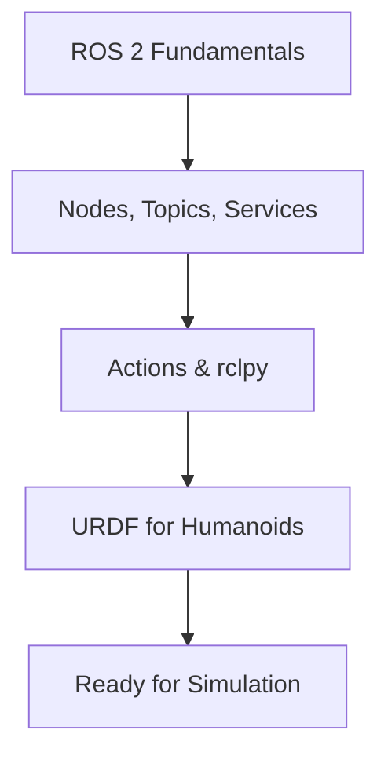

# Chapter 2: The Robotic Nervous System (ROS 2)

If Physical AI is the brain of a humanoid robot, then **ROS 2** (Robot Operating System 2) is its nervous system—the communication infrastructure that connects sensors, processors, and actuators into a coordinated whole.

## Learning Objectives

By the end of this chapter, you will be able to:

- Understand ROS 2 architecture and the DDS middleware
- Create nodes that communicate via topics, services, and actions
- Write Python code using the rclpy API
- Define robot geometry using URDF
- Visualize your robot in RViz2

## Why "Robotic Nervous System"?

Just as the human nervous system:
- **Carries signals** between brain and body parts
- **Enables coordination** of complex movements
- **Processes sensory input** in real-time
- **Supports reflexes** alongside deliberate action

ROS 2:
- **Routes messages** between software components
- **Enables distributed computing** across multiple processes
- **Processes sensor data** with predictable latency
- **Supports reactive behaviors** alongside planning

## Prerequisites

:::caution Required Setup
Before starting this chapter, ensure you have:

- [x] Completed [Chapter 1: Introduction to Physical AI](/docs/chapter-1-introduction)
- [x] Basic Python 3 programming skills
- [x] Ubuntu 22.04 (recommended) or compatible OS
- [x] ROS 2 Humble installed ([installation guide](https://docs.ros.org/en/humble/Installation.html))
:::

## Environment Setup Checklist

Verify your ROS 2 installation before proceeding:

```bash
# Source ROS 2 setup
source /opt/ros/humble/setup.bash

# Verify installation
ros2 --version

# Check system health
ros2 doctor --report
```

Expected output for `ros2 --version`:
```
ros2 0.9.x
```

## Chapter Roadmap



| Section | Topic | You'll Build |
|---------|-------|--------------|
| 2.1 | [ROS 2 Fundamentals](./ros2-fundamentals) | Understanding the architecture |
| 2.2 | [Nodes, Topics, Services](./nodes-topics-services) | Publisher, subscriber, service nodes |
| 2.3 | [Actions & rclpy](./actions-and-rclpy) | Action server with feedback |
| 2.4 | [URDF for Humanoids](./urdf-humanoids) | Simple humanoid robot model |

## What's Next?

After completing this chapter, you'll have a working humanoid robot description and the ROS 2 skills to control it. [Chapter 3: Simulation](/docs/chapter-3-simulation) will bring your robot to life in Gazebo and Unity.
