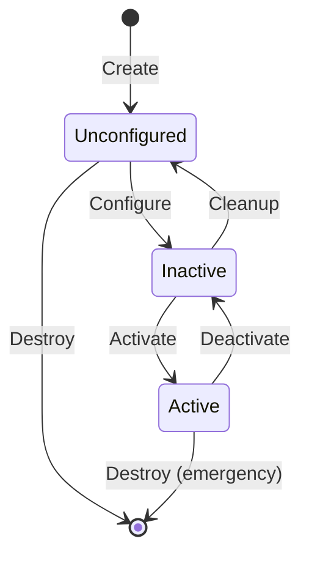
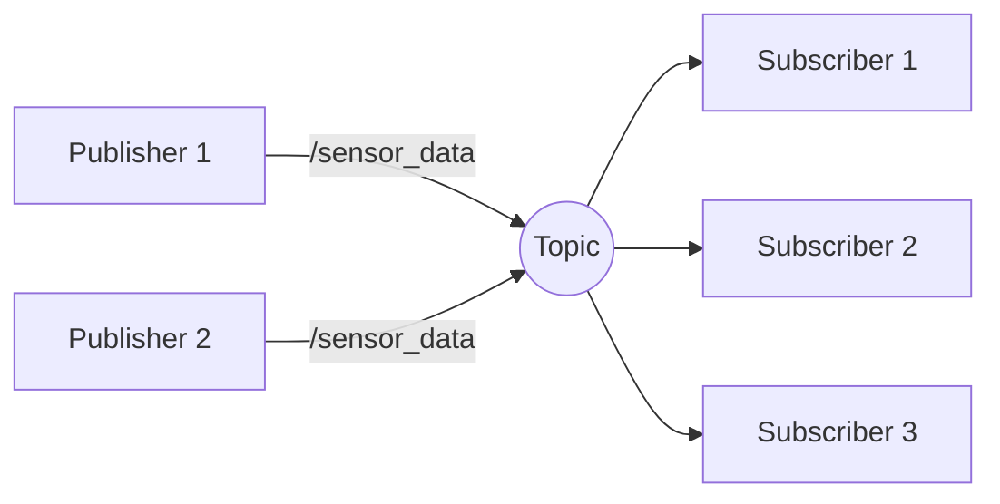
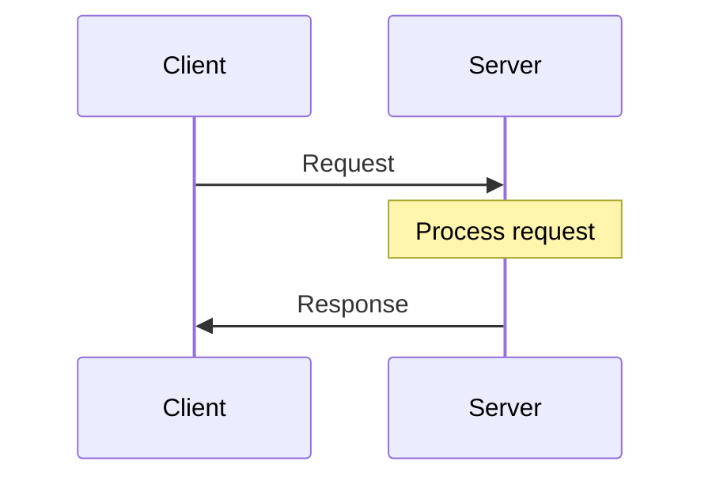

# Nodes, Topics, and Services

This section covers the three fundamental communication patterns in ROS 2. You'll write actual Python code using rclpy to create publishers, subscribers, and services.

## Nodes

A **node** is an executable that uses ROS 2 to communicate with other nodes. Each node should have a single, well-defined purpose.

### Node Lifecycle



For simple nodes, you'll typically use standard nodes that start directly in an "active" state. Lifecycle nodes (managed nodes) provide finer control for production systems.

## Topics: Publish/Subscribe Pattern

**Topics** implement a publish/subscribe pattern for streaming data:

- **Publishers** send messages to a named topic
- **Subscribers** receive messages from a named topic
- **Many-to-many**: Multiple publishers and subscribers per topic
- **Asynchronous**: Publishers don't wait for subscribers



### Minimal Publisher Node

```python
#!/usr/bin/env python3
"""Minimal ROS 2 publisher example."""

import rclpy
from rclpy.node import Node
from std_msgs.msg import String


class MinimalPublisher(Node):
    """A simple publisher node that sends messages every 0.5 seconds."""

    def __init__(self):
        super().__init__('minimal_publisher')
        self.publisher_ = self.create_publisher(String, 'topic', 10)
        timer_period = 0.5  # seconds
        self.timer = self.create_timer(timer_period, self.timer_callback)
        self.i = 0

    def timer_callback(self):
        msg = String()
        msg.data = f'Hello World: {self.i}'
        self.publisher_.publish(msg)
        self.get_logger().info(f'Publishing: "{msg.data}"')
        self.i += 1


def main(args=None):
    rclpy.init(args=args)
    node = MinimalPublisher()
    rclpy.spin(node)
    node.destroy_node()
    rclpy.shutdown()


if __name__ == '__main__':
    main()
```

Expected output:
```
[INFO] [minimal_publisher]: Publishing: "Hello World: 0"
[INFO] [minimal_publisher]: Publishing: "Hello World: 1"
[INFO] [minimal_publisher]: Publishing: "Hello World: 2"
...
```

### Minimal Subscriber Node

```python
#!/usr/bin/env python3
"""Minimal ROS 2 subscriber example."""

import rclpy
from rclpy.node import Node
from std_msgs.msg import String


class MinimalSubscriber(Node):
    """A simple subscriber node that prints received messages."""

    def __init__(self):
        super().__init__('minimal_subscriber')
        self.subscription = self.create_subscription(
            String,
            'topic',
            self.listener_callback,
            10)
        self.subscription  # prevent unused variable warning

    def listener_callback(self, msg):
        self.get_logger().info(f'I heard: "{msg.data}"')


def main(args=None):
    rclpy.init(args=args)
    node = MinimalSubscriber()
    rclpy.spin(node)
    node.destroy_node()
    rclpy.shutdown()


if __name__ == '__main__':
    main()
```

Expected output (when publisher is running):
```
[INFO] [minimal_subscriber]: I heard: "Hello World: 0"
[INFO] [minimal_subscriber]: I heard: "Hello World: 1"
[INFO] [minimal_subscriber]: I heard: "Hello World: 2"
...
```

### Topic CLI Commands

```bash
# List all active topics
ros2 topic list
```
Expected output:
```
/parameter_events
/rosout
/topic
```

```bash
# Show topic info
ros2 topic info /topic
```
Expected output:
```
Type: std_msgs/msg/String
Publisher count: 1
Subscription count: 1
```

```bash
# Echo messages on a topic
ros2 topic echo /topic
```
Expected output:
```
data: 'Hello World: 42'
---
data: 'Hello World: 43'
---
```

```bash
# Publish from command line
ros2 topic pub /topic std_msgs/msg/String "{data: 'CLI message'}"
```

## Services: Request/Response Pattern

**Services** implement a synchronous request/response pattern:

- **Server** provides a named service
- **Client** calls the service and waits for response
- **One server**: Only one server per service name
- **Synchronous**: Client blocks until response



### Service Server

```python
#!/usr/bin/env python3
"""Simple ROS 2 service server."""

import rclpy
from rclpy.node import Node
from example_interfaces.srv import AddTwoInts


class AddTwoIntsServer(Node):
    """Service server that adds two integers."""

    def __init__(self):
        super().__init__('add_two_ints_server')
        self.srv = self.create_service(
            AddTwoInts,
            'add_two_ints',
            self.add_two_ints_callback)
        self.get_logger().info('Service ready: add_two_ints')

    def add_two_ints_callback(self, request, response):
        response.sum = request.a + request.b
        self.get_logger().info(
            f'Request: {request.a} + {request.b} = {response.sum}')
        return response


def main(args=None):
    rclpy.init(args=args)
    node = AddTwoIntsServer()
    rclpy.spin(node)
    node.destroy_node()
    rclpy.shutdown()


if __name__ == '__main__':
    main()
```

Expected output:
```
[INFO] [add_two_ints_server]: Service ready: add_two_ints
[INFO] [add_two_ints_server]: Request: 3 + 5 = 8
```

### Service Client

```python
#!/usr/bin/env python3
"""Simple ROS 2 service client."""

import rclpy
from rclpy.node import Node
from example_interfaces.srv import AddTwoInts


class AddTwoIntsClient(Node):
    """Service client that requests addition of two integers."""

    def __init__(self):
        super().__init__('add_two_ints_client')
        self.cli = self.create_client(AddTwoInts, 'add_two_ints')
        while not self.cli.wait_for_service(timeout_sec=1.0):
            self.get_logger().info('Waiting for service...')
        self.req = AddTwoInts.Request()

    def send_request(self, a, b):
        self.req.a = a
        self.req.b = b
        self.future = self.cli.call_async(self.req)
        return self.future


def main(args=None):
    rclpy.init(args=args)
    client = AddTwoIntsClient()
    future = client.send_request(3, 5)
    rclpy.spin_until_future_complete(client, future)
    result = future.result()
    client.get_logger().info(f'Result: {result.sum}')
    client.destroy_node()
    rclpy.shutdown()


if __name__ == '__main__':
    main()
```

Expected output:
```
[INFO] [add_two_ints_client]: Result: 8
```

### Service CLI Commands

```bash
# List all services
ros2 service list
```
Expected output:
```
/add_two_ints
/add_two_ints_server/describe_parameters
...
```

```bash
# Show service type
ros2 service type /add_two_ints
```
Expected output:
```
example_interfaces/srv/AddTwoInts
```

```bash
# Call service from CLI
ros2 service call /add_two_ints example_interfaces/srv/AddTwoInts "{a: 10, b: 20}"
```
Expected output:
```
requester: making request: example_interfaces.srv.AddTwoInts_Request(a=10, b=20)

response:
example_interfaces.srv.AddTwoInts_Response(sum=30)
```

## Quality of Service (QoS)

QoS policies let you configure communication reliability and behavior:

| Policy | Options | Use Case |
|--------|---------|----------|
| **Reliability** | RELIABLE, BEST_EFFORT | RELIABLE for commands, BEST_EFFORT for sensors |
| **Durability** | TRANSIENT_LOCAL, VOLATILE | TRANSIENT_LOCAL for late-joining subscribers |
| **History** | KEEP_LAST(n), KEEP_ALL | KEEP_LAST for real-time, KEEP_ALL for logging |
| **Deadline** | Duration | Alert if messages don't arrive in time |

```python
from rclpy.qos import QoSProfile, ReliabilityPolicy, HistoryPolicy

sensor_qos = QoSProfile(
    reliability=ReliabilityPolicy.BEST_EFFORT,
    history=HistoryPolicy.KEEP_LAST,
    depth=10
)

self.subscription = self.create_subscription(
    SensorMsg,
    '/sensor_data',
    self.callback,
    sensor_qos
)
```

## When to Use Topics vs Services

| Scenario | Use Topics | Use Services |
|----------|-----------|--------------|
| Streaming sensor data | ✅ | |
| Continuous state updates | ✅ | |
| One-time configuration | | ✅ |
| Trigger an action | | ✅ |
| Request data on demand | | ✅ |
| Many-to-many broadcast | ✅ | |

## Summary

You've learned the two fundamental communication patterns:

- **Topics**: Streaming, many-to-many, asynchronous
- **Services**: Request/response, one server, synchronous

Both are essential for building robot systems. In the next section, we'll learn about **Actions**—the pattern for long-running tasks with feedback.
