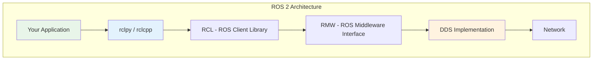

# ROS 2 Fundamentals

ROS 2 is the second generation of the Robot Operating System, redesigned from the ground up for production robotics. This section covers the core concepts you need to understand before writing code.

## What is ROS 2?

**ROS 2** is not actually an operating system—it's a **middleware framework** that provides:

- **Communication infrastructure**: Message passing between processes
- **Tools**: CLI utilities, visualization, debugging
- **Libraries**: Sensor drivers, algorithms, planning
- **Conventions**: Standard interfaces and patterns
- **Ecosystem**: Packages from the global robotics community

### Why Does ROS 2 Exist?

ROS 1 (2007-present) was groundbreaking but had limitations:

| Issue in ROS 1 | Solution in ROS 2 |
|----------------|-------------------|
| Single point of failure (roscore) | Decentralized, no master node |
| Best-effort networking only | Configurable QoS (Quality of Service) |
| Linux-only | Multi-platform (Linux, Windows, macOS) |
| Not real-time capable | Real-time support with proper configuration |
| Security as afterthought | Built-in DDS security features |
| Python 2 | Python 3 (exclusively) |

## DDS Middleware

At the heart of ROS 2 is the **Data Distribution Service (DDS)**—an industry standard for real-time publish/subscribe communication.



### Layers Explained

1. **Your Application**: Nodes you write using rclpy (Python) or rclcpp (C++)
2. **rclpy/rclcpp**: Language-specific client libraries
3. **RCL**: Core C library that all client libraries use
4. **RMW**: Abstraction layer allowing different DDS implementations
5. **DDS**: The actual middleware (CycloneDDS, FastDDS, etc.)

### Why DDS?

DDS provides capabilities essential for robotics:

- **Discovery**: Nodes find each other automatically
- **QoS policies**: Reliability, durability, deadline guarantees
- **Scalability**: Works from embedded to data center
- **Standards-based**: RTPS protocol, interoperable implementations

## ROS 2 vs ROS 1 Comparison

| Aspect | ROS 1 | ROS 2 |
|--------|-------|-------|
| Master | Required (roscore) | None (DDS discovery) |
| Language | Python 2 or 3, C++ | Python 3, C++ |
| Platform | Linux | Linux, Windows, macOS |
| Real-time | Difficult | Supported |
| Security | Manual | Built-in (DDS-Security) |
| Build system | catkin | colcon + ament |
| Communication | Custom protocol | DDS (industry standard) |

## Key Concepts

### Workspace

A **workspace** is a directory containing ROS 2 packages you're developing:

```bash
my_ros2_ws/
├── src/                    # Source packages
│   ├── my_package/
│   └── another_package/
├── build/                  # Build artifacts (generated)
├── install/                # Installed packages (generated)
└── log/                    # Build logs (generated)
```

Create a workspace:

```bash
mkdir -p ~/ros2_ws/src
cd ~/ros2_ws
colcon build
source install/setup.bash
```

### Packages

A **package** is the unit of organization in ROS 2. Each package contains:

```bash
my_package/
├── package.xml             # Package metadata and dependencies
├── setup.py                # Python package configuration
├── my_package/             # Python module
│   ├── __init__.py
│   └── my_node.py
├── resource/               # Package marker
│   └── my_package
├── launch/                 # Launch files (optional)
└── config/                 # Configuration files (optional)
```

Create a package:

```bash
cd ~/ros2_ws/src
ros2 pkg create --build-type ament_python my_package
```

### Nodes

A **node** is a single-purpose process that communicates via ROS 2. Nodes should be:

- **Modular**: One responsibility per node
- **Reusable**: Configurable via parameters
- **Composable**: Can run in same process for efficiency

## Installation Verification

Before proceeding, verify your ROS 2 installation:

```bash
# Check ROS 2 version
ros2 --version
```

Expected output:
```
ros2 0.9.x
```

```bash
# Run system diagnostics
ros2 doctor --report
```

This will output a detailed report. Key sections to check:
- **network**: Should show active interfaces
- **middleware**: Should show your DDS implementation
- **platform**: Should match your OS

```bash
# List available packages
ros2 pkg list | head -10
```

Expected output (partial):
```
action_msgs
action_tutorials_interfaces
action_tutorials_py
ament_cmake
...
```

```bash
# Test with demo nodes (run in separate terminals)
# Terminal 1:
ros2 run demo_nodes_cpp talker

# Terminal 2:
ros2 run demo_nodes_cpp listener
```

You should see messages flowing from talker to listener.

## Summary

ROS 2 provides the communication backbone for robotic systems:

- **DDS middleware** enables reliable, real-time message passing
- **Decentralized architecture** eliminates single points of failure
- **Workspaces and packages** organize your code
- **Nodes** are the building blocks of your system

In the next section, we'll create our own nodes using topics and services.
