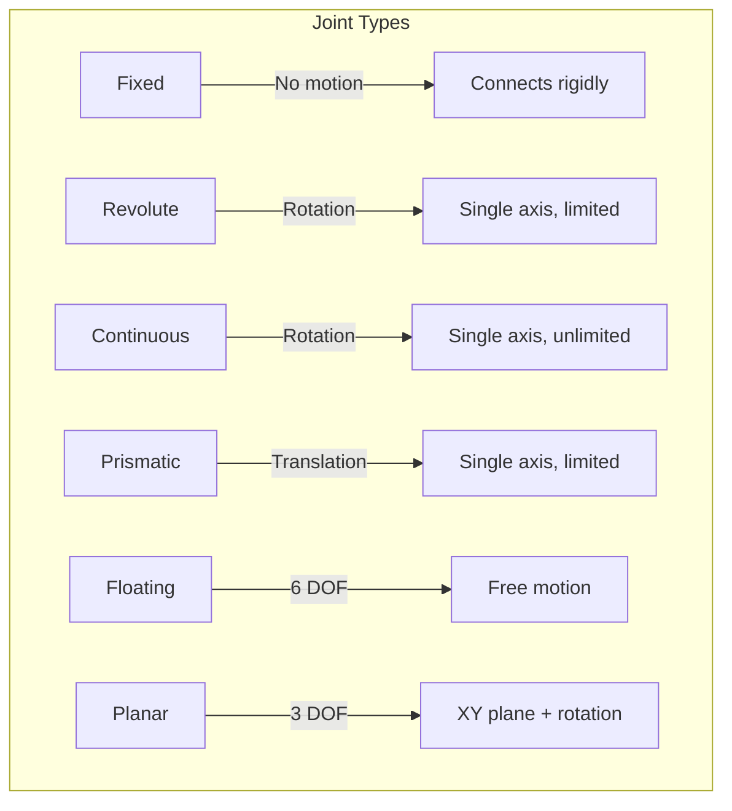

# URDF for Humanoids

The **Unified Robot Description Format (URDF)** is an XML format for describing robot geometry. In this section, you'll learn URDF fundamentals and build a simple humanoid robot model.

## What is URDF?

URDF describes:
- **Links**: Rigid bodies with visual and collision geometry
- **Joints**: Connections between links with motion constraints
- **Sensors**: Cameras, LiDAR, IMUs (via extensions)
- **Materials**: Colors and textures for visualization

### URDF Link/Joint Hierarchy

```
              [torso]
                 |
        fixed joint (torso_head)
                 |
              [head]
                 |
    +-----------+-----------+
    |                       |
revolute             revolute
(left_shoulder)    (right_shoulder)
    |                       |
[left_arm]           [right_arm]
```

## URDF Elements

### Links

A **link** represents a rigid body:

```xml
<link name="torso">
  <!-- Visual: what you see in RViz -->
  <visual>
    <geometry>
      <box size="0.3 0.2 0.5"/>
    </geometry>
    <material name="blue">
      <color rgba="0.0 0.0 1.0 1.0"/>
    </material>
  </visual>

  <!-- Collision: for physics simulation -->
  <collision>
    <geometry>
      <box size="0.3 0.2 0.5"/>
    </geometry>
  </collision>

  <!-- Inertial: mass properties -->
  <inertial>
    <mass value="10.0"/>
    <inertia ixx="0.1" ixy="0" ixz="0"
             iyy="0.1" iyz="0" izz="0.1"/>
  </inertial>
</link>
```

### Joints

A **joint** connects two links:

```xml
<joint name="torso_to_head" type="fixed">
  <parent link="torso"/>
  <child link="head"/>
  <origin xyz="0 0 0.35" rpy="0 0 0"/>
</joint>
```

### Joint Types and Their Motion



| Type | Motion | Limits | Example |
|------|--------|--------|---------|
| **fixed** | None | N/A | Sensor mount |
| **revolute** | Rotation | Yes | Elbow, knee |
| **continuous** | Rotation | No | Wheel |
| **prismatic** | Translation | Yes | Linear actuator |
| **floating** | 6 DOF | No | Mobile base |
| **planar** | XY + rotation | No | Holonomic base |

## Simple Two-Link Robot URDF

Let's start with a minimal example:

```xml
<?xml version="1.0"?>
<robot name="two_link_robot">

  <!-- Base link (fixed to world) -->
  <link name="base_link">
    <visual>
      <geometry>
        <cylinder radius="0.1" length="0.05"/>
      </geometry>
      <material name="gray">
        <color rgba="0.5 0.5 0.5 1.0"/>
      </material>
    </visual>
  </link>

  <!-- First link -->
  <link name="link1">
    <visual>
      <origin xyz="0 0 0.25"/>
      <geometry>
        <box size="0.05 0.05 0.5"/>
      </geometry>
      <material name="red">
        <color rgba="1.0 0.0 0.0 1.0"/>
      </material>
    </visual>
  </link>

  <!-- Joint connecting base to link1 -->
  <joint name="joint1" type="revolute">
    <parent link="base_link"/>
    <child link="link1"/>
    <origin xyz="0 0 0.025" rpy="0 0 0"/>
    <axis xyz="0 1 0"/>
    <limit lower="-1.57" upper="1.57" effort="10" velocity="1.0"/>
  </joint>

  <!-- Second link -->
  <link name="link2">
    <visual>
      <origin xyz="0 0 0.2"/>
      <geometry>
        <box size="0.04 0.04 0.4"/>
      </geometry>
      <material name="green">
        <color rgba="0.0 1.0 0.0 1.0"/>
      </material>
    </visual>
  </link>

  <!-- Joint connecting link1 to link2 -->
  <joint name="joint2" type="revolute">
    <parent link="link1"/>
    <child link="link2"/>
    <origin xyz="0 0 0.5" rpy="0 0 0"/>
    <axis xyz="0 1 0"/>
    <limit lower="-2.0" upper="2.0" effort="10" velocity="1.0"/>
  </joint>

</robot>
```

## Humanoid Torso and Head URDF

Now let's build a simple humanoid upper body:

```xml
<?xml version="1.0"?>
<robot name="simple_humanoid">

  <!-- Materials -->
  <material name="skin">
    <color rgba="0.96 0.80 0.69 1.0"/>
  </material>
  <material name="blue">
    <color rgba="0.2 0.4 0.8 1.0"/>
  </material>
  <material name="dark">
    <color rgba="0.2 0.2 0.2 1.0"/>
  </material>

  <!-- Torso (root link) -->
  <link name="torso">
    <visual>
      <geometry>
        <box size="0.35 0.15 0.5"/>
      </geometry>
      <material name="blue"/>
    </visual>
    <collision>
      <geometry>
        <box size="0.35 0.15 0.5"/>
      </geometry>
    </collision>
    <inertial>
      <mass value="15.0"/>
      <inertia ixx="0.5" ixy="0" ixz="0"
               iyy="0.5" iyz="0" izz="0.3"/>
    </inertial>
  </link>

  <!-- Neck -->
  <link name="neck">
    <visual>
      <geometry>
        <cylinder radius="0.04" length="0.1"/>
      </geometry>
      <material name="skin"/>
    </visual>
  </link>

  <joint name="torso_to_neck" type="fixed">
    <parent link="torso"/>
    <child link="neck"/>
    <origin xyz="0 0 0.3" rpy="0 0 0"/>
  </joint>

  <!-- Head -->
  <link name="head">
    <visual>
      <geometry>
        <sphere radius="0.12"/>
      </geometry>
      <material name="skin"/>
    </visual>
    <collision>
      <geometry>
        <sphere radius="0.12"/>
      </geometry>
    </collision>
    <inertial>
      <mass value="4.0"/>
      <inertia ixx="0.02" ixy="0" ixz="0"
               iyy="0.02" iyz="0" izz="0.02"/>
    </inertial>
  </link>

  <joint name="neck_to_head" type="revolute">
    <parent link="neck"/>
    <child link="head"/>
    <origin xyz="0 0 0.15" rpy="0 0 0"/>
    <axis xyz="0 0 1"/>
    <limit lower="-1.0" upper="1.0" effort="5" velocity="2.0"/>
  </joint>

  <!-- Left Shoulder -->
  <link name="left_upper_arm">
    <visual>
      <origin xyz="0 0 -0.15"/>
      <geometry>
        <cylinder radius="0.04" length="0.3"/>
      </geometry>
      <material name="blue"/>
    </visual>
  </link>

  <joint name="left_shoulder" type="revolute">
    <parent link="torso"/>
    <child link="left_upper_arm"/>
    <origin xyz="0.2 0 0.2" rpy="0 0 0"/>
    <axis xyz="1 0 0"/>
    <limit lower="-3.14" upper="1.0" effort="20" velocity="2.0"/>
  </joint>

  <!-- Left Forearm -->
  <link name="left_forearm">
    <visual>
      <origin xyz="0 0 -0.125"/>
      <geometry>
        <cylinder radius="0.035" length="0.25"/>
      </geometry>
      <material name="skin"/>
    </visual>
  </link>

  <joint name="left_elbow" type="revolute">
    <parent link="left_upper_arm"/>
    <child link="left_forearm"/>
    <origin xyz="0 0 -0.3" rpy="0 0 0"/>
    <axis xyz="1 0 0"/>
    <limit lower="0" upper="2.5" effort="15" velocity="2.0"/>
  </joint>

  <!-- Right Shoulder -->
  <link name="right_upper_arm">
    <visual>
      <origin xyz="0 0 -0.15"/>
      <geometry>
        <cylinder radius="0.04" length="0.3"/>
      </geometry>
      <material name="blue"/>
    </visual>
  </link>

  <joint name="right_shoulder" type="revolute">
    <parent link="torso"/>
    <child link="right_upper_arm"/>
    <origin xyz="-0.2 0 0.2" rpy="0 0 0"/>
    <axis xyz="1 0 0"/>
    <limit lower="-3.14" upper="1.0" effort="20" velocity="2.0"/>
  </joint>

  <!-- Right Forearm -->
  <link name="right_forearm">
    <visual>
      <origin xyz="0 0 -0.125"/>
      <geometry>
        <cylinder radius="0.035" length="0.25"/>
      </geometry>
      <material name="skin"/>
    </visual>
  </link>

  <joint name="right_elbow" type="revolute">
    <parent link="right_upper_arm"/>
    <child link="right_forearm"/>
    <origin xyz="0 0 -0.3" rpy="0 0 0"/>
    <axis xyz="1 0 0"/>
    <limit lower="0" upper="2.5" effort="15" velocity="2.0"/>
  </joint>

</robot>
```

## Launch File to Load URDF

Create a launch file to load and visualize the URDF:

```python
# launch/display_humanoid.launch.py
from launch import LaunchDescription
from launch_ros.actions import Node
from launch.substitutions import Command
from ament_index_python.packages import get_package_share_directory
import os


def generate_launch_description():
    # Path to URDF file
    urdf_file = os.path.join(
        get_package_share_directory('my_humanoid'),
        'urdf',
        'simple_humanoid.urdf'
    )

    # Read URDF content
    with open(urdf_file, 'r') as f:
        robot_description = f.read()

    return LaunchDescription([
        # Robot State Publisher
        Node(
            package='robot_state_publisher',
            executable='robot_state_publisher',
            parameters=[{'robot_description': robot_description}]
        ),

        # Joint State Publisher GUI (for interactive joint control)
        Node(
            package='joint_state_publisher_gui',
            executable='joint_state_publisher_gui',
        ),

        # RViz2 for visualization
        Node(
            package='rviz2',
            executable='rviz2',
            arguments=['-d', os.path.join(
                get_package_share_directory('my_humanoid'),
                'rviz',
                'humanoid.rviz'
            )]
        ),
    ])
```

## RViz2 Configuration

Save this as `config/humanoid.rviz`:

```yaml
Panels:
  - Class: rviz_common/Displays
Visualization Manager:
  Displays:
    - Class: rviz_default_plugins/RobotModel
      Name: RobotModel
      Enabled: true
      Description Topic:
        Value: /robot_description
      Visual Enabled: true
      Collision Enabled: false
    - Class: rviz_default_plugins/TF
      Name: TF
      Enabled: true
      Frame Timeout: 15
      Show Arrows: true
      Show Axes: true
      Show Names: true
    - Class: rviz_default_plugins/Grid
      Name: Grid
      Enabled: true
  Global Options:
    Fixed Frame: torso
  Tools:
    - Class: rviz_default_plugins/Interact
    - Class: rviz_default_plugins/MoveCamera
```

## Running the Visualization

```bash
# Build your package
cd ~/ros2_ws
colcon build --packages-select my_humanoid
source install/setup.bash

# Launch the visualization
ros2 launch my_humanoid display_humanoid.launch.py
```

Expected output:
- RViz2 window opens showing the humanoid model
- Joint State Publisher GUI shows sliders for each joint
- Moving sliders animates the robot in real-time

## Summary

You've learned:
- **URDF structure**: Links, joints, and their properties
- **Joint types**: Revolute, continuous, prismatic, fixed
- **Building a humanoid**: Torso, head, and arms
- **Visualization**: Launch files and RViz2 configuration

This URDF is the foundation for our simulation work. In [Chapter 3: Simulation](/docs/chapter-3-simulation), we'll bring this robot to life in Gazebo with physics and sensors.
