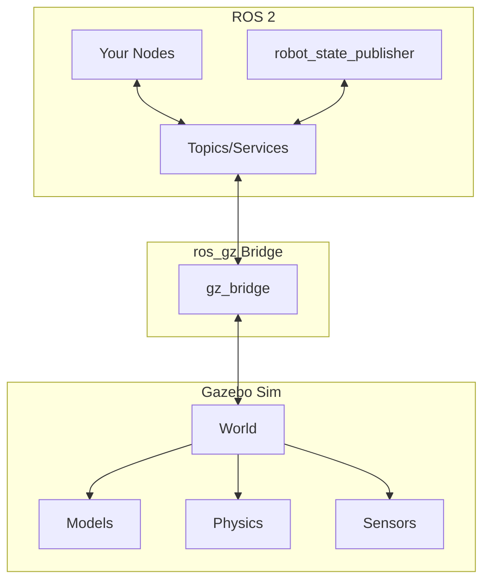

# Gazebo Physics Simulation

Gazebo is the de facto standard for robot simulation in ROS. This section covers Gazebo Sim (the modern version) and how to create physics-accurate simulations.

## Gazebo Classic vs Gazebo Sim

:::warning Use Gazebo Sim
**Gazebo Classic** (gazebo11 and earlier) is deprecated. This book uses **Gazebo Sim** (formerly Ignition Gazebo), which is actively developed and has native ROS 2 support.
:::

| Feature | Gazebo Classic | Gazebo Sim |
|---------|---------------|------------|
| ROS 2 support | Via bridge | Native |
| Physics engines | ODE | ODE, DART, Bullet, TPE |
| Rendering | OGRE 1.x | OGRE 2.x (modern) |
| Plugin architecture | Monolithic | Modular (ECS) |
| Development | Deprecated | Active |

## Installation and Setup

```bash
# Install Gazebo Sim with ROS 2 integration
sudo apt install ros-humble-ros-gz

# Verify installation
gz sim --version
```

Expected output:
```
Gazebo Sim, version 7.x.x
```

```bash
# Test with a sample world
gz sim shapes.sdf
```

## Gazebo-ROS 2 Architecture



## Physics Engines

Gazebo Sim supports multiple physics engines:

| Engine | Strengths | Best For |
|--------|-----------|----------|
| **DART** | Accurate contacts, stable | Manipulation, humanoids |
| **Bullet** | Fast, widely used | General robotics |
| **ODE** | Mature, well-tested | Legacy compatibility |
| **TPE** | Fast, simple | Large-scale simulation |

### Choosing a Physics Engine

For humanoid robotics, we recommend **DART** due to its:
- Stable contact handling for bipedal balance
- Accurate friction models
- Good performance with articulated bodies

## World File Structure (SDF)

SDF (Simulation Description Format) defines simulation worlds:

```xml
<?xml version="1.0"?>
<sdf version="1.8">
  <world name="humanoid_world">

    <!-- Physics configuration -->
    <physics name="dart_physics" type="dart">
      <max_step_size>0.001</max_step_size>
      <real_time_factor>1.0</real_time_factor>
      <real_time_update_rate>1000</real_time_update_rate>
    </physics>

    <!-- Gravity -->
    <gravity>0 0 -9.81</gravity>

    <!-- Lighting -->
    <light type="directional" name="sun">
      <cast_shadows>true</cast_shadows>
      <pose>0 0 10 0 0 0</pose>
      <diffuse>0.8 0.8 0.8 1</diffuse>
      <specular>0.2 0.2 0.2 1</specular>
      <direction>-0.5 0.1 -0.9</direction>
    </light>

    <!-- Ground plane -->
    <model name="ground_plane">
      <static>true</static>
      <link name="link">
        <collision name="collision">
          <geometry>
            <plane>
              <normal>0 0 1</normal>
              <size>100 100</size>
            </plane>
          </geometry>
          <surface>
            <friction>
              <ode>
                <mu>0.8</mu>
                <mu2>0.8</mu2>
              </ode>
            </friction>
          </surface>
        </collision>
        <visual name="visual">
          <geometry>
            <plane>
              <normal>0 0 1</normal>
              <size>100 100</size>
            </plane>
          </geometry>
          <material>
            <ambient>0.8 0.8 0.8 1</ambient>
            <diffuse>0.8 0.8 0.8 1</diffuse>
          </material>
        </visual>
      </link>
    </model>

    <!-- Plugins for ROS 2 integration -->
    <plugin
      filename="gz-sim-physics-system"
      name="gz::sim::systems::Physics">
    </plugin>
    <plugin
      filename="gz-sim-scene-broadcaster-system"
      name="gz::sim::systems::SceneBroadcaster">
    </plugin>
    <plugin
      filename="gz-sim-user-commands-system"
      name="gz::sim::systems::UserCommands">
    </plugin>

  </world>
</sdf>
```

## Spawning Robot Models

### Launch File for Gazebo with ROS 2

```python
# launch/gazebo_humanoid.launch.py
from launch import LaunchDescription
from launch.actions import IncludeLaunchDescription, DeclareLaunchArgument
from launch.launch_description_sources import PythonLaunchDescriptionSource
from launch.substitutions import LaunchConfiguration, PathJoinSubstitution
from launch_ros.actions import Node
from launch_ros.substitutions import FindPackageShare
import os


def generate_launch_description():
    # Paths
    pkg_share = FindPackageShare('my_humanoid')
    world_file = PathJoinSubstitution([pkg_share, 'worlds', 'humanoid_world.sdf'])
    urdf_file = PathJoinSubstitution([pkg_share, 'urdf', 'simple_humanoid.urdf'])

    # Read URDF
    urdf_path = os.path.join(
        FindPackageShare('my_humanoid').find('my_humanoid'),
        'urdf', 'simple_humanoid.urdf')
    with open(urdf_path, 'r') as f:
        robot_description = f.read()

    return LaunchDescription([
        # Launch Gazebo
        IncludeLaunchDescription(
            PythonLaunchDescriptionSource([
                FindPackageShare('ros_gz_sim'), '/launch/gz_sim.launch.py'
            ]),
            launch_arguments={'gz_args': ['-r ', world_file]}.items(),
        ),

        # Robot State Publisher
        Node(
            package='robot_state_publisher',
            executable='robot_state_publisher',
            parameters=[{'robot_description': robot_description}],
        ),

        # Spawn robot in Gazebo
        Node(
            package='ros_gz_sim',
            executable='create',
            arguments=[
                '-name', 'humanoid',
                '-topic', 'robot_description',
                '-z', '1.0'  # Spawn 1m above ground
            ],
            output='screen',
        ),

        # Bridge for clock
        Node(
            package='ros_gz_bridge',
            executable='parameter_bridge',
            arguments=['/clock@rosgraph_msgs/msg/Clock[gz.msgs.Clock'],
            output='screen',
        ),
    ])
```

### Spawning URDF via ros_gz

```bash
# Spawn a robot from URDF
ros2 run ros_gz_sim create -topic robot_description -name my_robot -z 1.0
```

## Physics Parameter Tuning

Fine-tuning physics parameters is crucial for realistic simulation:

```xml
<!-- Physics parameters in SDF -->
<physics name="humanoid_physics" type="dart">
  <!-- Step size: smaller = more accurate, slower -->
  <max_step_size>0.001</max_step_size>

  <!-- Real-time factor: 1.0 = real-time, <1 = slower, >1 = faster -->
  <real_time_factor>1.0</real_time_factor>

  <!-- DART-specific parameters -->
  <dart>
    <collision_detector>bullet</collision_detector>
    <solver>
      <solver_type>dantzig</solver_type>
    </solver>
  </dart>
</physics>

<!-- Surface properties for contacts -->
<surface>
  <friction>
    <ode>
      <mu>0.9</mu>           <!-- Friction coefficient -->
      <mu2>0.9</mu2>         <!-- Secondary friction -->
    </ode>
  </friction>
  <contact>
    <ode>
      <kp>1e6</kp>           <!-- Contact stiffness -->
      <kd>100</kd>           <!-- Contact damping -->
      <max_vel>0.01</max_vel> <!-- Max correcting velocity -->
    </ode>
  </contact>
</surface>
```

### Tuning Guidelines

| Parameter | Effect | Humanoid Recommendation |
|-----------|--------|-------------------------|
| `max_step_size` | Accuracy vs speed | 0.001s (1kHz) |
| `mu` (friction) | Foot traction | 0.8-1.0 |
| `kp` (stiffness) | Contact hardness | 1e6 |
| `kd` (damping) | Contact bounce | 100-1000 |

## Running Your Simulation

```bash
# Terminal 1: Launch Gazebo with your world
ros2 launch my_humanoid gazebo_humanoid.launch.py

# Terminal 2: View topics from Gazebo
ros2 topic list

# Terminal 3: Send joint commands (example)
ros2 topic pub /model/humanoid/joint/left_shoulder/cmd_pos \
  std_msgs/msg/Float64 "{data: 0.5}"
```

## Summary

You've learned:
- **Gazebo Sim** is the modern replacement for Gazebo Classic
- **SDF format** defines worlds, models, and physics
- **Physics engines**: DART recommended for humanoids
- **ros_gz** provides native ROS 2 integration

In the next section, we'll explore Unity for high-fidelity visualization and HRI scenarios.
