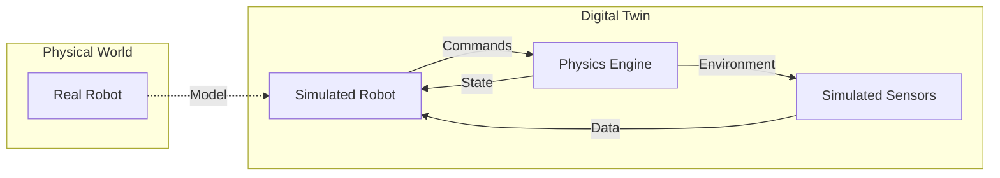
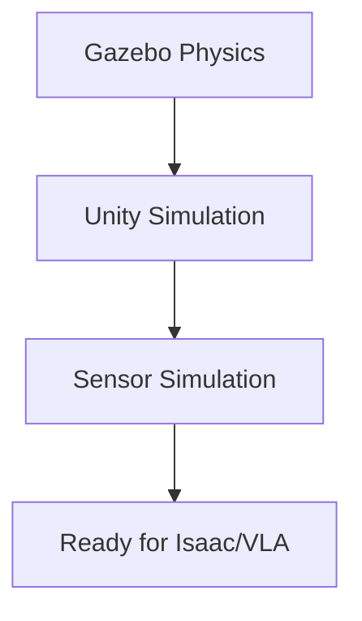

# Chapter 3: Digital Twin Simulation (Gazebo & Unity)

A **digital twin** is a virtual representation of a physical robot that mirrors its real-world counterpart. In this chapter, you'll learn to create digital twins using Gazebo for physics simulation and Unity for high-fidelity visualization.

## Learning Objectives

By the end of this chapter, you will be able to:

- Set up Gazebo Sim with ROS 2 integration
- Create physics-accurate simulations of your humanoid
- Configure Unity with ROS-TCP-Connector for bidirectional communication
- Simulate sensors including LiDAR, cameras, and IMUs
- Visualize sensor data in RViz2

## What is a Digital Twin?

A digital twin goes beyond simple visualization—it's a virtual replica that:

- **Mirrors physics**: Same mass, friction, joint limits as the real robot
- **Replicates sensors**: Simulated cameras, LiDAR, IMUs with realistic noise
- **Enables testing**: Run scenarios before risking real hardware
- **Supports AI training**: Generate vast amounts of training data



## Why Simulation Before Hardware?

| Reason | Benefit |
|--------|---------|
| **Safety** | No risk of damaging expensive hardware |
| **Speed** | Faster-than-realtime simulation possible |
| **Scale** | Run thousands of parallel scenarios |
| **Reproducibility** | Reset to exact states for debugging |
| **Cost** | No wear, no power consumption, no repairs |

## Prerequisites

:::caution Required Setup
Before starting this chapter:

- [x] Completed [Chapter 2: ROS 2 Fundamentals](/docs/chapter-2-ros2)
- [x] ROS 2 Humble installed and working
- [x] Working URDF from Chapter 2
:::

## Software Requirements

### Gazebo Sim (Ignition)

:::warning Gazebo Classic Deprecation
**Gazebo Classic** (version ≤11) is deprecated. This book uses **Gazebo Sim** (formerly Ignition Gazebo), the modern successor with better ROS 2 integration.
:::

Install Gazebo Sim:
```bash
sudo apt install ros-humble-ros-gz
```

### Unity (Optional)

For Unity simulation sections:
- Unity 2021.3 LTS or newer
- Unity Robotics Hub package
- ROS-TCP-Connector

## Chapter Roadmap



| Section | Topic | You'll Build |
|---------|-------|--------------|
| 3.1 | [Gazebo Physics](./gazebo-physics) | Humanoid in physics simulation |
| 3.2 | [Unity Simulation](./unity-simulation) | ROS 2 connected Unity scene |
| 3.3 | [Sensor Simulation](./sensor-simulation) | LiDAR, cameras, IMU |

## What's Next?

After this chapter, you'll have a fully simulated humanoid with working sensors. [Chapter 4: NVIDIA Isaac](/docs/chapter-4-isaac) will show you how to leverage GPU-accelerated simulation for AI training.
