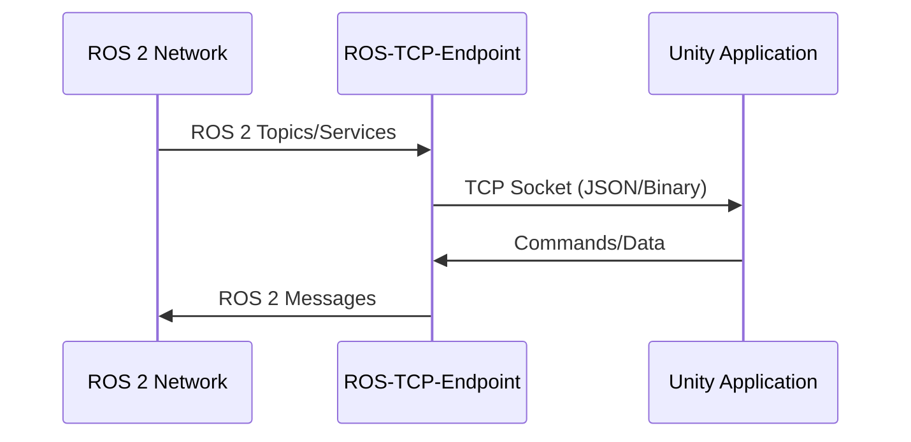
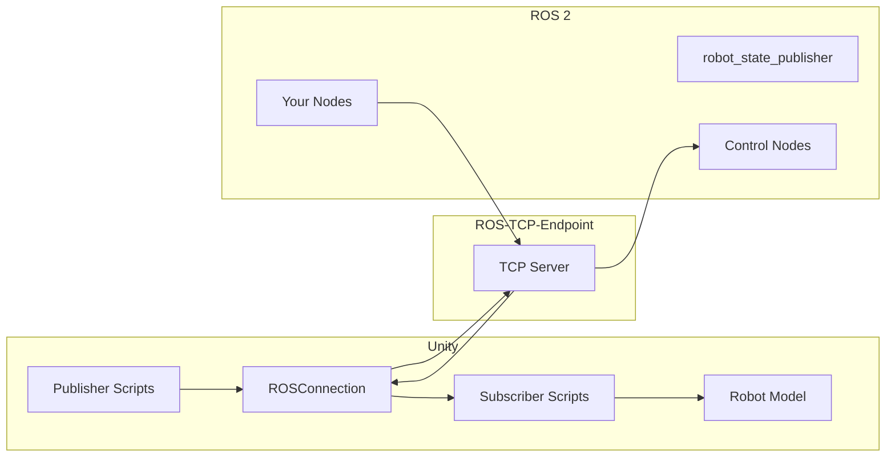

# Unity Simulation

Unity offers high-fidelity rendering and is excellent for human-robot interaction (HRI) scenarios. This section covers integrating Unity with ROS 2 using the ROS-TCP-Connector.

## Why Unity for Robotics?

| Strength | Application |
|----------|-------------|
| **Visual fidelity** | Photorealistic environments for perception training |
| **VR/AR support** | Immersive teleoperation interfaces |
| **Asset ecosystem** | Thousands of ready-made environments |
| **Cross-platform** | Deploy to desktop, mobile, web |
| **Rapid prototyping** | Visual scripting, quick iteration |

Unity complements Gazebo:
- **Gazebo**: Physics accuracy, ROS-native
- **Unity**: Visual quality, HRI, VR/AR

## Unity Robotics Hub Overview

Unity provides official robotics packages:

- **ROS-TCP-Connector**: Bidirectional ROS 2 communication
- **URDF Importer**: Import robot models from URDF
- **Perception Package**: Synthetic data generation
- **Unity Robotics Hub**: Tutorials and examples

## ROS-TCP-Connector Architecture



## Setup Guide

### ROS 2 Side: ROS-TCP-Endpoint

```bash
# Install the ROS-TCP-Endpoint package
cd ~/ros2_ws/src
git clone -b ros2 https://github.com/Unity-Technologies/ROS-TCP-Endpoint.git
cd ~/ros2_ws
colcon build --packages-select ros_tcp_endpoint
source install/setup.bash
```

### Launch ROS-TCP-Endpoint

```python
# launch/tcp_endpoint.launch.py
from launch import LaunchDescription
from launch_ros.actions import Node


def generate_launch_description():
    return LaunchDescription([
        Node(
            package='ros_tcp_endpoint',
            executable='default_server_endpoint',
            emulate_tty=True,
            parameters=[
                {'ROS_IP': '0.0.0.0'},  # Listen on all interfaces
                {'ROS_TCP_PORT': 10000},
            ],
        ),
    ])
```

Launch the endpoint:
```bash
ros2 launch my_package tcp_endpoint.launch.py
```

Expected output:
```
[INFO] [default_server_endpoint]: Starting server on 0.0.0.0:10000
```

### Unity Side: Install Packages

1. Open Unity Package Manager (Window → Package Manager)
2. Click "+" → "Add package from git URL"
3. Add: `https://github.com/Unity-Technologies/ROS-TCP-Connector.git?path=/com.unity.robotics.ros-tcp-connector`

### Configure Unity Connection

In Unity:
1. Go to Robotics → ROS Settings
2. Set **ROS IP Address**: `127.0.0.1` (or your ROS machine IP)
3. Set **ROS Port**: `10000`
4. Set **Protocol**: ROS2

## Unity C# Subscriber Example

Create a script that subscribes to a ROS 2 topic:

```csharp
// StringSubscriber.cs
using UnityEngine;
using Unity.Robotics.ROSTCPConnector;
using RosMessageTypes.Std;

public class StringSubscriber : MonoBehaviour
{
    public string topicName = "/chatter";

    void Start()
    {
        // Register subscriber
        ROSConnection.GetOrCreateInstance().Subscribe<StringMsg>(
            topicName,
            OnMessageReceived
        );
        Debug.Log($"Subscribed to {topicName}");
    }

    void OnMessageReceived(StringMsg message)
    {
        Debug.Log($"Received: {message.data}");

        // Update UI or trigger actions based on message
        // Example: Update a TextMeshPro component
    }
}
```

## Unity C# Publisher Example

Create a script that publishes to a ROS 2 topic:

```csharp
// JointCommandPublisher.cs
using UnityEngine;
using Unity.Robotics.ROSTCPConnector;
using RosMessageTypes.Std;

public class JointCommandPublisher : MonoBehaviour
{
    public string topicName = "/joint_command";
    public float publishRate = 10f; // Hz

    private ROSConnection ros;
    private float timeElapsed;

    void Start()
    {
        ros = ROSConnection.GetOrCreateInstance();
        ros.RegisterPublisher<Float64Msg>(topicName);
        Debug.Log($"Publishing to {topicName}");
    }

    void Update()
    {
        timeElapsed += Time.deltaTime;

        if (timeElapsed >= 1f / publishRate)
        {
            // Create message
            Float64Msg message = new Float64Msg();

            // Example: Send sine wave command
            message.data = Mathf.Sin(Time.time);

            // Publish
            ros.Publish(topicName, message);

            timeElapsed = 0;
        }
    }
}
```

## URDF Importer

### Installation

Add via Package Manager:
`https://github.com/Unity-Technologies/URDF-Importer.git?path=/com.unity.robotics.urdf-importer`

### Import Configuration

1. Place your URDF file in Unity's Assets folder
2. Right-click the URDF → Import Robot from URDF
3. Configure import settings:

```csharp
// Typical URDF import settings (shown in Inspector)
// - Axis Type: Z-Up (convert from ROS convention)
// - Mesh Decomposer: VHACD (for convex collision)
// - Import Inertia: true
// - Import Visual: true
// - Import Collision: true
```

### Post-Import Configuration

```csharp
// RobotController.cs - Basic articulation control
using UnityEngine;

public class RobotController : MonoBehaviour
{
    public ArticulationBody[] joints;

    void Start()
    {
        // Find all articulation bodies (joints)
        joints = GetComponentsInChildren<ArticulationBody>();

        // Configure joint drives
        foreach (var joint in joints)
        {
            if (joint.jointType == ArticulationJointType.RevoluteJoint)
            {
                var drive = joint.xDrive;
                drive.stiffness = 10000f;
                drive.damping = 100f;
                drive.forceLimit = 1000f;
                joint.xDrive = drive;
            }
        }
    }

    public void SetJointTarget(int jointIndex, float targetAngle)
    {
        if (jointIndex < joints.Length)
        {
            var drive = joints[jointIndex].xDrive;
            drive.target = targetAngle * Mathf.Rad2Deg;
            joints[jointIndex].xDrive = drive;
        }
    }
}
```

## Unity-ROS 2 Communication Flow



## Complete Example: Bidirectional Communication

### ROS 2 Node (Python)

```python
#!/usr/bin/env python3
"""ROS 2 node that talks to Unity."""

import rclpy
from rclpy.node import Node
from std_msgs.msg import String, Float64


class UnityBridge(Node):
    def __init__(self):
        super().__init__('unity_bridge')

        # Publisher to Unity
        self.publisher_ = self.create_publisher(String, '/to_unity', 10)

        # Subscriber from Unity
        self.subscription = self.create_subscription(
            Float64,
            '/from_unity',
            self.unity_callback,
            10)

        # Timer to send periodic messages
        self.timer = self.create_timer(1.0, self.timer_callback)
        self.count = 0

    def timer_callback(self):
        msg = String()
        msg.data = f'Hello Unity #{self.count}'
        self.publisher_.publish(msg)
        self.get_logger().info(f'Sent to Unity: {msg.data}')
        self.count += 1

    def unity_callback(self, msg):
        self.get_logger().info(f'From Unity: {msg.data}')


def main(args=None):
    rclpy.init(args=args)
    node = UnityBridge()
    rclpy.spin(node)
    node.destroy_node()
    rclpy.shutdown()


if __name__ == '__main__':
    main()
```

### Unity Scripts

Attach both subscriber and publisher scripts to a GameObject to complete the bidirectional communication.

## Summary

You've learned:
- **Unity complements Gazebo** for visualization and HRI
- **ROS-TCP-Connector** enables bidirectional ROS 2 communication
- **URDF Importer** brings your robot model into Unity
- **C# scripts** can publish and subscribe to ROS 2 topics

In the next section, we'll add simulated sensors to your robot.
