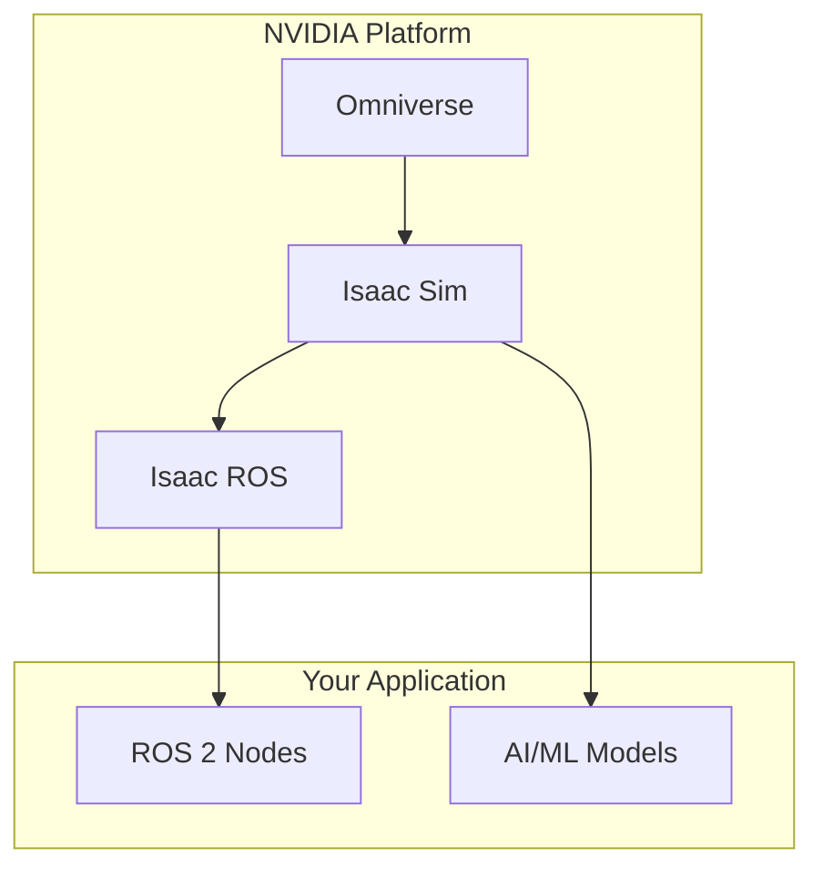
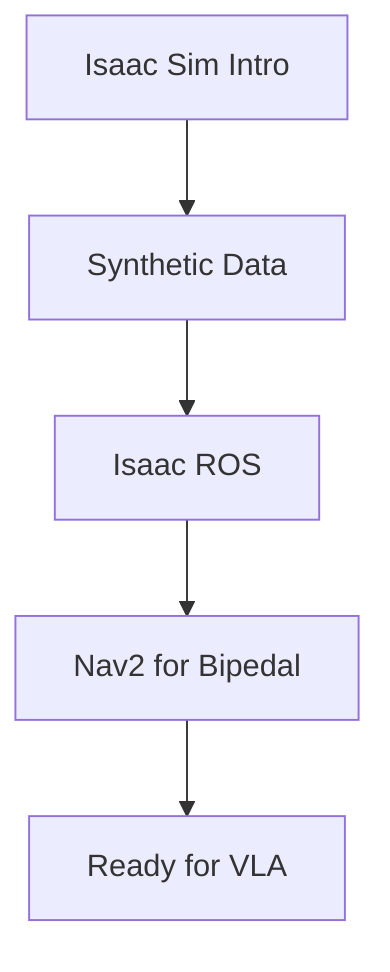

# Chapter 4: The AI-Robot Brain (NVIDIA Isaac)

NVIDIA Isaac is a platform for AI-enabled robotics, providing GPU-accelerated simulation, perception, and training tools. This chapter covers Isaac Sim for photorealistic simulation and Isaac ROS for accelerated perception.

## Learning Objectives

By the end of this chapter, you will be able to:

- Set up and navigate NVIDIA Isaac Sim
- Generate synthetic training data with domain randomization
- Deploy GPU-accelerated perception with Isaac ROS
- Configure Nav2 for bipedal humanoid navigation

## What Makes Isaac Different from Gazebo?

| Feature | Gazebo Sim | Isaac Sim |
|---------|------------|-----------|
| **Rendering** | OGRE 2.x | RTX (ray tracing) |
| **Physics** | DART/Bullet | PhysX 5 |
| **GPU acceleration** | Limited | Comprehensive |
| **Synthetic data** | Manual | Built-in Replicator |
| **Scene format** | SDF | USD |
| **AI training** | External | Integrated |
| **Cost** | Free | Free (workstation) |

## When to Use Isaac vs Gazebo

### Use Isaac Sim When:
- Training perception models (need photorealistic data)
- Generating large synthetic datasets
- Running GPU-accelerated physics
- Working with complex visual environments

### Use Gazebo When:
- Don't have NVIDIA RTX GPU
- Need quick prototyping
- Running on embedded systems
- Lighter-weight simulation is sufficient

## Prerequisites

:::caution Hardware Requirements
NVIDIA Isaac Sim requires:
- **GPU**: NVIDIA RTX 2070 or higher (RTX 3080+ recommended)
- **VRAM**: 8GB minimum (16GB+ recommended)
- **RAM**: 32GB minimum
- **Storage**: 50GB for Isaac Sim + dependencies
:::

:::tip Gazebo Fallback
If you don't have the required hardware, each section includes a **Gazebo fallback** so you can still learn the concepts using the simulation tools from Chapter 3.
:::

Required setup:
- [x] Completed [Chapter 3: Simulation](/docs/chapter-3-simulation)
- [x] NVIDIA RTX GPU (or use Gazebo fallback)
- [x] NVIDIA driver 525+ installed
- [x] Docker (recommended for Isaac Sim)

## Chapter Roadmap

| Section | Topic | You'll Build |
|---------|-------|--------------|
| 4.1 | [Isaac Sim Introduction](./isaac-sim-intro) | First Isaac Sim scene |
| 4.2 | [Synthetic Data](./synthetic-data) | Training dataset pipeline |
| 4.3 | [Isaac ROS](./isaac-ros) | GPU-accelerated perception |
| 4.4 | [Nav2 for Bipedal](./nav2-bipedal) | Humanoid navigation |

## What's Next?

After this chapter, you'll have GPU-accelerated simulation and perception capabilities. [Chapter 5: Vision-Language-Action](/docs/chapter-5-vla) will add speech understanding and LLM-based planning to your humanoid.
