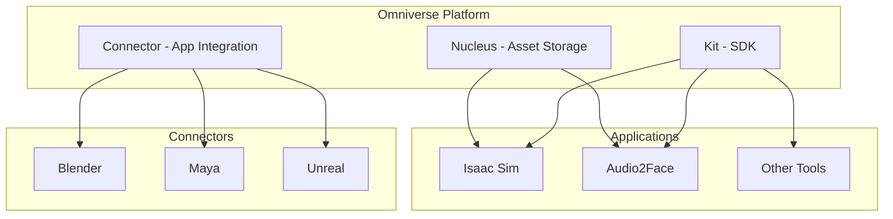
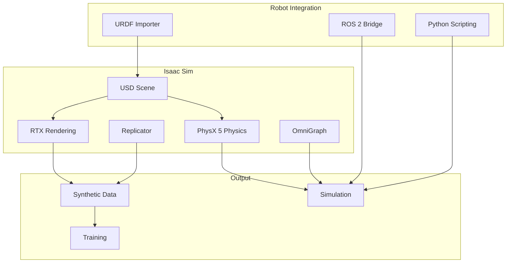

# Isaac Sim Introduction

NVIDIA Isaac Sim is a photorealistic, physically-accurate robotics simulator built on the Omniverse platform. This section covers setup and basic usage.

## NVIDIA Omniverse Platform

**Omniverse** is NVIDIA's platform for 3D content creation and simulation:



## Isaac Sim Architecture



## Installation and Setup

### Standalone Installation

```bash
# Download from NVIDIA (requires account)
# https://developer.nvidia.com/isaac-sim

# After installation, launch:
~/.local/share/ov/pkg/isaac_sim-2023.1.1/isaac-sim.sh
```

### Docker Installation (Recommended)

```bash
# Pull Isaac Sim container
docker pull nvcr.io/nvidia/isaac-sim:2023.1.1

# Run with GUI support
docker run --name isaac-sim --entrypoint bash -it --gpus all \
  -e "ACCEPT_EULA=Y" \
  --rm --network=host \
  -e "DISPLAY=$DISPLAY" \
  -v /tmp/.X11-unix:/tmp/.X11-unix \
  -v ~/docker/isaac-sim/cache/kit:/isaac-sim/kit/cache:rw \
  -v ~/docker/isaac-sim/cache/ov:/root/.cache/ov:rw \
  -v ~/docker/isaac-sim/cache/glcache:/root/.cache/nvidia/GLCache:rw \
  -v ~/docker/isaac-sim/cache/computecache:/root/.nv/ComputeCache:rw \
  -v ~/docker/isaac-sim/logs:/root/.nvidia-omniverse/logs:rw \
  -v ~/docker/isaac-sim/data:/root/.local/share/ov/data:rw \
  nvcr.io/nvidia/isaac-sim:2023.1.1
```

### Isaac Sim Launch Command

From within Docker or standalone:

```bash
# Launch Isaac Sim with ROS 2 support
./isaac-sim.sh --/app/enableGpu=true

# Headless mode for servers
./isaac-sim.sh --headless --/app/enableGpu=true
```

Expected output:
```
[INFO] [omni.isaac.kit.app] Isaac Sim starting...
[INFO] [omni.isaac.kit.app] PhysX initialized
[INFO] [omni.isaac.ros2_bridge] ROS 2 bridge ready
```

:::tip Gazebo Fallback
If you don't have Isaac Sim:
```bash
# Use Gazebo Sim instead
gz sim -r empty.sdf
```
:::

## USD (Universal Scene Description)

USD is the scene format used by Isaac Sim:

- **Universal**: Works across tools (Blender, Maya, etc.)
- **Hierarchical**: Nested prims (primitives)
- **Composable**: Layers for non-destructive editing
- **Scalable**: Handles massive scenes

### Basic USD Structure

```
/World
├── /ground_plane
├── /robot
│   ├── /torso
│   │   ├── /left_arm
│   │   └── /right_arm
│   └── /head
├── /camera
└── /lights
```

## Python Scripting in Isaac Sim

Isaac Sim provides a powerful Python API:

```python
# Basic Isaac Sim script
from omni.isaac.kit import SimulationApp

# Initialize simulation
simulation_app = SimulationApp({"headless": False})

from omni.isaac.core import World
from omni.isaac.core.utils.stage import add_reference_to_stage

# Create world
world = World(stage_units_in_meters=1.0)

# Add ground plane
world.scene.add_default_ground_plane()

# Add a cube
from omni.isaac.core.objects import DynamicCuboid
cube = world.scene.add(
    DynamicCuboid(
        prim_path="/World/cube",
        name="cube",
        position=[0, 0, 1.0],
        size=0.5,
        color=[1.0, 0.0, 0.0]
    )
)

# Reset world
world.reset()

# Simulation loop
while simulation_app.is_running():
    world.step(render=True)

simulation_app.close()
```

Expected behavior: A red cube falls onto a ground plane under gravity.

## Loading URDF as USD

Convert your ROS 2 URDF to USD format:

```python
# Import URDF to USD
from omni.isaac.urdf import _urdf
from omni.isaac.core.utils.stage import get_current_stage

# Initialize URDF importer
urdf_interface = _urdf.acquire_urdf_interface()

# Import configuration
import_config = _urdf.ImportConfig()
import_config.merge_fixed_joints = False
import_config.fix_base = False  # Allow robot to move
import_config.import_inertia_tensor = True
import_config.distance_scale = 1.0
import_config.density = 1000.0
import_config.default_drive_type = _urdf.UrdfJointTargetType.JOINT_DRIVE_POSITION

# Import URDF
result, prim_path = urdf_interface.parse_urdf(
    urdf_path="/path/to/simple_humanoid.urdf",
    import_config=import_config
)

print(f"Robot imported at: {prim_path}")
```

:::tip Gazebo Fallback
In Gazebo, use ros_gz to spawn URDF:
```bash
ros2 run ros_gz_sim create -topic robot_description -name humanoid -z 1.0
```
:::

## Basic Simulation Control Script

Complete script to load a robot and run simulation:

```python
#!/usr/bin/env python3
"""Isaac Sim robot simulation example."""

from omni.isaac.kit import SimulationApp

# Initialize (must be first)
config = {
    "headless": False,
    "width": 1280,
    "height": 720,
}
simulation_app = SimulationApp(config)

# Now import Isaac modules
from omni.isaac.core import World
from omni.isaac.core.utils.extensions import enable_extension
from omni.isaac.core.robots import Robot
from omni.isaac.urdf import _urdf
import numpy as np

# Enable ROS 2 bridge
enable_extension("omni.isaac.ros2_bridge")

def main():
    # Create world
    world = World(stage_units_in_meters=1.0)
    world.scene.add_default_ground_plane()

    # Physics settings
    physics_context = world.get_physics_context()
    physics_context.set_gravity([0, 0, -9.81])
    physics_context.set_solver_type("TGS")  # Temporal Gauss-Seidel

    # Import URDF
    urdf_interface = _urdf.acquire_urdf_interface()
    import_config = _urdf.ImportConfig()
    import_config.fix_base = False

    result, prim_path = urdf_interface.parse_urdf(
        "/home/user/ros2_ws/src/my_humanoid/urdf/simple_humanoid.urdf",
        import_config
    )

    # Wrap as Robot object
    robot = Robot(prim_path=prim_path, name="humanoid")
    world.scene.add(robot)

    # Reset world
    world.reset()

    # Get joint info
    joint_names = robot.get_joint_names()
    print(f"Joints: {joint_names}")

    # Simulation loop
    step = 0
    while simulation_app.is_running():
        world.step(render=True)

        # Example: Oscillate shoulder joints
        if step % 10 == 0:
            t = step * 0.01
            target = np.sin(t) * 0.5  # Oscillate between -0.5 and 0.5 rad
            robot.set_joint_position_targets(
                positions=[target, target],
                joint_indices=[0, 1]  # Shoulders
            )

        step += 1

    simulation_app.close()


if __name__ == "__main__":
    main()
```

Run with:
```bash
~/.local/share/ov/pkg/isaac_sim-2023.1.1/python.sh my_isaac_script.py
```

## Summary

You've learned:
- **Omniverse** is the platform, **Isaac Sim** is the robotics simulator
- **USD** is the universal scene format
- **Python API** provides full simulation control
- **URDF import** brings your ROS models into Isaac

In the next section, we'll use Isaac Sim's **Replicator** to generate synthetic training data.
