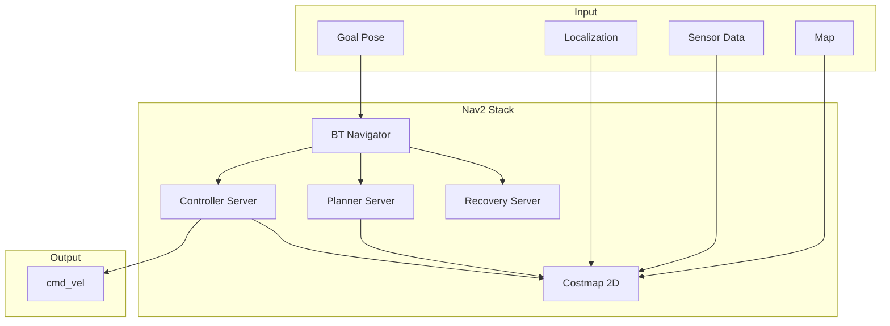

# Nav2 for Bipedal Robots

Nav2 (Navigation 2) is the ROS 2 navigation stack. This section covers adapting Nav2 for bipedal humanoid robots, which have unique constraints compared to wheeled platforms.

## Nav2 Architecture Overview



### Key Components

| Component | Purpose |
|-----------|---------|
| **BT Navigator** | Orchestrates navigation using behavior trees |
| **Planner** | Computes global path |
| **Controller** | Follows path, outputs velocities |
| **Costmap** | Obstacle representation |
| **Recovery** | Handles stuck situations |

## Bipedal Locomotion Considerations

Humanoids differ from wheeled robots:

| Aspect | Wheeled Robot | Humanoid |
|--------|---------------|----------|
| **Stability** | Inherently stable | Requires active balance |
| **Speed** | Fast (1+ m/s) | Slow (0.3-0.5 m/s safe) |
| **Turning** | In-place rotation | Requires step sequence |
| **Terrain** | Flat required | Can handle stairs |
| **Fall risk** | None | Significant |

## Costmap Configuration for Humanoids

### Costmap Layers

```
┌─────────────────────────────────────┐
│         Inflation Layer             │  <- Safety buffer
├─────────────────────────────────────┤
│         Obstacle Layer              │  <- Dynamic obstacles
├─────────────────────────────────────┤
│         Voxel Layer                 │  <- 3D obstacles
├─────────────────────────────────────┤
│         Static Layer                │  <- From map
└─────────────────────────────────────┘
         Costmap 2D
```

### Humanoid Costmap Configuration

```yaml
# config/nav2_costmap.yaml
global_costmap:
  global_costmap:
    ros__parameters:
      update_frequency: 1.0
      publish_frequency: 1.0
      global_frame: map
      robot_base_frame: base_link
      use_sim_time: true
      robot_radius: 0.25  # Humanoid footprint radius

      plugins: ["static_layer", "obstacle_layer", "inflation_layer"]

      static_layer:
        plugin: "nav2_costmap_2d::StaticLayer"
        map_subscribe_transient_local: true

      obstacle_layer:
        plugin: "nav2_costmap_2d::ObstacleLayer"
        enabled: true
        observation_sources: scan
        scan:
          topic: /scan
          max_obstacle_height: 2.0
          clearing: true
          marking: true
          data_type: "LaserScan"

      inflation_layer:
        plugin: "nav2_costmap_2d::InflationLayer"
        cost_scaling_factor: 3.0
        inflation_radius: 0.5  # Larger for humanoid safety

local_costmap:
  local_costmap:
    ros__parameters:
      update_frequency: 5.0
      publish_frequency: 2.0
      global_frame: odom
      robot_base_frame: base_link
      use_sim_time: true
      rolling_window: true
      width: 3
      height: 3
      resolution: 0.05
      robot_radius: 0.25

      plugins: ["voxel_layer", "inflation_layer"]

      voxel_layer:
        plugin: "nav2_costmap_2d::VoxelLayer"
        enabled: true
        publish_voxel_map: true
        origin_z: 0.0
        z_resolution: 0.05
        z_voxels: 16
        max_obstacle_height: 2.0
        mark_threshold: 0
        observation_sources: pointcloud
        pointcloud:
          topic: /lidar/points
          max_obstacle_height: 2.0
          min_obstacle_height: 0.1
          clearing: true
          marking: true
          data_type: "PointCloud2"

      inflation_layer:
        plugin: "nav2_costmap_2d::InflationLayer"
        cost_scaling_factor: 3.0
        inflation_radius: 0.4
```

## Nav2 Parameters YAML for Humanoid

Conservative parameters for safe bipedal navigation:

```yaml
# config/nav2_params.yaml
bt_navigator:
  ros__parameters:
    use_sim_time: true
    global_frame: map
    robot_base_frame: base_link
    odom_topic: /odom
    default_nav_to_pose_bt_xml: navigate_to_pose_w_recovery.xml
    plugin_lib_names:
      - nav2_compute_path_to_pose_action_bt_node
      - nav2_follow_path_action_bt_node
      - nav2_back_up_action_bt_node
      - nav2_spin_action_bt_node
      - nav2_wait_action_bt_node
      - nav2_clear_costmap_service_bt_node
      - nav2_is_stuck_condition_bt_node
      - nav2_goal_reached_condition_bt_node
      - nav2_recovery_node_bt_node
      - nav2_pipeline_sequence_bt_node

planner_server:
  ros__parameters:
    use_sim_time: true
    expected_planner_frequency: 5.0
    planner_plugins: ["GridBased"]

    GridBased:
      plugin: "nav2_navfn_planner/NavfnPlanner"
      tolerance: 0.5
      use_astar: true
      allow_unknown: true

controller_server:
  ros__parameters:
    use_sim_time: true
    controller_frequency: 10.0  # Lower frequency for humanoids
    min_x_velocity_threshold: 0.001
    min_y_velocity_threshold: 0.001
    min_theta_velocity_threshold: 0.001
    progress_checker_plugin: "progress_checker"
    goal_checker_plugins: ["goal_checker"]
    controller_plugins: ["FollowPath"]

    progress_checker:
      plugin: "nav2_controller::SimpleProgressChecker"
      required_movement_radius: 0.3
      movement_time_allowance: 20.0  # More time for slow humanoid

    goal_checker:
      plugin: "nav2_controller::SimpleGoalChecker"
      xy_goal_tolerance: 0.25
      yaw_goal_tolerance: 0.25
      stateful: true

    FollowPath:
      plugin: "dwb_core::DWBLocalPlanner"
      debug_trajectory_details: true
      min_vel_x: 0.0
      min_vel_y: 0.0
      max_vel_x: 0.3        # Conservative max speed
      max_vel_y: 0.0        # No lateral movement
      max_vel_theta: 0.5    # Slow rotation
      min_speed_xy: 0.0
      max_speed_xy: 0.3
      min_speed_theta: 0.0
      acc_lim_x: 0.5        # Low acceleration
      acc_lim_y: 0.0
      acc_lim_theta: 0.5
      decel_lim_x: -0.5
      decel_lim_y: 0.0
      decel_lim_theta: -0.5
      vx_samples: 10
      vy_samples: 1
      vtheta_samples: 20
      sim_time: 2.0
      linear_granularity: 0.05
      angular_granularity: 0.025
      transform_tolerance: 0.5
      xy_goal_tolerance: 0.25
      trans_stopped_velocity: 0.25
      short_circuit_trajectory_evaluation: true
      stateful: true

      critics:
        - RotateToGoal
        - Oscillation
        - BaseObstacle
        - GoalAlign
        - PathAlign
        - PathDist
        - GoalDist

      BaseObstacle.scale: 0.02
      PathAlign.scale: 32.0
      PathAlign.forward_point_distance: 0.1
      GoalAlign.scale: 24.0
      GoalAlign.forward_point_distance: 0.1
      PathDist.scale: 32.0
      GoalDist.scale: 24.0
      RotateToGoal.scale: 32.0
      RotateToGoal.slowing_factor: 5.0
      RotateToGoal.lookahead_time: -1.0
```

## Launch File for Nav2 with Isaac Sim

```python
# launch/nav2_humanoid.launch.py
from launch import LaunchDescription
from launch.actions import IncludeLaunchDescription, DeclareLaunchArgument
from launch.launch_description_sources import PythonLaunchDescriptionSource
from launch.substitutions import LaunchConfiguration
from launch_ros.actions import Node
from launch_ros.substitutions import FindPackageShare
import os


def generate_launch_description():
    pkg_share = FindPackageShare('my_humanoid').find('my_humanoid')

    # Parameters
    use_sim_time = LaunchConfiguration('use_sim_time', default='true')
    map_yaml = LaunchConfiguration('map',
        default=os.path.join(pkg_share, 'maps', 'warehouse.yaml'))
    params_file = LaunchConfiguration('params_file',
        default=os.path.join(pkg_share, 'config', 'nav2_params.yaml'))

    return LaunchDescription([
        DeclareLaunchArgument('use_sim_time', default_value='true'),
        DeclareLaunchArgument('map', default_value=map_yaml),
        DeclareLaunchArgument('params_file', default_value=params_file),

        # Map server
        Node(
            package='nav2_map_server',
            executable='map_server',
            name='map_server',
            parameters=[
                {'yaml_filename': map_yaml},
                {'use_sim_time': use_sim_time}
            ],
        ),

        # AMCL localization
        Node(
            package='nav2_amcl',
            executable='amcl',
            name='amcl',
            parameters=[
                params_file,
                {'use_sim_time': use_sim_time}
            ],
        ),

        # Nav2 bringup
        IncludeLaunchDescription(
            PythonLaunchDescriptionSource([
                FindPackageShare('nav2_bringup'),
                '/launch/navigation_launch.py'
            ]),
            launch_arguments={
                'use_sim_time': use_sim_time,
                'params_file': params_file,
            }.items(),
        ),

        # Lifecycle manager
        Node(
            package='nav2_lifecycle_manager',
            executable='lifecycle_manager',
            name='lifecycle_manager_navigation',
            parameters=[
                {'use_sim_time': use_sim_time},
                {'autostart': True},
                {'node_names': [
                    'map_server',
                    'amcl',
                    'planner_server',
                    'controller_server',
                    'bt_navigator',
                    'recoveries_server'
                ]}
            ],
        ),
    ])
```

## Custom Behavior Tree Example

Humanoid-specific navigation behavior tree:

```xml
<!-- behavior_trees/humanoid_nav.xml -->
<root main_tree_to_execute="MainTree">
  <BehaviorTree ID="MainTree">
    <RecoveryNode number_of_retries="3" name="NavigateRecovery">
      <PipelineSequence name="NavigateWithReplanning">
        <RateController hz="0.5">
          <ComputePathToPose goal="{goal}" path="{path}" planner_id="GridBased"/>
        </RateController>
        <FollowPath path="{path}" controller_id="FollowPath"/>
      </PipelineSequence>
      <ReactiveFallback name="RecoveryFallback">
        <GoalUpdated/>
        <SequenceStar name="RecoveryActions">
          <!-- Wait longer than wheeled robots -->
          <Wait wait_duration="5"/>
          <ClearEntireCostmap name="ClearGlobalCostmap"
            service_name="global_costmap/clear_entirely_global_costmap"/>
          <ClearEntireCostmap name="ClearLocalCostmap"
            service_name="local_costmap/clear_entirely_local_costmap"/>
          <!-- Small backup for humanoids -->
          <BackUp backup_dist="0.15" backup_speed="0.1"/>
          <!-- Careful spin -->
          <Spin spin_dist="0.78" time_allowance="20"/>
          <Wait wait_duration="5"/>
        </SequenceStar>
      </ReactiveFallback>
    </RecoveryNode>
  </BehaviorTree>
</root>
```

## Recovery Behaviors for Humanoids

Humanoids need careful recovery:

```yaml
# Recovery server configuration
recoveries_server:
  ros__parameters:
    use_sim_time: true
    costmap_topic: local_costmap/costmap_raw
    footprint_topic: local_costmap/published_footprint
    cycle_frequency: 10.0
    recovery_plugins: ["spin", "backup", "wait"]

    spin:
      plugin: "nav2_recoveries/Spin"
      # Very slow spin to maintain balance
      simulate_ahead_time: 2.0

    backup:
      plugin: "nav2_recoveries/BackUp"
      # Minimal backup distance
      simulate_ahead_time: 2.0

    wait:
      plugin: "nav2_recoveries/Wait"
```

:::tip Gazebo Fallback
The same Nav2 configuration works with Gazebo:
```bash
# Launch Gazebo simulation with Nav2
ros2 launch my_humanoid gazebo_nav2.launch.py
```
Just ensure your robot publishes `/odom`, `/scan`, and accepts `/cmd_vel`.
:::

## Summary

You've learned:
- **Nav2 architecture** and key components
- **Costmap configuration** for humanoid safety margins
- **Conservative parameters** for slow, stable locomotion
- **Behavior trees** with humanoid-appropriate recovery

Your humanoid can now navigate autonomously. In [Chapter 5: Vision-Language-Action](/docs/chapter-5-vla), we'll add speech understanding and intelligent task planning.
