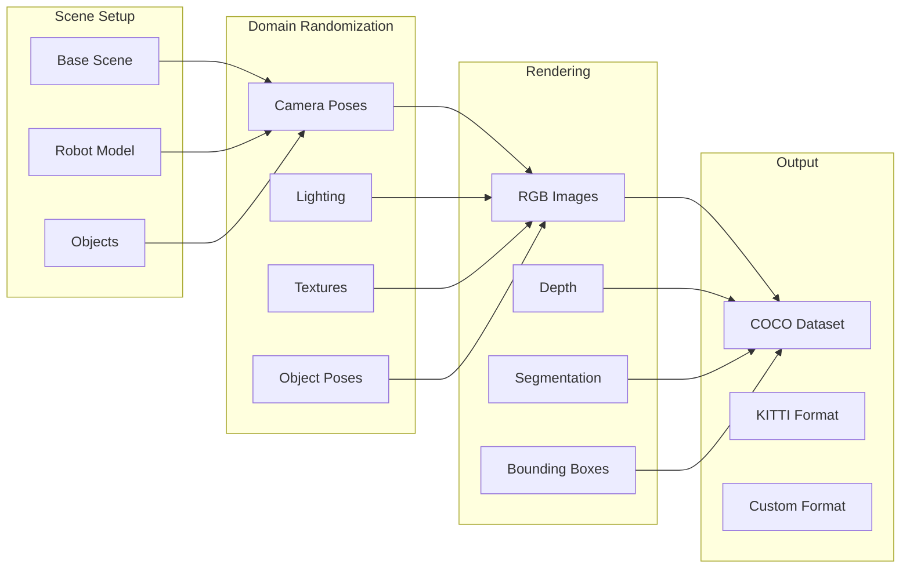

# Synthetic Data Generation

Training perception models requires massive amounts of labeled data. NVIDIA Isaac Sim's **Replicator** enables automatic generation of photorealistic, perfectly-labeled training data through domain randomization.

## Why Synthetic Data for Perception?

| Challenge with Real Data | Synthetic Data Solution |
|--------------------------|------------------------|
| Manual labeling is slow | Perfect automatic labels |
| Limited diversity | Infinite variation |
| Expensive to collect | Zero marginal cost |
| Safety concerns | Risk-free scenarios |
| Rare events are rare | Generate on demand |

## Synthetic Data Pipeline



## Domain Randomization Concept

**Domain randomization** varies simulation parameters during data generation:

- **Appearance**: Textures, colors, lighting
- **Geometry**: Object poses, camera positions
- **Physics**: Mass, friction variations
- **Distractors**: Random background objects

The goal: Train models robust enough to transfer to the real world by seeing every possible variation in simulation.

## Replicator Overview

**Replicator** is Isaac Sim's synthetic data generation framework:

```python
# Basic Replicator workflow
import omni.replicator.core as rep

# Define scene modifications
with rep.new_layer():
    # Randomize camera
    camera = rep.create.camera()
    rep.modify.pose(
        camera,
        position=rep.distribution.uniform([-2, -2, 1], [2, 2, 3]),
        look_at="/World/target"
    )

    # Randomize lighting
    light = rep.create.light(light_type="dome")
    rep.modify.attribute(
        light,
        intensity=rep.distribution.uniform(500, 1500)
    )

# Generate data
rep.orchestrator.run()
```

## Replicator Basic Randomization Script

Complete example for generating training data:

```python
#!/usr/bin/env python3
"""Synthetic data generation with Replicator."""

import omni.replicator.core as rep
from omni.isaac.kit import SimulationApp

simulation_app = SimulationApp({"headless": True})

# Scene setup
rep.settings.set_render_rtx_realtime()

# Create environment
with rep.new_layer():
    # Ground plane
    ground = rep.create.plane(
        scale=10,
        position=(0, 0, 0),
        semantics=[("class", "floor")]
    )

    # Target objects to detect
    cube = rep.create.cube(
        semantics=[("class", "cube")],
        position=(0, 0, 0.5),
        scale=0.2
    )

    sphere = rep.create.sphere(
        semantics=[("class", "sphere")],
        position=(1, 0, 0.3),
        scale=0.15
    )

    # Randomize object positions each frame
    with rep.trigger.on_frame():
        rep.modify.pose(
            cube,
            position=rep.distribution.uniform(
                (-1, -1, 0.5),
                (1, 1, 0.5)
            ),
            rotation=rep.distribution.uniform(
                (0, 0, 0),
                (0, 0, 360)
            )
        )

        rep.modify.pose(
            sphere,
            position=rep.distribution.uniform(
                (-1, -1, 0.3),
                (1, 1, 0.3)
            )
        )

# Camera setup with randomization
camera = rep.create.camera(
    position=(0, -3, 2),
    look_at=(0, 0, 0.5)
)

with rep.trigger.on_frame():
    rep.modify.pose(
        camera,
        position=rep.distribution.uniform(
            (-1, -3, 1.5),
            (1, -2, 3)
        ),
        look_at=(0, 0, 0.5)
    )

# Render settings
render_product = rep.create.render_product(camera, (640, 480))

# Writers for output data
writer = rep.WriterRegistry.get("BasicWriter")
writer.initialize(
    output_dir="./synthetic_data",
    rgb=True,
    bounding_box_2d_tight=True,
    semantic_segmentation=True,
    distance_to_camera=True
)
writer.attach([render_product])

# Generate 100 frames
for i in range(100):
    rep.orchestrator.step()
    print(f"Generated frame {i+1}/100")

simulation_app.close()
```

## Camera Placement and Variation

```python
# Multi-camera setup with domain randomization
cameras = []

# Ring of cameras around the scene
for i in range(8):
    angle = i * (360 / 8)
    cam = rep.create.camera(
        name=f"camera_{i}",
        focal_length=24.0
    )
    cameras.append(cam)

# Randomize camera intrinsics and extrinsics
with rep.trigger.on_frame():
    for cam in cameras:
        rep.modify.pose(
            cam,
            position=rep.distribution.uniform(
                (-3, -3, 1),
                (3, 3, 4)
            ),
            look_at=rep.distribution.uniform(
                (-0.5, -0.5, 0),
                (0.5, 0.5, 1)
            )
        )

        # Randomize focal length
        rep.modify.attribute(
            cam,
            focal_length=rep.distribution.uniform(18, 50)
        )
```

## Semantic Segmentation Setup

```python
# Define semantic classes
semantics_mapping = {
    "robot": 1,
    "floor": 2,
    "wall": 3,
    "object": 4,
    "human": 5,
}

# Apply semantics to objects
robot = rep.create.from_usd("/path/to/humanoid.usd")
rep.modify.semantics(robot, [("class", "robot")])

# Create objects with semantics
for i in range(10):
    obj = rep.create.cube(
        semantics=[("class", "object")],
        scale=rep.distribution.uniform(0.1, 0.3)
    )

# Configure segmentation writer
writer = rep.WriterRegistry.get("BasicWriter")
writer.initialize(
    output_dir="./segmentation_data",
    semantic_segmentation=True,
    colorize_semantic_segmentation=True,
    semantic_types=["class"]
)
```

## Dataset Export Configuration

### COCO Format Export

```python
# Export in COCO format for object detection
from omni.replicator.core import AnnotatorRegistry

# Register annotators
rgb_annot = AnnotatorRegistry.get_annotator("rgb")
bbox_annot = AnnotatorRegistry.get_annotator("bounding_box_2d_tight")

# COCO writer
coco_writer = rep.WriterRegistry.get("CocoWriter")
coco_writer.initialize(
    output_dir="./coco_dataset",
    semantic_types=["class"],
    image_output_format="png"
)
coco_writer.attach([render_product])
```

### KITTI Format Export

```python
# Export in KITTI format for autonomous driving style data
kitti_writer = rep.WriterRegistry.get("KittiWriter")
kitti_writer.initialize(
    output_dir="./kitti_dataset",
    semantic_types=["class"],
    bbox_height_threshold=10,  # Min bbox height in pixels
    fully_visible_threshold=0.9
)
kitti_writer.attach([render_product])
```

## Lighting Variation

```python
# Dome light for environment lighting
dome_light = rep.create.light(
    light_type="dome",
    rotation=(0, 0, 0)
)

# Directional light (sun)
sun = rep.create.light(
    light_type="distant",
    intensity=1000,
    color=(1.0, 0.95, 0.9)
)

# Randomize lighting per frame
with rep.trigger.on_frame():
    rep.modify.attribute(
        dome_light,
        intensity=rep.distribution.uniform(200, 800),
        texture=rep.distribution.choice([
            "/textures/hdri_sky_01.hdr",
            "/textures/hdri_indoor_01.hdr",
            "/textures/hdri_outdoor_01.hdr",
        ])
    )

    rep.modify.pose(
        sun,
        rotation=rep.distribution.uniform(
            (30, 0, 0),
            (60, 0, 360)
        )
    )

    rep.modify.attribute(
        sun,
        intensity=rep.distribution.uniform(500, 2000)
    )
```

:::tip Gazebo Fallback
For manual data collection in Gazebo:
```bash
# Record camera images
ros2 bag record /camera/image /camera/camera_info

# Save images from bag
ros2 run image_transport republish raw --ros-args \
  -r in:=/camera/image -r out:=/camera/image_republished

# Use rqt_image_view to save frames
rqt_image_view
```
Note: This requires manual labeling with tools like CVAT or LabelImg.
:::

## Summary

You've learned:
- **Domain randomization** creates robust training data
- **Replicator** automates synthetic data generation
- **Multiple annotation types**: RGB, depth, segmentation, bounding boxes
- **Standard formats**: COCO, KITTI for compatibility with ML pipelines

In the next section, we'll deploy GPU-accelerated perception with **Isaac ROS**.
