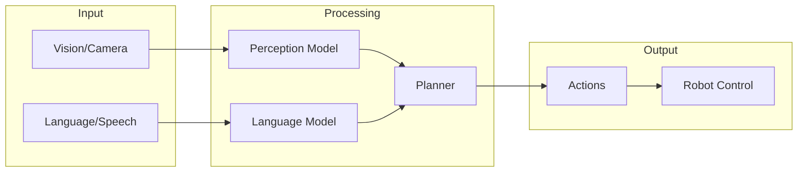
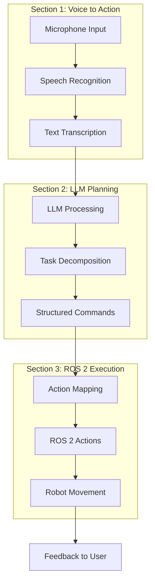

# Chapter 5: Vision-Language-Action Systems

This chapter explores the cutting-edge intersection of large language models (LLMs) and robotics. You'll learn to build voice-controlled robot systems that understand natural language commands, plan task sequences, and execute physical actions through ROS 2.

## Learning Objectives

By the end of this chapter, you will be able to:

- Process voice commands using OpenAI Whisper or local alternatives
- Design LLM prompts for robot task planning and decomposition
- Implement function calling patterns for structured robot commands
- Map natural language intents to ROS 2 actions
- Build complete voice-to-action pipelines
- Apply safety validation to LLM-generated robot commands

## What is Vision-Language-Action (VLA)?

Vision-Language-Action (VLA) represents a paradigm shift in robotics, where robots understand and act upon natural language instructions by combining:

- **Vision**: Perceiving the environment through cameras and sensors
- **Language**: Understanding human intent through speech and text
- **Action**: Executing physical movements to accomplish goals



## The Convergence of LLMs and Robotics

Large language models have transformed how robots can understand and respond to human instructions:

| Traditional Approach | LLM-Enhanced Approach |
|---------------------|----------------------|
| Fixed command vocabulary | Natural language understanding |
| Explicit programming for each task | Zero-shot task generalization |
| Brittle error handling | Contextual reasoning about failures |
| No explanation capability | Natural language feedback to users |

### Key Capabilities Enabled by LLMs

1. **Natural Language Understanding**: Process free-form voice commands like "go to the kitchen and bring me a glass of water"
2. **Task Decomposition**: Break complex instructions into actionable steps
3. **Contextual Reasoning**: Handle ambiguous commands using scene context
4. **Error Recovery**: Reason about failures and suggest alternatives
5. **Human Interaction**: Provide natural explanations of robot behavior

## Prerequisites

Before starting this chapter, ensure you have:

### Technical Requirements

- **Chapter 2 completed**: ROS 2 nodes, topics, services, and actions
- **Python 3.10+** with pip package manager
- **Audio hardware**: Microphone for voice capture (USB mic recommended)

### API Access (Choose One)

| Option | Requirements | Pros | Cons |
|--------|-------------|------|------|
| OpenAI API | API key, internet | Best accuracy, simple setup | Cost, latency, privacy |
| Local Whisper | 8GB+ RAM, optional GPU | Free, private, offline | Setup complexity, slower |
| Vosk | 2GB RAM | Very lightweight, offline | Lower accuracy |

### Python Dependencies

```bash
# Core dependencies
pip install openai pyaudio numpy

# For local Whisper
pip install openai-whisper torch

# For Vosk offline
pip install vosk sounddevice
```

:::warning Privacy and Safety Considerations

When building voice-controlled robots, consider these critical factors:

**Privacy Concerns**:
- Audio data sent to cloud APIs may be logged
- Consider local models for sensitive environments
- Implement wake word detection to avoid continuous listening

**Safety Concerns**:
- LLMs can hallucinate invalid or dangerous commands
- Always validate LLM outputs before execution
- Implement action bounds and safety constraints
- Never trust LLM output for safety-critical decisions

:::

## Chapter Structure

This chapter progresses through the complete voice-to-action pipeline:



### Section Overview

| Section | Focus | Key Topics |
|---------|-------|------------|
| [Voice to Action](./voice-to-action) | Speech Processing | Whisper API, local models, audio capture |
| [LLM Cognitive Planning](./llm-cognitive-planning) | Task Planning | Prompt engineering, function calling, safety |
| [NLP to ROS 2](./nlp-to-ros2) | Action Execution | Action mapping, feedback, error handling |

## What You'll Build

By the end of this chapter, you'll have a complete voice-controlled robot system:

```python
# High-level architecture preview
class VoiceControlledRobot:
    """Complete voice-to-action pipeline."""

    def __init__(self):
        self.speech_recognizer = WhisperRecognizer()
        self.task_planner = LLMTaskPlanner()
        self.action_executor = ROS2ActionExecutor()

    async def process_command(self, audio_data: bytes) -> str:
        # 1. Speech to text
        text = await self.speech_recognizer.transcribe(audio_data)

        # 2. Plan task sequence
        actions = await self.task_planner.plan(text)

        # 3. Execute actions
        results = await self.action_executor.execute(actions)

        return self.generate_response(results)
```

## Real-World Applications

VLA systems enable numerous practical applications:

- **Service Robots**: "Bring me the red cup from the kitchen"
- **Warehouse Automation**: "Move pallet A to zone 3"
- **Healthcare**: "Help me stand up and walk to the bathroom"
- **Manufacturing**: "Inspect the assembly line for defects"
- **Home Assistance**: "Clean the living room floor"

## Next Steps

Ready to build your voice-controlled robot? Start with [Voice to Action](./voice-to-action) to set up speech recognition.

---

:::tip Key Takeaway

VLA systems represent the future of human-robot interaction, but require careful attention to safety. Always validate LLM outputs and implement robust error handling before executing physical actions.

:::
