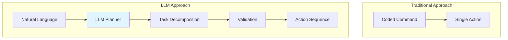
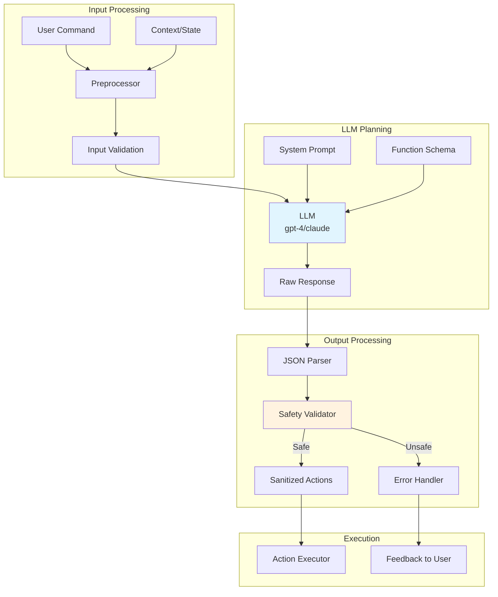
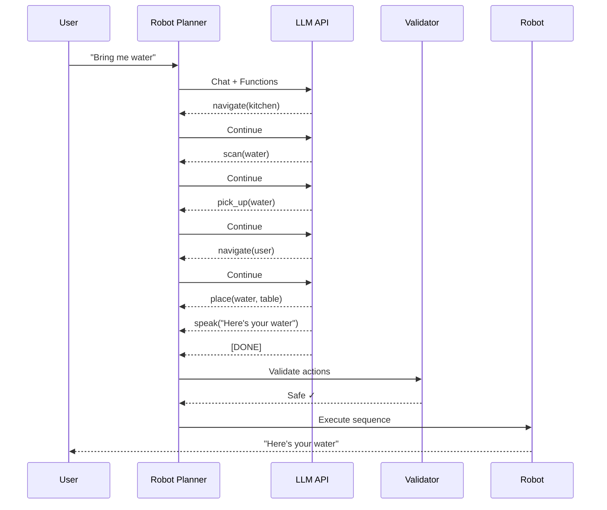

# LLM Cognitive Planning

Large language models serve as a cognitive layer for robots, translating natural language commands into structured action plans. This section covers prompt engineering, function calling, and safety validation for LLM-powered robot planning.

## LLM as Cognitive Layer for Robots

Traditional robot programming requires explicit commands for every action. LLMs enable natural language understanding and reasoning:



### What LLMs Enable

| Capability | Description | Example |
|-----------|-------------|---------|
| Intent Understanding | Parse ambiguous commands | "Get me something to drink" → navigate to kitchen, find beverage |
| Task Decomposition | Break complex tasks into steps | "Clean the room" → pick up items, vacuum, organize |
| Contextual Reasoning | Use scene context | "Put it over there" → resolve "it" and "there" from context |
| Error Recovery | Reason about failures | "Can't reach object" → suggest repositioning |
| Explanation | Describe actions | "I'm moving to the kitchen to find a cup" |

## System Prompt for Robot Planner

The system prompt defines the robot's capabilities and constraints:

```python
"""System prompt for humanoid robot task planner."""

ROBOT_PLANNER_PROMPT = """You are a task planner for a humanoid robot with the following capabilities:

## Robot Capabilities
- **Navigation**: Move to named locations (kitchen, living_room, bedroom, bathroom, office)
- **Manipulation**: Pick up and place objects within reach
- **Vision**: Detect and identify objects, read text, recognize people
- **Speech**: Speak to provide feedback to users

## Physical Constraints
- Maximum reach: 0.8 meters from base
- Cannot climb stairs or ladders
- Cannot open locked doors
- Maximum payload: 2 kg
- Battery life: 4 hours continuous operation

## Safety Rules (MUST FOLLOW)
1. Never approach humans closer than 0.5 meters without explicit permission
2. Never manipulate sharp objects, chemicals, or hot items
3. Stop immediately if any obstacle is detected in path
4. Never enter restricted areas (marked as off-limits)
5. Always announce actions before executing them

## Response Format
For each user command, respond with a JSON object containing:
1. "understood": boolean - whether you understood the command
2. "safe": boolean - whether the command can be executed safely
3. "actions": list of action objects with "type", "parameters", and "description"
4. "explanation": brief explanation for the user
5. "warnings": any safety concerns or limitations

If a command cannot be executed safely, set "safe" to false and explain why.

## Available Actions
- navigate(location: string) - Move to a named location
- pick_up(object: string) - Grasp an object
- place(object: string, location: string) - Put object at location
- speak(message: string) - Say something to the user
- scan(target: string) - Look for a specific object or person
- wait(seconds: number) - Pause for specified time

Example valid response:
{
    "understood": true,
    "safe": true,
    "actions": [
        {"type": "speak", "parameters": {"message": "I'll get that for you"}, "description": "Acknowledge request"},
        {"type": "navigate", "parameters": {"location": "kitchen"}, "description": "Move to kitchen"},
        {"type": "scan", "parameters": {"target": "red cup"}, "description": "Find the cup"},
        {"type": "pick_up", "parameters": {"object": "red cup"}, "description": "Grasp the cup"},
        {"type": "navigate", "parameters": {"location": "living_room"}, "description": "Return to user"},
        {"type": "place", "parameters": {"object": "red cup", "location": "table"}, "description": "Put cup on table"}
    ],
    "explanation": "I will go to the kitchen, find the red cup, and bring it to you.",
    "warnings": []
}
"""
```

## Function Calling Schema

Define structured function schemas for precise LLM output:

```python
"""Function calling schema for robot actions."""
import json
from typing import Literal

# OpenAI function calling format
ROBOT_FUNCTIONS = [
    {
        "name": "navigate",
        "description": "Move the robot to a named location in the environment",
        "parameters": {
            "type": "object",
            "properties": {
                "location": {
                    "type": "string",
                    "enum": ["kitchen", "living_room", "bedroom", "bathroom", "office", "entrance"],
                    "description": "Target location name"
                },
                "speed": {
                    "type": "string",
                    "enum": ["slow", "normal", "fast"],
                    "default": "normal",
                    "description": "Movement speed"
                }
            },
            "required": ["location"]
        }
    },
    {
        "name": "pick_up",
        "description": "Grasp and lift an object within reach",
        "parameters": {
            "type": "object",
            "properties": {
                "object": {
                    "type": "string",
                    "description": "Name or description of the object to pick up"
                },
                "grasp_type": {
                    "type": "string",
                    "enum": ["pinch", "power", "precision"],
                    "default": "power",
                    "description": "Type of grasp to use"
                }
            },
            "required": ["object"]
        }
    },
    {
        "name": "place",
        "description": "Put a held object at a specified location",
        "parameters": {
            "type": "object",
            "properties": {
                "object": {
                    "type": "string",
                    "description": "Name of the object being held"
                },
                "surface": {
                    "type": "string",
                    "description": "Target surface or location for placement"
                },
                "position": {
                    "type": "string",
                    "enum": ["center", "left", "right", "front", "back"],
                    "default": "center",
                    "description": "Position on the surface"
                }
            },
            "required": ["object", "surface"]
        }
    },
    {
        "name": "speak",
        "description": "Say a message to the user through the robot's speaker",
        "parameters": {
            "type": "object",
            "properties": {
                "message": {
                    "type": "string",
                    "description": "Text to speak"
                },
                "volume": {
                    "type": "string",
                    "enum": ["quiet", "normal", "loud"],
                    "default": "normal"
                }
            },
            "required": ["message"]
        }
    },
    {
        "name": "scan",
        "description": "Search for an object or person in the current area",
        "parameters": {
            "type": "object",
            "properties": {
                "target": {
                    "type": "string",
                    "description": "What to look for (object name, person name, or 'all')"
                },
                "rotation": {
                    "type": "number",
                    "minimum": 0,
                    "maximum": 360,
                    "default": 360,
                    "description": "Degrees to rotate while scanning"
                }
            },
            "required": ["target"]
        }
    },
    {
        "name": "wait",
        "description": "Pause execution for a specified duration",
        "parameters": {
            "type": "object",
            "properties": {
                "seconds": {
                    "type": "number",
                    "minimum": 0,
                    "maximum": 60,
                    "description": "Duration to wait in seconds"
                },
                "reason": {
                    "type": "string",
                    "description": "Reason for waiting (for logging)"
                }
            },
            "required": ["seconds"]
        }
    }
]
```

## Task Decomposition Example

Use the LLM to break down complex commands:

```python
"""LLM task planner with function calling."""
import openai
import json
from typing import List, Dict, Any

class LLMTaskPlanner:
    """Plan robot tasks using LLM function calling."""

    def __init__(self, model: str = "gpt-4o"):
        self.client = openai.OpenAI()
        self.model = model

    def plan(self, user_command: str, context: Dict = None) -> Dict[str, Any]:
        """
        Generate action plan from user command.

        Args:
            user_command: Natural language command
            context: Optional scene context (detected objects, robot state)

        Returns:
            Plan with actions, explanations, and safety status
        """
        messages = [
            {"role": "system", "content": ROBOT_PLANNER_PROMPT},
        ]

        # Add context if available
        if context:
            context_str = f"Current context: {json.dumps(context)}"
            messages.append({"role": "system", "content": context_str})

        messages.append({"role": "user", "content": user_command})

        response = self.client.chat.completions.create(
            model=self.model,
            messages=messages,
            response_format={"type": "json_object"},
            temperature=0.1,  # Low temperature for consistent planning
        )

        plan = json.loads(response.choices[0].message.content)
        return plan

    def plan_with_functions(
        self,
        user_command: str,
        context: Dict = None
    ) -> List[Dict]:
        """
        Generate action sequence using function calling.

        Returns list of function calls to execute.
        """
        messages = [
            {"role": "system", "content": "You are a robot task planner. Generate a sequence of function calls to accomplish the user's goal. Call functions in order."},
        ]

        if context:
            messages.append({
                "role": "system",
                "content": f"Robot state: {json.dumps(context)}"
            })

        messages.append({"role": "user", "content": user_command})

        # Collect all function calls
        actions = []
        max_calls = 10  # Safety limit

        while len(actions) < max_calls:
            response = self.client.chat.completions.create(
                model=self.model,
                messages=messages,
                tools=[{"type": "function", "function": f} for f in ROBOT_FUNCTIONS],
                tool_choice="auto"
            )

            choice = response.choices[0]

            # Check if done
            if choice.finish_reason == "stop":
                break

            # Process function calls
            if choice.message.tool_calls:
                for tool_call in choice.message.tool_calls:
                    action = {
                        "function": tool_call.function.name,
                        "arguments": json.loads(tool_call.function.arguments),
                        "id": tool_call.id
                    }
                    actions.append(action)

                    # Add to messages for multi-step planning
                    messages.append(choice.message)
                    messages.append({
                        "role": "tool",
                        "tool_call_id": tool_call.id,
                        "content": "executed"
                    })
            else:
                break

        return actions

# Usage example
planner = LLMTaskPlanner()

# Simple command
plan = planner.plan("Bring me a glass of water from the kitchen")
print(json.dumps(plan, indent=2))

# With context
context = {
    "location": "living_room",
    "nearby_objects": ["remote", "book", "phone"],
    "battery": 85,
    "holding": None
}
plan = planner.plan(
    "Find my phone and bring it here",
    context=context
)
```

## Safety Validation Code

Always validate LLM outputs before execution:

```python
"""Safety validation for LLM-generated robot commands."""
from dataclasses import dataclass
from typing import List, Optional, Tuple
import re

@dataclass
class ValidationResult:
    """Result of safety validation."""
    is_safe: bool
    errors: List[str]
    warnings: List[str]
    sanitized_actions: Optional[List[dict]] = None

class SafetyValidator:
    """Validate LLM-generated robot commands for safety."""

    # Forbidden items - never manipulate
    FORBIDDEN_OBJECTS = {
        "knife", "scissors", "blade", "chemical", "poison",
        "medication", "medicine", "drug", "acid", "fire",
        "match", "lighter", "gun", "weapon", "explosive"
    }

    # Restricted locations
    RESTRICTED_LOCATIONS = {
        "outside", "roof", "basement", "garage",
        "storage", "utility_room"
    }

    # Valid locations
    VALID_LOCATIONS = {
        "kitchen", "living_room", "bedroom", "bathroom",
        "office", "entrance", "dining_room", "hallway"
    }

    # Maximum values
    MAX_ACTIONS = 20
    MAX_WAIT_TIME = 60  # seconds
    MIN_APPROACH_DISTANCE = 0.5  # meters from humans

    def validate_plan(self, plan: dict) -> ValidationResult:
        """
        Validate a complete action plan.

        Args:
            plan: LLM-generated plan with actions

        Returns:
            ValidationResult with safety status
        """
        errors = []
        warnings = []

        # Check plan structure
        if not isinstance(plan, dict):
            return ValidationResult(False, ["Invalid plan format"], [])

        actions = plan.get("actions", [])

        # Check action count
        if len(actions) > self.MAX_ACTIONS:
            errors.append(f"Too many actions: {len(actions)} > {self.MAX_ACTIONS}")

        # Validate each action
        sanitized = []
        for i, action in enumerate(actions):
            result = self._validate_action(action, i)
            if result[0]:  # has errors
                errors.extend(result[0])
            if result[1]:  # has warnings
                warnings.extend(result[1])
            if result[2]:  # sanitized action
                sanitized.append(result[2])

        is_safe = len(errors) == 0

        return ValidationResult(
            is_safe=is_safe,
            errors=errors,
            warnings=warnings,
            sanitized_actions=sanitized if is_safe else None
        )

    def _validate_action(
        self,
        action: dict,
        index: int
    ) -> Tuple[List[str], List[str], Optional[dict]]:
        """Validate a single action."""
        errors = []
        warnings = []

        action_type = action.get("type", "")
        params = action.get("parameters", {})

        # Validate based on action type
        if action_type == "navigate":
            location = params.get("location", "").lower()
            if location in self.RESTRICTED_LOCATIONS:
                errors.append(f"Action {index}: Cannot navigate to restricted location '{location}'")
            elif location not in self.VALID_LOCATIONS:
                warnings.append(f"Action {index}: Unknown location '{location}'")

        elif action_type == "pick_up":
            obj = params.get("object", "").lower()
            if self._contains_forbidden(obj):
                errors.append(f"Action {index}: Cannot manipulate forbidden object '{obj}'")

        elif action_type == "place":
            obj = params.get("object", "").lower()
            if self._contains_forbidden(obj):
                errors.append(f"Action {index}: Cannot manipulate forbidden object '{obj}'")

        elif action_type == "wait":
            seconds = params.get("seconds", 0)
            if seconds > self.MAX_WAIT_TIME:
                warnings.append(f"Action {index}: Wait time {seconds}s exceeds max, capping to {self.MAX_WAIT_TIME}s")
                params["seconds"] = self.MAX_WAIT_TIME

        elif action_type == "speak":
            message = params.get("message", "")
            # Check for potentially harmful messages
            if self._contains_harmful_language(message):
                errors.append(f"Action {index}: Message contains inappropriate content")

        # Return sanitized action if no errors
        sanitized = action.copy() if not errors else None
        return errors, warnings, sanitized

    def _contains_forbidden(self, text: str) -> bool:
        """Check if text contains forbidden object names."""
        text_lower = text.lower()
        return any(forbidden in text_lower for forbidden in self.FORBIDDEN_OBJECTS)

    def _contains_harmful_language(self, text: str) -> bool:
        """Check for harmful or inappropriate language."""
        # Simple check - in production use content moderation API
        harmful_patterns = [
            r"\b(kill|destroy|hurt|harm|attack)\b",
        ]
        return any(re.search(p, text.lower()) for p in harmful_patterns)

# Usage
validator = SafetyValidator()

# Test with a dangerous command
dangerous_plan = {
    "actions": [
        {"type": "navigate", "parameters": {"location": "kitchen"}},
        {"type": "pick_up", "parameters": {"object": "knife"}},
        {"type": "navigate", "parameters": {"location": "living_room"}}
    ]
}

result = validator.validate_plan(dangerous_plan)
print(f"Safe: {result.is_safe}")
print(f"Errors: {result.errors}")
# Output: Safe: False
# Output: Errors: ["Action 1: Cannot manipulate forbidden object 'knife'"]
```

## Error Handling for Invalid Commands

Handle cases where LLM generates invalid or ambiguous outputs:

```python
"""Error handling for LLM robot planning."""
from enum import Enum
from typing import Optional
import json

class PlanningError(Enum):
    """Types of planning errors."""
    PARSE_ERROR = "parse_error"
    AMBIGUOUS_COMMAND = "ambiguous_command"
    IMPOSSIBLE_TASK = "impossible_task"
    SAFETY_VIOLATION = "safety_violation"
    CONTEXT_MISSING = "context_missing"

class RobustTaskPlanner:
    """Task planner with comprehensive error handling."""

    def __init__(self, base_planner: LLMTaskPlanner, validator: SafetyValidator):
        self.planner = base_planner
        self.validator = validator

    def plan_with_error_handling(
        self,
        user_command: str,
        context: dict = None,
        max_retries: int = 2
    ) -> dict:
        """
        Plan with comprehensive error handling.

        Returns:
            Dict with either valid plan or error information
        """
        # Check for empty or very short commands
        if not user_command or len(user_command.strip()) < 3:
            return self._error_response(
                PlanningError.AMBIGUOUS_COMMAND,
                "Command too short to understand",
                suggestion="Please provide a more detailed command."
            )

        # Attempt planning with retries
        last_error = None
        for attempt in range(max_retries + 1):
            try:
                # Generate plan
                plan = self.planner.plan(user_command, context)

                # Check if understood
                if not plan.get("understood", False):
                    return self._error_response(
                        PlanningError.AMBIGUOUS_COMMAND,
                        plan.get("explanation", "Could not understand command"),
                        suggestion="Try rephrasing your command."
                    )

                # Check if safe
                if not plan.get("safe", True):
                    return self._error_response(
                        PlanningError.SAFETY_VIOLATION,
                        plan.get("explanation", "Command violates safety rules"),
                        suggestion="This action cannot be performed for safety reasons."
                    )

                # Validate actions
                validation = self.validator.validate_plan(plan)
                if not validation.is_safe:
                    if attempt < max_retries:
                        # Retry with clarification
                        user_command = f"{user_command} (Note: avoid dangerous objects and restricted areas)"
                        continue
                    return self._error_response(
                        PlanningError.SAFETY_VIOLATION,
                        "; ".join(validation.errors),
                        suggestion="Please modify your request to avoid unsafe actions."
                    )

                # Check for empty action list
                if not plan.get("actions"):
                    return self._error_response(
                        PlanningError.IMPOSSIBLE_TASK,
                        "No actions could be planned for this command",
                        suggestion="This task may not be possible with current capabilities."
                    )

                # Success - return validated plan
                plan["validation_warnings"] = validation.warnings
                plan["sanitized_actions"] = validation.sanitized_actions
                return {"success": True, "plan": plan}

            except json.JSONDecodeError as e:
                last_error = f"Failed to parse LLM response: {e}"
            except Exception as e:
                last_error = f"Planning error: {e}"

        # All retries exhausted
        return self._error_response(
            PlanningError.PARSE_ERROR,
            last_error or "Unknown error",
            suggestion="Please try again or rephrase your command."
        )

    def _error_response(
        self,
        error_type: PlanningError,
        message: str,
        suggestion: str
    ) -> dict:
        """Create standardized error response."""
        return {
            "success": False,
            "error": {
                "type": error_type.value,
                "message": message,
                "suggestion": suggestion
            },
            "speak_message": f"I'm sorry, {suggestion}"
        }

# Usage
planner = LLMTaskPlanner()
validator = SafetyValidator()
robust_planner = RobustTaskPlanner(planner, validator)

result = robust_planner.plan_with_error_handling(
    "Get me the knife from the kitchen",
    context={"location": "living_room"}
)

if not result["success"]:
    print(f"Error: {result['error']['message']}")
    print(f"Suggestion: {result['error']['suggestion']}")
```

## LLM Planning Architecture



## Function Calling Flow



## Local Model Alternatives

For privacy or offline operation, use local LLMs:

### Using Ollama with Llama 3

```python
"""Local LLM planning with Ollama."""
import requests
import json

class LocalLLMPlanner:
    """Task planner using local Ollama models."""

    def __init__(
        self,
        model: str = "llama3",
        host: str = "http://localhost:11434"
    ):
        self.model = model
        self.host = host

    def plan(self, user_command: str, context: dict = None) -> dict:
        """Generate plan using local LLM."""
        system_prompt = ROBOT_PLANNER_PROMPT

        if context:
            system_prompt += f"\n\nCurrent context: {json.dumps(context)}"

        response = requests.post(
            f"{self.host}/api/generate",
            json={
                "model": self.model,
                "prompt": f"{system_prompt}\n\nUser command: {user_command}\n\nRespond with JSON:",
                "stream": False,
                "format": "json"
            }
        )

        result = response.json()
        return json.loads(result["response"])

# Usage
local_planner = LocalLLMPlanner(model="llama3:8b")
plan = local_planner.plan("Go to the kitchen and look for a cup")
```

### Model Comparison

| Model | Size | Speed | Reasoning | Offline |
|-------|------|-------|-----------|---------|
| GPT-4o | N/A | Fast | Excellent | No |
| Claude 3 | N/A | Fast | Excellent | No |
| Llama 3 8B | 8GB | Medium | Good | Yes |
| Mistral 7B | 7GB | Fast | Good | Yes |
| Phi-3 | 4GB | Very Fast | Moderate | Yes |

## Next Steps

Now that you can plan tasks with LLMs, proceed to [NLP to ROS 2](./nlp-to-ros2) to learn how to execute these plans through ROS 2 actions.

---

:::warning LLM Safety Reminder

LLMs can generate plausible-looking but dangerous commands. Always:
1. Validate all outputs against safety rules
2. Use allowlists for locations and objects
3. Implement physical safety constraints in the robot firmware
4. Never trust LLM output for safety-critical decisions

The LLM is a planning assistant, not a safety system.

:::
