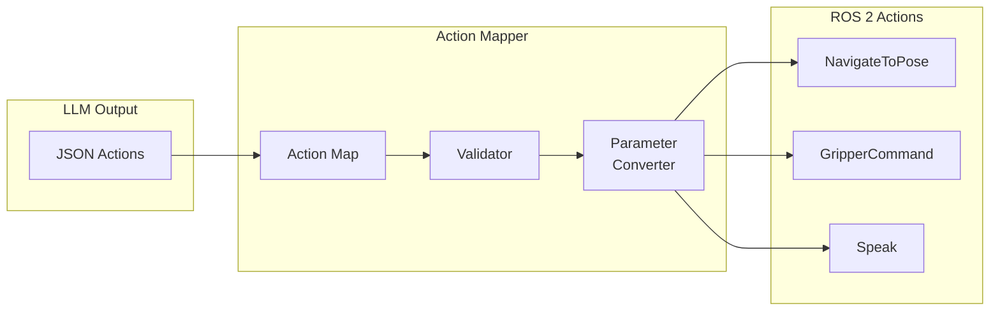
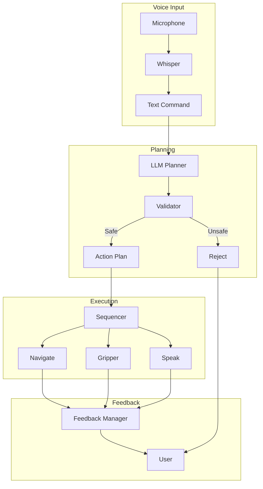
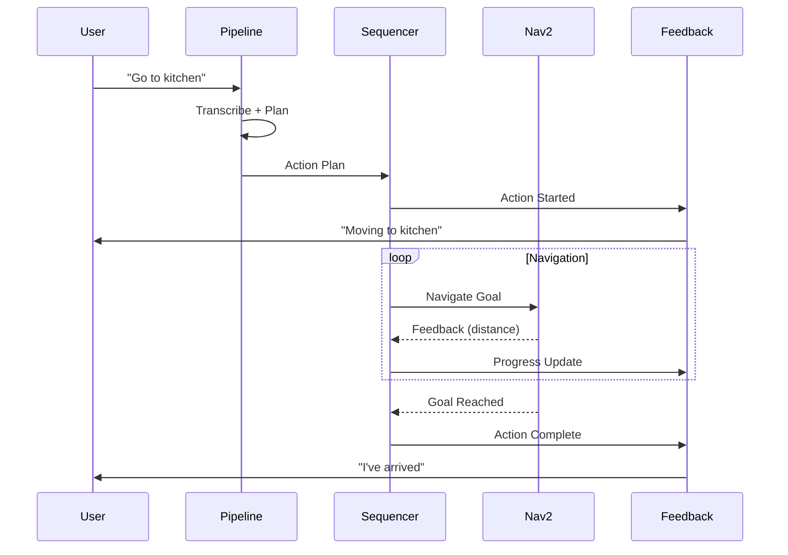

# NLP to ROS 2

Bridge the gap between LLM-generated plans and physical robot execution. This section covers action mapping, ROS 2 action clients, feedback loops, and multi-step task execution.

## Mapping LLM Output to ROS 2 Actions

Transform structured LLM outputs into ROS 2 action goals:



### Action Mapping Dictionary

```python
"""Map LLM action names to ROS 2 action types."""
from dataclasses import dataclass
from typing import Dict, Any, Callable, Optional
from enum import Enum

# ROS 2 imports
from nav2_msgs.action import NavigateToPose
from control_msgs.action import GripperCommand
from std_srvs.srv import Trigger

class ActionType(Enum):
    """Supported action types."""
    NAVIGATE = "navigate"
    PICK_UP = "pick_up"
    PLACE = "place"
    SPEAK = "speak"
    SCAN = "scan"
    WAIT = "wait"

@dataclass
class ActionMapping:
    """Mapping from LLM action to ROS 2 action."""
    ros2_action_type: str
    action_name: str  # ROS 2 action server name
    parameter_converter: Callable[[Dict], Any]
    timeout: float = 60.0
    preemptable: bool = True

# Location coordinates (from map/SLAM)
LOCATION_COORDS = {
    "kitchen": {"x": 5.0, "y": 2.0, "theta": 0.0},
    "living_room": {"x": 0.0, "y": 0.0, "theta": 0.0},
    "bedroom": {"x": -3.0, "y": 4.0, "theta": 1.57},
    "bathroom": {"x": -3.0, "y": -2.0, "theta": 3.14},
    "office": {"x": 5.0, "y": -3.0, "theta": -1.57},
    "entrance": {"x": 0.0, "y": -5.0, "theta": 0.0},
}

def convert_navigate_params(params: Dict) -> NavigateToPose.Goal:
    """Convert navigate parameters to Nav2 goal."""
    from geometry_msgs.msg import PoseStamped
    from nav2_msgs.action import NavigateToPose

    location = params.get("location", "living_room")
    coords = LOCATION_COORDS.get(location, LOCATION_COORDS["living_room"])

    goal = NavigateToPose.Goal()
    goal.pose = PoseStamped()
    goal.pose.header.frame_id = "map"
    goal.pose.pose.position.x = coords["x"]
    goal.pose.pose.position.y = coords["y"]

    # Convert theta to quaternion
    import math
    theta = coords["theta"]
    goal.pose.pose.orientation.z = math.sin(theta / 2)
    goal.pose.pose.orientation.w = math.cos(theta / 2)

    return goal

def convert_gripper_params(params: Dict) -> GripperCommand.Goal:
    """Convert pick_up/place parameters to gripper goal."""
    goal = GripperCommand.Goal()

    action = params.get("action", "close")
    if action == "close":
        goal.command.position = 0.0  # Closed
        goal.command.max_effort = 50.0
    else:
        goal.command.position = 0.08  # Open
        goal.command.max_effort = 10.0

    return goal

# Action mapping registry
ACTION_MAPPINGS: Dict[ActionType, ActionMapping] = {
    ActionType.NAVIGATE: ActionMapping(
        ros2_action_type="nav2_msgs/action/NavigateToPose",
        action_name="/navigate_to_pose",
        parameter_converter=convert_navigate_params,
        timeout=120.0,
        preemptable=True
    ),
    ActionType.PICK_UP: ActionMapping(
        ros2_action_type="control_msgs/action/GripperCommand",
        action_name="/gripper_controller/gripper_cmd",
        parameter_converter=convert_gripper_params,
        timeout=30.0,
        preemptable=False
    ),
    ActionType.PLACE: ActionMapping(
        ros2_action_type="control_msgs/action/GripperCommand",
        action_name="/gripper_controller/gripper_cmd",
        parameter_converter=convert_gripper_params,
        timeout=30.0,
        preemptable=False
    ),
}
```

## ROS 2 Action Client for Navigation

Implement a robust action client for Nav2 navigation:

```python
"""ROS 2 action client for navigation."""
import rclpy
from rclpy.node import Node
from rclpy.action import ActionClient
from rclpy.action.client import ClientGoalHandle
from action_msgs.msg import GoalStatus

from nav2_msgs.action import NavigateToPose
from geometry_msgs.msg import PoseStamped

from typing import Callable, Optional
import asyncio

class NavigationClient(Node):
    """Action client for Nav2 navigation."""

    def __init__(self):
        super().__init__("navigation_client")

        self._action_client = ActionClient(
            self,
            NavigateToPose,
            "navigate_to_pose"
        )

        self._goal_handle: Optional[ClientGoalHandle] = None
        self._result_future = None

        # Callbacks
        self._feedback_callback: Optional[Callable] = None
        self._result_callback: Optional[Callable] = None

        self.get_logger().info("Navigation client initialized")

    async def navigate_to_pose(
        self,
        x: float,
        y: float,
        theta: float = 0.0,
        frame_id: str = "map",
        feedback_callback: Optional[Callable] = None,
        timeout: float = 120.0
    ) -> bool:
        """
        Navigate to a pose.

        Args:
            x, y: Target position in meters
            theta: Target orientation in radians
            frame_id: Reference frame
            feedback_callback: Called with navigation feedback
            timeout: Maximum time for navigation

        Returns:
            True if navigation succeeded
        """
        # Wait for action server
        if not self._action_client.wait_for_server(timeout_sec=10.0):
            self.get_logger().error("Navigation action server not available")
            return False

        # Create goal
        goal = NavigateToPose.Goal()
        goal.pose = PoseStamped()
        goal.pose.header.frame_id = frame_id
        goal.pose.header.stamp = self.get_clock().now().to_msg()
        goal.pose.pose.position.x = x
        goal.pose.pose.position.y = y

        # Convert theta to quaternion
        import math
        goal.pose.pose.orientation.z = math.sin(theta / 2)
        goal.pose.pose.orientation.w = math.cos(theta / 2)

        self._feedback_callback = feedback_callback

        # Send goal
        self.get_logger().info(f"Navigating to ({x:.2f}, {y:.2f})")

        send_goal_future = self._action_client.send_goal_async(
            goal,
            feedback_callback=self._handle_feedback
        )

        # Wait for goal acceptance
        self._goal_handle = await send_goal_future

        if not self._goal_handle.accepted:
            self.get_logger().warn("Navigation goal rejected")
            return False

        self.get_logger().info("Navigation goal accepted")

        # Wait for result
        result_future = self._goal_handle.get_result_async()

        try:
            result = await asyncio.wait_for(
                asyncio.wrap_future(result_future),
                timeout=timeout
            )

            if result.status == GoalStatus.STATUS_SUCCEEDED:
                self.get_logger().info("Navigation succeeded")
                return True
            else:
                self.get_logger().warn(f"Navigation failed with status: {result.status}")
                return False

        except asyncio.TimeoutError:
            self.get_logger().error("Navigation timeout")
            await self.cancel_navigation()
            return False

    def _handle_feedback(self, feedback_msg):
        """Process navigation feedback."""
        feedback = feedback_msg.feedback

        # Extract useful info
        current_pose = feedback.current_pose.pose
        distance = feedback.distance_remaining

        self.get_logger().debug(
            f"Distance remaining: {distance:.2f}m"
        )

        if self._feedback_callback:
            self._feedback_callback({
                "distance_remaining": distance,
                "current_x": current_pose.position.x,
                "current_y": current_pose.position.y,
            })

    async def cancel_navigation(self) -> bool:
        """Cancel current navigation goal."""
        if self._goal_handle is None:
            return True

        self.get_logger().info("Cancelling navigation")
        cancel_future = self._goal_handle.cancel_goal_async()
        cancel_result = await cancel_future

        return cancel_result.goals_canceling > 0

    def navigate_to_location(
        self,
        location: str,
        feedback_callback: Optional[Callable] = None
    ):
        """Navigate to a named location."""
        coords = LOCATION_COORDS.get(location)
        if not coords:
            self.get_logger().error(f"Unknown location: {location}")
            return False

        return self.navigate_to_pose(
            coords["x"],
            coords["y"],
            coords["theta"],
            feedback_callback=feedback_callback
        )
```

## Feedback Callback Implementation

Provide real-time feedback to users during action execution:

```python
"""Feedback handling for robot actions."""
import rclpy
from rclpy.node import Node
from std_msgs.msg import String

from typing import Dict, List, Callable
from dataclasses import dataclass
from enum import Enum
import json

class ActionStatus(Enum):
    """Action execution status."""
    PENDING = "pending"
    EXECUTING = "executing"
    SUCCEEDED = "succeeded"
    FAILED = "failed"
    CANCELLED = "cancelled"

@dataclass
class ActionFeedback:
    """Feedback data for an action."""
    action_id: str
    action_type: str
    status: ActionStatus
    progress: float  # 0.0 to 1.0
    message: str
    details: Dict = None

class FeedbackManager(Node):
    """Manage and publish action feedback."""

    def __init__(self):
        super().__init__("feedback_manager")

        # Publisher for user feedback
        self.feedback_pub = self.create_publisher(
            String,
            "action_feedback",
            10
        )

        # Publisher for spoken feedback
        self.speech_pub = self.create_publisher(
            String,
            "robot_speech",
            10
        )

        # Track active actions
        self.active_actions: Dict[str, ActionFeedback] = {}

        # Feedback message templates
        self.templates = {
            ActionType.NAVIGATE: {
                "start": "Moving to {location}",
                "progress": "On my way, {distance:.1f} meters remaining",
                "success": "I've arrived at {location}",
                "failure": "I couldn't reach {location}: {reason}"
            },
            ActionType.PICK_UP: {
                "start": "Reaching for {object}",
                "progress": "Grasping {object}",
                "success": "I've picked up {object}",
                "failure": "I couldn't pick up {object}: {reason}"
            },
            ActionType.SCAN: {
                "start": "Looking for {target}",
                "progress": "Scanning area...",
                "success": "I found {target}",
                "failure": "I couldn't find {target}"
            }
        }

    def start_action(
        self,
        action_id: str,
        action_type: ActionType,
        parameters: Dict
    ) -> None:
        """Register and announce action start."""
        feedback = ActionFeedback(
            action_id=action_id,
            action_type=action_type.value,
            status=ActionStatus.EXECUTING,
            progress=0.0,
            message=self._format_message(action_type, "start", parameters),
            details=parameters
        )

        self.active_actions[action_id] = feedback
        self._publish_feedback(feedback)
        self._speak(feedback.message)

    def update_progress(
        self,
        action_id: str,
        progress: float,
        details: Dict = None
    ) -> None:
        """Update action progress."""
        if action_id not in self.active_actions:
            return

        feedback = self.active_actions[action_id]
        feedback.progress = progress

        if details:
            feedback.details.update(details)
            action_type = ActionType(feedback.action_type)
            feedback.message = self._format_message(
                action_type, "progress", feedback.details
            )

        self._publish_feedback(feedback)

    def complete_action(
        self,
        action_id: str,
        success: bool,
        reason: str = None
    ) -> None:
        """Mark action as complete."""
        if action_id not in self.active_actions:
            return

        feedback = self.active_actions[action_id]
        feedback.status = ActionStatus.SUCCEEDED if success else ActionStatus.FAILED
        feedback.progress = 1.0 if success else feedback.progress

        if reason:
            feedback.details["reason"] = reason

        action_type = ActionType(feedback.action_type)
        template_key = "success" if success else "failure"
        feedback.message = self._format_message(
            action_type, template_key, feedback.details
        )

        self._publish_feedback(feedback)
        self._speak(feedback.message)

        # Remove from active
        del self.active_actions[action_id]

    def _format_message(
        self,
        action_type: ActionType,
        phase: str,
        params: Dict
    ) -> str:
        """Format feedback message from template."""
        templates = self.templates.get(action_type, {})
        template = templates.get(phase, "Action {phase}")

        try:
            return template.format(**params, phase=phase)
        except KeyError:
            return f"Action {action_type.value}: {phase}"

    def _publish_feedback(self, feedback: ActionFeedback) -> None:
        """Publish feedback to topic."""
        msg = String()
        msg.data = json.dumps({
            "action_id": feedback.action_id,
            "type": feedback.action_type,
            "status": feedback.status.value,
            "progress": feedback.progress,
            "message": feedback.message
        })
        self.feedback_pub.publish(msg)

    def _speak(self, message: str) -> None:
        """Publish speech message."""
        msg = String()
        msg.data = message
        self.speech_pub.publish(msg)
```

## Multi-Action Sequencer Node

Execute sequences of actions from LLM plans:

```python
"""Multi-action sequencer for executing LLM plans."""
import rclpy
from rclpy.node import Node
from rclpy.callback_groups import ReentrantCallbackGroup
from rclpy.executors import MultiThreadedExecutor

from std_msgs.msg import String

import json
import asyncio
from typing import List, Dict, Optional
from dataclasses import dataclass
from enum import Enum
import uuid

class SequenceStatus(Enum):
    """Status of action sequence."""
    IDLE = "idle"
    RUNNING = "running"
    PAUSED = "paused"
    COMPLETED = "completed"
    FAILED = "failed"
    CANCELLED = "cancelled"

@dataclass
class ActionResult:
    """Result of a single action."""
    action_id: str
    success: bool
    error: Optional[str] = None
    data: Optional[Dict] = None

class ActionSequencer(Node):
    """Execute sequences of robot actions."""

    def __init__(self):
        super().__init__("action_sequencer")

        # Callback group for concurrent operations
        self.callback_group = ReentrantCallbackGroup()

        # Action clients
        self.nav_client = NavigationClient()
        self.feedback_manager = FeedbackManager()

        # Sequence state
        self.current_sequence: List[Dict] = []
        self.current_index: int = 0
        self.sequence_status: SequenceStatus = SequenceStatus.IDLE
        self.sequence_id: Optional[str] = None

        # Subscribers
        self.plan_sub = self.create_subscription(
            String,
            "action_plan",
            self.plan_callback,
            10,
            callback_group=self.callback_group
        )

        self.control_sub = self.create_subscription(
            String,
            "sequence_control",
            self.control_callback,
            10,
            callback_group=self.callback_group
        )

        # Publishers
        self.status_pub = self.create_publisher(
            String,
            "sequence_status",
            10
        )

        self.get_logger().info("Action sequencer ready")

    def plan_callback(self, msg: String) -> None:
        """Handle incoming action plan."""
        try:
            plan = json.loads(msg.data)
            actions = plan.get("actions", [])

            if not actions:
                self.get_logger().warn("Received empty action plan")
                return

            # Start new sequence
            asyncio.create_task(self.execute_sequence(actions))

        except json.JSONDecodeError as e:
            self.get_logger().error(f"Invalid plan JSON: {e}")

    def control_callback(self, msg: String) -> None:
        """Handle sequence control commands."""
        command = msg.data.lower()

        if command == "pause":
            self.pause_sequence()
        elif command == "resume":
            self.resume_sequence()
        elif command == "cancel":
            self.cancel_sequence()

    async def execute_sequence(
        self,
        actions: List[Dict]
    ) -> List[ActionResult]:
        """
        Execute a sequence of actions.

        Args:
            actions: List of action dictionaries from LLM

        Returns:
            List of results for each action
        """
        self.current_sequence = actions
        self.current_index = 0
        self.sequence_status = SequenceStatus.RUNNING
        self.sequence_id = str(uuid.uuid4())[:8]

        results = []

        self.get_logger().info(
            f"Starting sequence {self.sequence_id} with {len(actions)} actions"
        )
        self._publish_status()

        for i, action in enumerate(actions):
            self.current_index = i

            # Check for pause/cancel
            while self.sequence_status == SequenceStatus.PAUSED:
                await asyncio.sleep(0.1)

            if self.sequence_status == SequenceStatus.CANCELLED:
                self.get_logger().info("Sequence cancelled")
                break

            # Execute action
            action_id = f"{self.sequence_id}-{i}"
            result = await self._execute_action(action_id, action)
            results.append(result)

            if not result.success:
                self.get_logger().error(
                    f"Action {i} failed: {result.error}"
                )
                self.sequence_status = SequenceStatus.FAILED
                break

        if self.sequence_status == SequenceStatus.RUNNING:
            self.sequence_status = SequenceStatus.COMPLETED
            self.get_logger().info("Sequence completed successfully")

        self._publish_status()
        return results

    async def _execute_action(
        self,
        action_id: str,
        action: Dict
    ) -> ActionResult:
        """Execute a single action."""
        action_type = action.get("type", "")
        params = action.get("parameters", {})

        self.get_logger().info(f"Executing: {action_type} with {params}")

        # Start feedback
        try:
            at = ActionType(action_type)
            self.feedback_manager.start_action(action_id, at, params)
        except ValueError:
            pass

        try:
            if action_type == "navigate":
                success = await self._execute_navigate(action_id, params)
            elif action_type == "pick_up":
                success = await self._execute_pick_up(action_id, params)
            elif action_type == "place":
                success = await self._execute_place(action_id, params)
            elif action_type == "speak":
                success = await self._execute_speak(action_id, params)
            elif action_type == "scan":
                success = await self._execute_scan(action_id, params)
            elif action_type == "wait":
                success = await self._execute_wait(action_id, params)
            else:
                return ActionResult(
                    action_id=action_id,
                    success=False,
                    error=f"Unknown action type: {action_type}"
                )

            self.feedback_manager.complete_action(action_id, success)
            return ActionResult(action_id=action_id, success=success)

        except Exception as e:
            error = str(e)
            self.feedback_manager.complete_action(action_id, False, error)
            return ActionResult(action_id=action_id, success=False, error=error)

    async def _execute_navigate(
        self,
        action_id: str,
        params: Dict
    ) -> bool:
        """Execute navigation action."""
        location = params.get("location")

        def feedback_cb(fb):
            self.feedback_manager.update_progress(
                action_id,
                progress=max(0, 1 - fb["distance_remaining"] / 10),
                details=fb
            )

        return await self.nav_client.navigate_to_location(
            location,
            feedback_callback=feedback_cb
        )

    async def _execute_pick_up(
        self,
        action_id: str,
        params: Dict
    ) -> bool:
        """Execute pick up action."""
        # Implement gripper control
        # This is a placeholder - real implementation depends on hardware
        await asyncio.sleep(2.0)  # Simulate gripper action
        return True

    async def _execute_place(
        self,
        action_id: str,
        params: Dict
    ) -> bool:
        """Execute place action."""
        await asyncio.sleep(2.0)  # Simulate gripper action
        return True

    async def _execute_speak(
        self,
        action_id: str,
        params: Dict
    ) -> bool:
        """Execute speak action."""
        message = params.get("message", "")
        msg = String()
        msg.data = message
        # Publish to TTS node
        self.feedback_manager._speak(message)
        return True

    async def _execute_scan(
        self,
        action_id: str,
        params: Dict
    ) -> bool:
        """Execute scan/search action."""
        # Implement vision-based search
        await asyncio.sleep(3.0)  # Simulate scanning
        return True

    async def _execute_wait(
        self,
        action_id: str,
        params: Dict
    ) -> bool:
        """Execute wait action."""
        seconds = params.get("seconds", 1)
        await asyncio.sleep(seconds)
        return True

    def pause_sequence(self) -> None:
        """Pause current sequence."""
        if self.sequence_status == SequenceStatus.RUNNING:
            self.sequence_status = SequenceStatus.PAUSED
            self.get_logger().info("Sequence paused")
            self._publish_status()

    def resume_sequence(self) -> None:
        """Resume paused sequence."""
        if self.sequence_status == SequenceStatus.PAUSED:
            self.sequence_status = SequenceStatus.RUNNING
            self.get_logger().info("Sequence resumed")
            self._publish_status()

    def cancel_sequence(self) -> None:
        """Cancel current sequence."""
        if self.sequence_status in [SequenceStatus.RUNNING, SequenceStatus.PAUSED]:
            self.sequence_status = SequenceStatus.CANCELLED
            self.get_logger().info("Sequence cancelled")
            self._publish_status()

    def _publish_status(self) -> None:
        """Publish sequence status."""
        msg = String()
        msg.data = json.dumps({
            "sequence_id": self.sequence_id,
            "status": self.sequence_status.value,
            "current_action": self.current_index,
            "total_actions": len(self.current_sequence)
        })
        self.status_pub.publish(msg)

def main(args=None):
    rclpy.init(args=args)
    sequencer = ActionSequencer()
    executor = MultiThreadedExecutor()
    executor.add_node(sequencer)

    try:
        executor.spin()
    except KeyboardInterrupt:
        pass
    finally:
        sequencer.destroy_node()
        rclpy.shutdown()

if __name__ == "__main__":
    main()
```

## Complete Voice-to-Navigation Pipeline

Putting it all together - a complete pipeline from voice to robot action:

```python
"""Complete voice-to-navigation pipeline."""
import rclpy
from rclpy.node import Node
from std_msgs.msg import String

import json
import asyncio
from typing import Optional

class VoiceToActionPipeline(Node):
    """
    Complete pipeline: Voice → Text → Plan → Actions.

    Integrates:
    - Speech recognition (Whisper)
    - Task planning (LLM)
    - Safety validation
    - Action execution (ROS 2)
    """

    def __init__(self):
        super().__init__("voice_to_action_pipeline")

        # Parameters
        self.declare_parameter("use_local_whisper", True)
        self.declare_parameter("use_local_llm", False)
        self.declare_parameter("whisper_model", "base")
        self.declare_parameter("llm_model", "gpt-4o")

        use_local_whisper = self.get_parameter("use_local_whisper").value
        use_local_llm = self.get_parameter("use_local_llm").value

        # Initialize speech recognizer
        if use_local_whisper:
            model = self.get_parameter("whisper_model").value
            self.recognizer = LocalWhisperRecognizer(model)
            self.get_logger().info(f"Using local Whisper ({model})")
        else:
            self.recognizer = WhisperAPIRecognizer()
            self.get_logger().info("Using Whisper API")

        # Initialize task planner
        if use_local_llm:
            self.planner = LocalLLMPlanner()
            self.get_logger().info("Using local LLM")
        else:
            model = self.get_parameter("llm_model").value
            self.planner = LLMTaskPlanner(model=model)
            self.get_logger().info(f"Using {model}")

        # Initialize safety validator
        self.validator = SafetyValidator()

        # Robust planner wrapper
        self.robust_planner = RobustTaskPlanner(self.planner, self.validator)

        # Audio capture
        self.audio_capture = AudioCapture()
        self.vad = VoiceActivityDetector()

        # Publishers
        self.plan_pub = self.create_publisher(String, "action_plan", 10)
        self.status_pub = self.create_publisher(String, "pipeline_status", 10)

        # Robot state (updated from other nodes)
        self.robot_state = {
            "location": "living_room",
            "holding": None,
            "battery": 100,
            "nearby_objects": []
        }

        # State subscriber
        self.state_sub = self.create_subscription(
            String,
            "robot_state",
            self.state_callback,
            10
        )

        self.get_logger().info("Voice-to-action pipeline ready")

    def state_callback(self, msg: String) -> None:
        """Update robot state from state publisher."""
        try:
            self.robot_state = json.loads(msg.data)
        except json.JSONDecodeError:
            pass

    async def process_voice_command(self) -> Optional[str]:
        """
        Capture voice, transcribe, plan, and execute.

        Returns:
            Spoken response to user
        """
        self._publish_status("listening")

        # 1. Capture audio
        self.get_logger().info("Listening for command...")

        try:
            audio = self.audio_capture.record_seconds(5.0)
        except Exception as e:
            self.get_logger().error(f"Audio capture failed: {e}")
            return "I couldn't hear you. Please try again."

        # 2. Transcribe
        self._publish_status("transcribing")

        try:
            text = self.recognizer.transcribe_array(audio)
            self.get_logger().info(f"Heard: {text}")
        except Exception as e:
            self.get_logger().error(f"Transcription failed: {e}")
            return "I couldn't understand that. Please try again."

        if not text or len(text.strip()) < 3:
            return "I didn't catch that. Could you repeat?"

        # 3. Plan
        self._publish_status("planning")

        result = self.robust_planner.plan_with_error_handling(
            text,
            context=self.robot_state
        )

        if not result["success"]:
            self.get_logger().warn(f"Planning failed: {result['error']}")
            return result.get("speak_message", "I can't do that.")

        plan = result["plan"]
        self.get_logger().info(f"Plan: {len(plan['actions'])} actions")

        # 4. Execute
        self._publish_status("executing")

        # Publish plan for action sequencer
        msg = String()
        msg.data = json.dumps(plan)
        self.plan_pub.publish(msg)

        # Return explanation to speak
        return plan.get("explanation", "Working on it.")

    def _publish_status(self, status: str) -> None:
        """Publish pipeline status."""
        msg = String()
        msg.data = json.dumps({"status": status})
        self.status_pub.publish(msg)

    async def run_continuous(self) -> None:
        """Run continuous voice command processing."""
        self.get_logger().info("Starting continuous voice processing")

        while rclpy.ok():
            try:
                response = await self.process_voice_command()

                if response:
                    self.get_logger().info(f"Response: {response}")
                    # Publish to TTS
                    # self.speak(response)

                # Brief pause between commands
                await asyncio.sleep(0.5)

            except KeyboardInterrupt:
                break
            except Exception as e:
                self.get_logger().error(f"Pipeline error: {e}")
                await asyncio.sleep(1.0)

def main(args=None):
    rclpy.init(args=args)
    pipeline = VoiceToActionPipeline()

    # Run with asyncio
    loop = asyncio.get_event_loop()
    try:
        loop.run_until_complete(pipeline.run_continuous())
    except KeyboardInterrupt:
        pass
    finally:
        pipeline.audio_capture.cleanup()
        pipeline.destroy_node()
        rclpy.shutdown()

if __name__ == "__main__":
    main()
```

## NLP to ROS 2 Action Flow



## Feedback Loop Architecture



## Launch File Example

```python
"""Launch file for voice-to-action system."""
from launch import LaunchDescription
from launch_ros.actions import Node
from launch.actions import DeclareLaunchArgument
from launch.substitutions import LaunchConfiguration

def generate_launch_description():
    return LaunchDescription([
        # Arguments
        DeclareLaunchArgument(
            "use_local_whisper",
            default_value="true",
            description="Use local Whisper model"
        ),
        DeclareLaunchArgument(
            "whisper_model",
            default_value="base",
            description="Whisper model size"
        ),
        DeclareLaunchArgument(
            "llm_model",
            default_value="gpt-4o",
            description="LLM model for planning"
        ),

        # Voice-to-action pipeline
        Node(
            package="humanoid_vla",
            executable="voice_to_action_pipeline",
            name="voice_to_action",
            parameters=[{
                "use_local_whisper": LaunchConfiguration("use_local_whisper"),
                "whisper_model": LaunchConfiguration("whisper_model"),
                "llm_model": LaunchConfiguration("llm_model"),
            }],
            output="screen"
        ),

        # Action sequencer
        Node(
            package="humanoid_vla",
            executable="action_sequencer",
            name="action_sequencer",
            output="screen"
        ),

        # Feedback manager
        Node(
            package="humanoid_vla",
            executable="feedback_manager",
            name="feedback_manager",
            output="screen"
        ),
    ])
```

## Testing the Pipeline

```bash
# Terminal 1: Start Nav2 (simulation)
ros2 launch nav2_bringup navigation_launch.py

# Terminal 2: Start voice-to-action
ros2 launch humanoid_vla voice_to_action.launch.py

# Terminal 3: Monitor feedback
ros2 topic echo /action_feedback

# Terminal 4: Send test command (without voice)
ros2 topic pub /action_plan std_msgs/String "data: '{\"actions\": [{\"type\": \"navigate\", \"parameters\": {\"location\": \"kitchen\"}}]}'"
```

## Summary

This chapter covered the complete voice-to-action pipeline:

| Component | Purpose | Key Classes |
|-----------|---------|-------------|
| Speech Recognition | Convert voice to text | `LocalWhisperRecognizer`, `AudioCapture` |
| LLM Planning | Generate action plans | `LLMTaskPlanner`, `RobustTaskPlanner` |
| Safety Validation | Ensure safe commands | `SafetyValidator`, `ValidationResult` |
| Action Mapping | Convert to ROS 2 | `ACTION_MAPPINGS`, converters |
| Action Execution | Execute on robot | `ActionSequencer`, `NavigationClient` |
| Feedback | Inform user | `FeedbackManager`, `ActionFeedback` |

## Next Steps

Proceed to [Chapter 6: Capstone Project](../chapter-6-capstone/) to integrate all components into a complete autonomous humanoid system.

---

:::tip Key Takeaway

The voice-to-action pipeline requires careful orchestration of multiple components. Use async programming for responsive feedback, implement robust error handling at each stage, and always validate LLM outputs before physical execution.

:::
