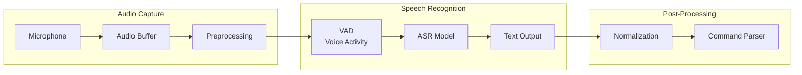

# Voice to Action

Transform spoken commands into text that your robot can understand. This section covers speech-to-text processing using OpenAI Whisper and local alternatives, with integration into ROS 2.

## Speech-to-Text Overview

Speech recognition converts audio waveforms into text transcriptions. For robotics applications, we need:

- **Low latency**: Real-time or near-real-time transcription
- **Noise robustness**: Handle ambient sounds in real environments
- **Command recognition**: Accurately capture robot-specific vocabulary



## OpenAI Whisper API

The Whisper API provides state-of-the-art speech recognition with minimal setup.

### Basic Transcription

```python
"""Whisper API transcription example."""
import openai
from pathlib import Path

# Initialize client
client = openai.OpenAI()  # Uses OPENAI_API_KEY env var

def transcribe_audio(audio_path: str) -> str:
    """
    Transcribe audio file using Whisper API.

    Args:
        audio_path: Path to audio file (mp3, wav, m4a, webm)

    Returns:
        Transcribed text
    """
    with open(audio_path, "rb") as audio_file:
        response = client.audio.transcriptions.create(
            model="whisper-1",
            file=audio_file,
            response_format="text"
        )
    return response

# Usage
text = transcribe_audio("command.wav")
print(f"Transcription: {text}")
```

### With Language and Prompt Hints

```python
"""Enhanced Whisper transcription with context."""

def transcribe_with_context(
    audio_path: str,
    language: str = "en",
    prompt: str = None
) -> dict:
    """
    Transcribe with language hint and vocabulary prompt.

    The prompt helps Whisper recognize domain-specific terms.
    """
    with open(audio_path, "rb") as audio_file:
        response = client.audio.transcriptions.create(
            model="whisper-1",
            file=audio_file,
            language=language,
            # Prompt with robot command vocabulary
            prompt=prompt or "Robot commands: navigate, pickup, place, scan, stop, go to kitchen, living room",
            response_format="verbose_json",
            timestamp_granularities=["word"]
        )

    return {
        "text": response.text,
        "language": response.language,
        "duration": response.duration,
        "words": response.words
    }

# Usage
result = transcribe_with_context(
    "command.wav",
    prompt="Navigate to the kitchen. Pick up the red cup. Go to living room."
)
print(f"Text: {result['text']}")
print(f"Duration: {result['duration']}s")
```

## Local Whisper Model

For privacy, offline operation, or cost savings, run Whisper locally.

### Installation and Setup

```bash
# Install whisper with PyTorch
pip install openai-whisper torch

# For faster inference with GPU
pip install openai-whisper torch --extra-index-url https://download.pytorch.org/whl/cu118
```

### Local Transcription

```python
"""Local Whisper model for offline transcription."""
import whisper
import numpy as np

class LocalWhisperRecognizer:
    """Offline speech recognition using Whisper."""

    # Model sizes: tiny, base, small, medium, large
    # Accuracy vs speed tradeoff
    MODELS = {
        "tiny": {"size": "39M", "vram": "~1GB", "speed": "~32x"},
        "base": {"size": "74M", "vram": "~1GB", "speed": "~16x"},
        "small": {"size": "244M", "vram": "~2GB", "speed": "~6x"},
        "medium": {"size": "769M", "vram": "~5GB", "speed": "~2x"},
        "large": {"size": "1550M", "vram": "~10GB", "speed": "1x"},
    }

    def __init__(self, model_size: str = "base"):
        """
        Initialize local Whisper model.

        Args:
            model_size: One of tiny, base, small, medium, large
        """
        print(f"Loading Whisper {model_size} model...")
        self.model = whisper.load_model(model_size)
        print("Model loaded successfully")

    def transcribe(
        self,
        audio_path: str,
        language: str = "en"
    ) -> dict:
        """
        Transcribe audio file.

        Args:
            audio_path: Path to audio file
            language: Language code (en, es, fr, etc.)

        Returns:
            Dictionary with text and segments
        """
        result = self.model.transcribe(
            audio_path,
            language=language,
            fp16=False  # Set True for GPU
        )

        return {
            "text": result["text"].strip(),
            "segments": result["segments"],
            "language": result["language"]
        }

    def transcribe_array(
        self,
        audio_array: np.ndarray,
        sample_rate: int = 16000
    ) -> str:
        """
        Transcribe numpy audio array directly.

        Args:
            audio_array: Audio samples as float32 numpy array
            sample_rate: Sample rate (Whisper expects 16kHz)

        Returns:
            Transcribed text
        """
        # Resample if necessary
        if sample_rate != 16000:
            import librosa
            audio_array = librosa.resample(
                audio_array,
                orig_sr=sample_rate,
                target_sr=16000
            )

        result = self.model.transcribe(audio_array, fp16=False)
        return result["text"].strip()

# Usage
recognizer = LocalWhisperRecognizer("small")
result = recognizer.transcribe("command.wav")
print(f"Transcription: {result['text']}")
```

## Audio Capture with PyAudio

Capture microphone input for real-time transcription.

### Basic Audio Capture

```python
"""PyAudio microphone capture for speech recognition."""
import pyaudio
import wave
import numpy as np
from typing import Optional

class AudioCapture:
    """Capture audio from microphone."""

    def __init__(
        self,
        sample_rate: int = 16000,
        channels: int = 1,
        chunk_size: int = 1024,
        format: int = pyaudio.paInt16
    ):
        self.sample_rate = sample_rate
        self.channels = channels
        self.chunk_size = chunk_size
        self.format = format
        self.audio = pyaudio.PyAudio()
        self.stream: Optional[pyaudio.Stream] = None

    def list_devices(self) -> list:
        """List available audio input devices."""
        devices = []
        for i in range(self.audio.get_device_count()):
            info = self.audio.get_device_info_by_index(i)
            if info["maxInputChannels"] > 0:
                devices.append({
                    "index": i,
                    "name": info["name"],
                    "channels": info["maxInputChannels"],
                    "sample_rate": int(info["defaultSampleRate"])
                })
        return devices

    def record_seconds(
        self,
        duration: float,
        device_index: Optional[int] = None
    ) -> np.ndarray:
        """
        Record audio for specified duration.

        Args:
            duration: Recording duration in seconds
            device_index: Specific input device (None for default)

        Returns:
            Audio samples as numpy array
        """
        stream = self.audio.open(
            format=self.format,
            channels=self.channels,
            rate=self.sample_rate,
            input=True,
            input_device_index=device_index,
            frames_per_buffer=self.chunk_size
        )

        print(f"Recording for {duration} seconds...")
        frames = []
        num_chunks = int(self.sample_rate / self.chunk_size * duration)

        for _ in range(num_chunks):
            data = stream.read(self.chunk_size)
            frames.append(data)

        stream.stop_stream()
        stream.close()
        print("Recording complete")

        # Convert to numpy array
        audio_data = np.frombuffer(b"".join(frames), dtype=np.int16)
        # Normalize to float32 for Whisper
        return audio_data.astype(np.float32) / 32768.0

    def save_wav(
        self,
        audio_data: np.ndarray,
        filename: str
    ) -> None:
        """Save audio array to WAV file."""
        # Convert back to int16 for WAV
        audio_int16 = (audio_data * 32768).astype(np.int16)

        with wave.open(filename, "wb") as wf:
            wf.setnchannels(self.channels)
            wf.setsampwidth(2)  # 16-bit
            wf.setframerate(self.sample_rate)
            wf.writeframes(audio_int16.tobytes())

    def cleanup(self):
        """Release audio resources."""
        self.audio.terminate()

# Usage
capture = AudioCapture()
print("Available devices:", capture.list_devices())

audio = capture.record_seconds(5.0)
capture.save_wav(audio, "recorded_command.wav")
capture.cleanup()
```

### Voice Activity Detection

```python
"""Simple voice activity detection for command capture."""
import numpy as np
from collections import deque

class VoiceActivityDetector:
    """Detect speech in audio stream."""

    def __init__(
        self,
        threshold: float = 0.02,
        min_speech_duration: float = 0.3,
        silence_duration: float = 0.8,
        sample_rate: int = 16000
    ):
        """
        Initialize VAD.

        Args:
            threshold: RMS threshold for speech detection
            min_speech_duration: Minimum speech duration in seconds
            silence_duration: Silence duration to end recording
            sample_rate: Audio sample rate
        """
        self.threshold = threshold
        self.min_speech_samples = int(min_speech_duration * sample_rate)
        self.silence_samples = int(silence_duration * sample_rate)
        self.sample_rate = sample_rate

    def compute_rms(self, audio_chunk: np.ndarray) -> float:
        """Compute root mean square energy."""
        return np.sqrt(np.mean(audio_chunk ** 2))

    def detect_speech_segment(
        self,
        audio_stream,
        max_duration: float = 10.0
    ) -> np.ndarray:
        """
        Record until speech ends.

        Args:
            audio_stream: PyAudio stream object
            max_duration: Maximum recording duration

        Returns:
            Audio segment containing speech
        """
        chunk_size = 1024
        chunks = deque()
        speech_started = False
        silence_count = 0
        speech_samples = 0

        max_samples = int(max_duration * self.sample_rate)
        total_samples = 0

        while total_samples < max_samples:
            data = audio_stream.read(chunk_size)
            audio_chunk = np.frombuffer(data, dtype=np.int16).astype(np.float32) / 32768.0
            chunks.append(audio_chunk)
            total_samples += len(audio_chunk)

            rms = self.compute_rms(audio_chunk)

            if rms > self.threshold:
                speech_started = True
                speech_samples += len(audio_chunk)
                silence_count = 0
            elif speech_started:
                silence_count += len(audio_chunk)

                # End if enough silence after speech
                if silence_count >= self.silence_samples:
                    if speech_samples >= self.min_speech_samples:
                        break
                    # False start, reset
                    speech_started = False
                    speech_samples = 0
                    silence_count = 0

        return np.concatenate(list(chunks))
```

## ROS 2 Audio Subscriber Node

Integrate audio capture with ROS 2 for robot systems.

```python
"""ROS 2 node for audio capture and transcription."""
import rclpy
from rclpy.node import Node
from std_msgs.msg import String
from audio_msgs.msg import Audio  # Custom message or use std_msgs

import numpy as np
import threading
import queue

class AudioTranscriptionNode(Node):
    """ROS 2 node that captures audio and publishes transcriptions."""

    def __init__(self):
        super().__init__("audio_transcription_node")

        # Parameters
        self.declare_parameter("model_size", "base")
        self.declare_parameter("sample_rate", 16000)
        self.declare_parameter("use_api", False)

        model_size = self.get_parameter("model_size").value
        self.sample_rate = self.get_parameter("sample_rate").value
        self.use_api = self.get_parameter("use_api").value

        # Publishers
        self.transcription_pub = self.create_publisher(
            String,
            "voice_command",
            10
        )

        # Audio queue for async processing
        self.audio_queue = queue.Queue()

        # Initialize speech recognizer
        if self.use_api:
            import openai
            self.client = openai.OpenAI()
            self.get_logger().info("Using OpenAI Whisper API")
        else:
            import whisper
            self.model = whisper.load_model(model_size)
            self.get_logger().info(f"Loaded local Whisper {model_size} model")

        # Start transcription thread
        self.running = True
        self.transcription_thread = threading.Thread(
            target=self._transcription_loop
        )
        self.transcription_thread.start()

        # Audio subscriber (if receiving from another node)
        self.audio_sub = self.create_subscription(
            String,  # Base64 encoded audio or file path
            "audio_input",
            self.audio_callback,
            10
        )

        self.get_logger().info("Audio transcription node ready")

    def audio_callback(self, msg: String):
        """Handle incoming audio data."""
        self.audio_queue.put(msg.data)

    def _transcription_loop(self):
        """Background thread for transcription."""
        while self.running:
            try:
                audio_data = self.audio_queue.get(timeout=1.0)
                text = self._transcribe(audio_data)

                if text:
                    msg = String()
                    msg.data = text
                    self.transcription_pub.publish(msg)
                    self.get_logger().info(f"Transcribed: {text}")

            except queue.Empty:
                continue
            except Exception as e:
                self.get_logger().error(f"Transcription error: {e}")

    def _transcribe(self, audio_path: str) -> str:
        """Transcribe audio file."""
        if self.use_api:
            with open(audio_path, "rb") as f:
                response = self.client.audio.transcriptions.create(
                    model="whisper-1",
                    file=f
                )
            return response.text
        else:
            result = self.model.transcribe(audio_path, fp16=False)
            return result["text"].strip()

    def destroy_node(self):
        """Cleanup on shutdown."""
        self.running = False
        self.transcription_thread.join()
        super().destroy_node()

def main(args=None):
    rclpy.init(args=args)
    node = AudioTranscriptionNode()

    try:
        rclpy.spin(node)
    except KeyboardInterrupt:
        pass
    finally:
        node.destroy_node()
        rclpy.shutdown()

if __name__ == "__main__":
    main()
```

## Streaming Transcription

For lower latency, use streaming transcription:

```python
"""Streaming speech recognition with continuous output."""
import pyaudio
import numpy as np
from threading import Thread
from queue import Queue
import whisper

class StreamingTranscriber:
    """Real-time streaming transcription."""

    def __init__(
        self,
        model_size: str = "tiny",  # Use tiny for streaming
        chunk_duration: float = 2.0,
        overlap: float = 0.5
    ):
        """
        Initialize streaming transcriber.

        Args:
            model_size: Whisper model size (tiny recommended)
            chunk_duration: Audio chunk duration in seconds
            overlap: Overlap between chunks for continuity
        """
        self.model = whisper.load_model(model_size)
        self.chunk_duration = chunk_duration
        self.overlap = overlap
        self.sample_rate = 16000

        self.audio_queue = Queue()
        self.text_queue = Queue()
        self.running = False

    def start(self):
        """Start streaming transcription."""
        self.running = True

        # Start audio capture thread
        self.capture_thread = Thread(target=self._capture_audio)
        self.capture_thread.start()

        # Start transcription thread
        self.transcribe_thread = Thread(target=self._transcribe_stream)
        self.transcribe_thread.start()

    def stop(self):
        """Stop streaming."""
        self.running = False
        self.capture_thread.join()
        self.transcribe_thread.join()

    def _capture_audio(self):
        """Continuous audio capture."""
        audio = pyaudio.PyAudio()
        stream = audio.open(
            format=pyaudio.paFloat32,
            channels=1,
            rate=self.sample_rate,
            input=True,
            frames_per_buffer=1024
        )

        chunk_samples = int(self.chunk_duration * self.sample_rate)
        buffer = np.array([], dtype=np.float32)

        while self.running:
            data = stream.read(1024)
            chunk = np.frombuffer(data, dtype=np.float32)
            buffer = np.concatenate([buffer, chunk])

            if len(buffer) >= chunk_samples:
                self.audio_queue.put(buffer[:chunk_samples].copy())
                # Keep overlap for context
                overlap_samples = int(self.overlap * self.sample_rate)
                buffer = buffer[-overlap_samples:]

        stream.stop_stream()
        stream.close()
        audio.terminate()

    def _transcribe_stream(self):
        """Process audio chunks."""
        previous_text = ""

        while self.running:
            try:
                audio_chunk = self.audio_queue.get(timeout=1.0)
                result = self.model.transcribe(
                    audio_chunk,
                    fp16=False,
                    language="en"
                )
                text = result["text"].strip()

                # Deduplicate with previous
                if text and text != previous_text:
                    self.text_queue.put(text)
                    previous_text = text

            except Exception:
                continue

    def get_transcription(self, timeout: float = 0.1) -> str:
        """Get latest transcription."""
        try:
            return self.text_queue.get(timeout=timeout)
        except Exception:
            return None

# Usage
transcriber = StreamingTranscriber(model_size="tiny")
transcriber.start()

try:
    while True:
        text = transcriber.get_transcription()
        if text:
            print(f"Heard: {text}")
except KeyboardInterrupt:
    transcriber.stop()
```

## Handling Noise and Ambient Sounds

Real robot environments are noisy. Use these techniques:

### Noise Reduction

```python
"""Audio preprocessing for noise reduction."""
import numpy as np
from scipy import signal

def reduce_noise(
    audio: np.ndarray,
    sample_rate: int = 16000,
    noise_profile: np.ndarray = None
) -> np.ndarray:
    """
    Simple spectral subtraction noise reduction.

    Args:
        audio: Input audio array
        sample_rate: Sample rate
        noise_profile: Noise spectrum (from silence recording)

    Returns:
        Noise-reduced audio
    """
    # High-pass filter to remove low-frequency rumble
    nyquist = sample_rate / 2
    high_cutoff = 100 / nyquist
    b, a = signal.butter(4, high_cutoff, btype="high")
    audio = signal.filtfilt(b, a, audio)

    # Spectral gating (simplified)
    if noise_profile is not None:
        # Apply spectral subtraction
        stft = np.fft.rfft(audio)
        magnitude = np.abs(stft)
        phase = np.angle(stft)

        # Subtract noise spectrum
        noise_mag = np.abs(np.fft.rfft(noise_profile))
        noise_mag = np.resize(noise_mag, magnitude.shape)

        clean_mag = np.maximum(magnitude - noise_mag * 1.5, 0)
        clean_stft = clean_mag * np.exp(1j * phase)
        audio = np.fft.irfft(clean_stft)

    return audio.astype(np.float32)
```

### Wake Word Detection

```python
"""Wake word detection to trigger recording."""
import numpy as np

class WakeWordDetector:
    """Simple wake word detection using keyword spotting."""

    def __init__(self, wake_word: str = "robot"):
        """
        Initialize wake word detector.

        For production, consider using:
        - Porcupine (Picovoice)
        - Snowboy
        - Mycroft Precise
        """
        self.wake_word = wake_word.lower()
        # In production, load a dedicated KWS model
        # This example uses Whisper for simplicity

        import whisper
        self.model = whisper.load_model("tiny")

    def check_wake_word(self, audio: np.ndarray) -> bool:
        """
        Check if audio contains wake word.

        Args:
            audio: Short audio clip (1-2 seconds)

        Returns:
            True if wake word detected
        """
        result = self.model.transcribe(
            audio,
            fp16=False,
            language="en"
        )
        text = result["text"].lower()
        return self.wake_word in text
```

## Local Model Alternatives

For different requirements, consider these alternatives:

### Vosk (Lightweight Offline)

```python
"""Vosk offline speech recognition."""
from vosk import Model, KaldiRecognizer
import json

class VoskRecognizer:
    """Lightweight offline speech recognition."""

    def __init__(self, model_path: str = "vosk-model-small-en-us"):
        """
        Initialize Vosk recognizer.

        Download models from: https://alphacephei.com/vosk/models
        """
        self.model = Model(model_path)
        self.sample_rate = 16000

    def transcribe(self, audio: np.ndarray) -> str:
        """Transcribe audio array."""
        recognizer = KaldiRecognizer(self.model, self.sample_rate)

        # Convert to bytes
        audio_bytes = (audio * 32768).astype(np.int16).tobytes()

        recognizer.AcceptWaveform(audio_bytes)
        result = json.loads(recognizer.FinalResult())

        return result.get("text", "")
```

### Comparison Table

| Feature | Whisper API | Local Whisper | Vosk |
|---------|-------------|---------------|------|
| Accuracy | Excellent | Excellent | Good |
| Speed | Fast (API) | Slow-Medium | Very Fast |
| Privacy | Cloud | Local | Local |
| Cost | Pay per use | Free | Free |
| Offline | No | Yes | Yes |
| Languages | 99+ | 99+ | Limited |
| RAM | None | 1-10GB | Less than 1GB |

## Next Steps

Now that you can capture and transcribe voice commands, proceed to [LLM Cognitive Planning](./llm-cognitive-planning) to learn how to interpret these commands and plan robot actions.

---

:::tip Key Takeaway

Choose your speech recognition approach based on your requirements:
- **API**: Best accuracy, simplest setup, requires internet
- **Local Whisper**: Good accuracy, offline, higher resource usage
- **Vosk**: Fastest, lowest resources, offline, adequate accuracy

For robotics, local models often provide the best balance of latency, privacy, and reliability.

:::
