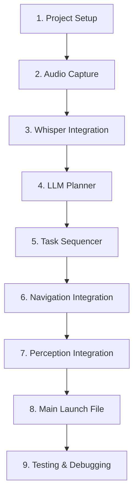

# Implementation

This section guides you through implementing the complete autonomous humanoid system step by step.

## Implementation Sequence



## Step 1: Project Setup

### Create Package Structure

```bash title="Create ROS 2 workspace and package"
# Create workspace
mkdir -p ~/capstone_ws/src
cd ~/capstone_ws/src

# Create main package
ros2 pkg create --build-type ament_python capstone_humanoid \
    --dependencies rclpy std_msgs sensor_msgs geometry_msgs nav2_msgs

# Create message package
ros2 pkg create --build-type ament_cmake capstone_msgs

# Build
cd ~/capstone_ws
colcon build
source install/setup.bash
```

### Package Structure

```
capstone_humanoid/
├── capstone_humanoid/
│   ├── __init__.py
│   ├── audio_capture_node.py
│   ├── whisper_node.py
│   ├── llm_planner_node.py
│   ├── task_sequencer_node.py
│   └── state_monitor_node.py
├── config/
│   ├── capstone_params.yaml
│   └── nav2_params.yaml
├── launch/
│   ├── capstone_launch.py
│   └── simulation_launch.py
├── test/
│   └── test_pipeline.py
├── package.xml
├── setup.py
└── setup.cfg
```

## Step 2: Audio Capture Node

```python title="audio_capture_node.py"
#!/usr/bin/env python3
"""Audio capture node for voice input."""

import rclpy
from rclpy.node import Node
from std_msgs.msg import ByteMultiArray
import pyaudio
import numpy as np


class AudioCaptureNode(Node):
    def __init__(self):
        super().__init__('audio_capture_node')

        # Parameters
        self.declare_parameter('sample_rate', 16000)
        self.declare_parameter('chunk_size', 1024)
        self.declare_parameter('channels', 1)

        self.sample_rate = self.get_parameter('sample_rate').value
        self.chunk_size = self.get_parameter('chunk_size').value
        self.channels = self.get_parameter('channels').value

        # Publisher
        self.audio_pub = self.create_publisher(
            ByteMultiArray,
            '/audio/raw',
            10
        )

        # PyAudio setup
        self.audio = pyaudio.PyAudio()
        self.stream = self.audio.open(
            format=pyaudio.paInt16,
            channels=self.channels,
            rate=self.sample_rate,
            input=True,
            frames_per_buffer=self.chunk_size,
            stream_callback=self.audio_callback
        )

        self.get_logger().info('Audio capture node started')

    def audio_callback(self, in_data, frame_count, time_info, status):
        """Callback for audio stream."""
        msg = ByteMultiArray()
        msg.data = list(in_data)
        self.audio_pub.publish(msg)
        return (in_data, pyaudio.paContinue)

    def destroy_node(self):
        self.stream.stop_stream()
        self.stream.close()
        self.audio.terminate()
        super().destroy_node()


def main(args=None):
    rclpy.init(args=args)
    node = AudioCaptureNode()
    try:
        rclpy.spin(node)
    except KeyboardInterrupt:
        pass
    finally:
        node.destroy_node()
        rclpy.shutdown()


if __name__ == '__main__':
    main()
```

## Step 3: Whisper ASR Integration

```python title="whisper_node.py"
#!/usr/bin/env python3
"""Whisper ASR node for speech-to-text conversion."""

import rclpy
from rclpy.node import Node
from std_msgs.msg import String, ByteMultiArray
import numpy as np
import whisper
import io
import soundfile as sf


class WhisperNode(Node):
    def __init__(self):
        super().__init__('whisper_node')

        # Parameters
        self.declare_parameter('model_size', 'base')
        self.declare_parameter('language', 'en')
        self.declare_parameter('buffer_duration', 5.0)  # seconds

        model_size = self.get_parameter('model_size').value
        self.language = self.get_parameter('language').value
        self.buffer_duration = self.get_parameter('buffer_duration').value

        # Load Whisper model
        self.get_logger().info(f'Loading Whisper model: {model_size}')
        self.model = whisper.load_model(model_size)
        self.get_logger().info('Whisper model loaded')

        # Audio buffer
        self.audio_buffer = []
        self.sample_rate = 16000

        # Subscriber
        self.audio_sub = self.create_subscription(
            ByteMultiArray,
            '/audio/raw',
            self.audio_callback,
            10
        )

        # Publisher
        self.transcript_pub = self.create_publisher(
            String,
            '/voice/transcript',
            10
        )

        # Timer for processing
        self.process_timer = self.create_timer(
            self.buffer_duration,
            self.process_audio
        )

    def audio_callback(self, msg):
        """Buffer incoming audio data."""
        audio_data = np.frombuffer(bytes(msg.data), dtype=np.int16)
        self.audio_buffer.extend(audio_data)

    def process_audio(self):
        """Process buffered audio through Whisper."""
        if len(self.audio_buffer) < self.sample_rate:
            return  # Not enough data

        # Convert to float32 normalized
        audio_np = np.array(self.audio_buffer, dtype=np.float32) / 32768.0
        self.audio_buffer = []  # Clear buffer

        # Transcribe
        result = self.model.transcribe(
            audio_np,
            language=self.language,
            fp16=False
        )

        transcript = result['text'].strip()
        if transcript:
            self.get_logger().info(f'Transcript: {transcript}')
            msg = String()
            msg.data = transcript
            self.transcript_pub.publish(msg)


def main(args=None):
    rclpy.init(args=args)
    node = WhisperNode()
    try:
        rclpy.spin(node)
    except KeyboardInterrupt:
        pass
    finally:
        node.destroy_node()
        rclpy.shutdown()


if __name__ == '__main__':
    main()
```

## Step 4: LLM Planner Node

```python title="llm_planner_node.py"
#!/usr/bin/env python3
"""LLM-based task planner node."""

import rclpy
from rclpy.node import Node
from std_msgs.msg import String
import json
import os

# Use OpenAI or local model
try:
    from openai import OpenAI
    HAS_OPENAI = True
except ImportError:
    HAS_OPENAI = False


class LLMPlannerNode(Node):
    def __init__(self):
        super().__init__('llm_planner_node')

        # Parameters
        self.declare_parameter('model', 'gpt-4')
        self.declare_parameter('temperature', 0.1)
        self.declare_parameter('max_tokens', 500)

        self.model = self.get_parameter('model').value
        self.temperature = self.get_parameter('temperature').value
        self.max_tokens = self.get_parameter('max_tokens').value

        # OpenAI client
        if HAS_OPENAI:
            self.client = OpenAI(api_key=os.environ.get('OPENAI_API_KEY'))
        else:
            self.get_logger().warn('OpenAI not available, using mock planner')

        # System prompt for robot planning
        self.system_prompt = """You are a robot task planner for a humanoid robot.
Given a natural language command, decompose it into a sequence of robot actions.

Available actions:
- navigate: Move to a location (kitchen, living_room, bedroom, etc.)
- detect: Look for an object (cup, ball, chair, person, etc.)
- speak: Say something to the user

Output ONLY valid JSON in this format:
{"tasks": [{"action": "navigate", "target": "kitchen"}, {"action": "detect", "target": "red cup"}]}

Be concise. Only include necessary actions."""

        # Subscriber
        self.transcript_sub = self.create_subscription(
            String,
            '/voice/transcript',
            self.transcript_callback,
            10
        )

        # Publisher
        self.tasks_pub = self.create_publisher(
            String,
            '/planning/task_sequence',
            10
        )

        self.get_logger().info('LLM Planner node started')

    def transcript_callback(self, msg):
        """Process transcript and generate task plan."""
        command = msg.data
        self.get_logger().info(f'Planning for: {command}')

        tasks = self.plan_tasks(command)
        if tasks:
            task_msg = String()
            task_msg.data = json.dumps(tasks)
            self.tasks_pub.publish(task_msg)
            self.get_logger().info(f'Published tasks: {tasks}')

    def plan_tasks(self, command: str) -> dict:
        """Use LLM to plan task sequence."""
        if not HAS_OPENAI:
            return self.mock_plan(command)

        try:
            response = self.client.chat.completions.create(
                model=self.model,
                messages=[
                    {"role": "system", "content": self.system_prompt},
                    {"role": "user", "content": command}
                ],
                temperature=self.temperature,
                max_tokens=self.max_tokens
            )

            content = response.choices[0].message.content
            return json.loads(content)

        except Exception as e:
            self.get_logger().error(f'LLM planning failed: {e}')
            return self.mock_plan(command)

    def mock_plan(self, command: str) -> dict:
        """Fallback mock planner for testing."""
        command_lower = command.lower()

        tasks = []
        # Simple keyword matching
        if 'kitchen' in command_lower:
            tasks.append({"action": "navigate", "target": "kitchen"})
        elif 'living room' in command_lower:
            tasks.append({"action": "navigate", "target": "living_room"})

        if 'find' in command_lower or 'look for' in command_lower:
            # Extract object after 'find' or 'look for'
            if 'cup' in command_lower:
                tasks.append({"action": "detect", "target": "cup"})
            elif 'ball' in command_lower:
                tasks.append({"action": "detect", "target": "ball"})

        if not tasks:
            tasks.append({"action": "speak", "target": "I don't understand"})

        return {"tasks": tasks}


def main(args=None):
    rclpy.init(args=args)
    node = LLMPlannerNode()
    try:
        rclpy.spin(node)
    except KeyboardInterrupt:
        pass
    finally:
        node.destroy_node()
        rclpy.shutdown()


if __name__ == '__main__':
    main()
```

## Step 5: Task Sequencer Node

```python title="task_sequencer_node.py"
#!/usr/bin/env python3
"""Task sequencer node for executing planned tasks."""

import rclpy
from rclpy.node import Node
from rclpy.action import ActionClient
from std_msgs.msg import String
from geometry_msgs.msg import PoseStamped
from nav2_msgs.action import NavigateToPose
import json


# Known locations (would be loaded from config in production)
LOCATIONS = {
    'kitchen': {'x': 5.0, 'y': 2.0, 'yaw': 0.0},
    'living_room': {'x': 0.0, 'y': 0.0, 'yaw': 0.0},
    'bedroom': {'x': -3.0, 'y': 4.0, 'yaw': 1.57},
    'entrance': {'x': 0.0, 'y': -2.0, 'yaw': 3.14},
}


class TaskSequencerNode(Node):
    def __init__(self):
        super().__init__('task_sequencer_node')

        # Parameters
        self.declare_parameter('max_retries', 3)
        self.max_retries = self.get_parameter('max_retries').value

        # State
        self.current_tasks = []
        self.current_task_index = 0
        self.is_executing = False

        # Action client for navigation
        self.nav_client = ActionClient(
            self,
            NavigateToPose,
            'navigate_to_pose'
        )

        # Subscribers
        self.tasks_sub = self.create_subscription(
            String,
            '/planning/task_sequence',
            self.tasks_callback,
            10
        )

        # Publishers
        self.status_pub = self.create_publisher(
            String,
            '/capstone/status',
            10
        )

        self.feedback_pub = self.create_publisher(
            String,
            '/capstone/feedback',
            10
        )

        self.get_logger().info('Task Sequencer node started')

    def tasks_callback(self, msg):
        """Receive new task sequence."""
        if self.is_executing:
            self.get_logger().warn('Already executing, ignoring new tasks')
            return

        try:
            data = json.loads(msg.data)
            self.current_tasks = data.get('tasks', [])
            self.current_task_index = 0
            self.get_logger().info(f'Received {len(self.current_tasks)} tasks')
            self.execute_next_task()
        except json.JSONDecodeError as e:
            self.get_logger().error(f'Failed to parse tasks: {e}')

    def execute_next_task(self):
        """Execute the next task in the sequence."""
        if self.current_task_index >= len(self.current_tasks):
            self.finish_execution()
            return

        task = self.current_tasks[self.current_task_index]
        action = task.get('action')
        target = task.get('target')

        self.is_executing = True
        self.publish_status(f'Executing: {action} -> {target}')

        if action == 'navigate':
            self.execute_navigation(target)
        elif action == 'detect':
            self.execute_detection(target)
        elif action == 'speak':
            self.execute_speak(target)
        else:
            self.get_logger().warn(f'Unknown action: {action}')
            self.task_completed(False)

    def execute_navigation(self, location: str):
        """Navigate to a named location."""
        if location not in LOCATIONS:
            self.get_logger().error(f'Unknown location: {location}')
            self.task_completed(False)
            return

        coords = LOCATIONS[location]
        goal = NavigateToPose.Goal()
        goal.pose = PoseStamped()
        goal.pose.header.frame_id = 'map'
        goal.pose.header.stamp = self.get_clock().now().to_msg()
        goal.pose.pose.position.x = coords['x']
        goal.pose.pose.position.y = coords['y']

        # Convert yaw to quaternion (simplified)
        import math
        goal.pose.pose.orientation.z = math.sin(coords['yaw'] / 2)
        goal.pose.pose.orientation.w = math.cos(coords['yaw'] / 2)

        self.get_logger().info(f'Navigating to {location}')

        if not self.nav_client.wait_for_server(timeout_sec=5.0):
            self.get_logger().error('Navigation server not available')
            self.task_completed(False)
            return

        future = self.nav_client.send_goal_async(goal)
        future.add_done_callback(self.nav_goal_response_callback)

    def nav_goal_response_callback(self, future):
        """Handle navigation goal response."""
        goal_handle = future.result()
        if not goal_handle.accepted:
            self.get_logger().error('Navigation goal rejected')
            self.task_completed(False)
            return

        result_future = goal_handle.get_result_async()
        result_future.add_done_callback(self.nav_result_callback)

    def nav_result_callback(self, future):
        """Handle navigation result."""
        result = future.result()
        if result.status == 4:  # SUCCEEDED
            self.get_logger().info('Navigation succeeded')
            self.task_completed(True)
        else:
            self.get_logger().error(f'Navigation failed: {result.status}')
            self.task_completed(False)

    def execute_detection(self, target: str):
        """Execute object detection task."""
        # Simplified: In production, call perception action server
        self.get_logger().info(f'Looking for: {target}')
        self.publish_feedback(f'Searching for {target}...')

        # Simulate detection delay
        self.create_timer(2.0, lambda: self.detection_complete(target))

    def detection_complete(self, target: str):
        """Handle detection completion."""
        # Simulated result
        self.publish_feedback(f'Detection complete for {target}')
        self.task_completed(True)

    def execute_speak(self, message: str):
        """Execute speak task."""
        self.publish_feedback(f'Robot says: {message}')
        self.task_completed(True)

    def task_completed(self, success: bool):
        """Handle task completion."""
        self.is_executing = False

        if success:
            self.current_task_index += 1
            self.execute_next_task()
        else:
            self.publish_status('Task failed, stopping execution')
            self.finish_execution()

    def finish_execution(self):
        """Finish task sequence execution."""
        self.is_executing = False
        self.publish_status('All tasks completed')
        self.publish_feedback('Task sequence finished!')
        self.current_tasks = []
        self.current_task_index = 0

    def publish_status(self, status: str):
        """Publish status update."""
        msg = String()
        msg.data = status
        self.status_pub.publish(msg)
        self.get_logger().info(f'Status: {status}')

    def publish_feedback(self, feedback: str):
        """Publish feedback for user."""
        msg = String()
        msg.data = feedback
        self.feedback_pub.publish(msg)


def main(args=None):
    rclpy.init(args=args)
    node = TaskSequencerNode()
    try:
        rclpy.spin(node)
    except KeyboardInterrupt:
        pass
    finally:
        node.destroy_node()
        rclpy.shutdown()


if __name__ == '__main__':
    main()
```

## Step 6: Configuration Files

```yaml title="config/capstone_params.yaml"
# Capstone humanoid system parameters

audio_capture_node:
  ros__parameters:
    sample_rate: 16000
    chunk_size: 1024
    channels: 1

whisper_node:
  ros__parameters:
    model_size: "base"
    language: "en"
    buffer_duration: 5.0

llm_planner_node:
  ros__parameters:
    model: "gpt-4"
    temperature: 0.1
    max_tokens: 500

task_sequencer_node:
  ros__parameters:
    max_retries: 3
    retry_delay: 2.0
    task_timeout: 60.0

state_monitor_node:
  ros__parameters:
    heartbeat_rate: 1.0
    log_level: "info"
```

## Step 7: Main Launch File

```python title="launch/capstone_launch.py"
#!/usr/bin/env python3
"""Main launch file for the capstone humanoid system."""

from launch import LaunchDescription
from launch.actions import DeclareLaunchArgument, IncludeLaunchDescription
from launch.substitutions import LaunchConfiguration, PathJoinSubstitution
from launch.launch_description_sources import PythonLaunchDescriptionSource
from launch_ros.actions import Node
from launch_ros.substitutions import FindPackageShare


def generate_launch_description():
    # Declare arguments
    use_sim = DeclareLaunchArgument(
        'use_sim',
        default_value='true',
        description='Use simulation instead of real hardware'
    )

    config_file = DeclareLaunchArgument(
        'config_file',
        default_value='capstone_params.yaml',
        description='Path to configuration file'
    )

    # Get package paths
    pkg_capstone = FindPackageShare('capstone_humanoid')
    config_path = PathJoinSubstitution([
        pkg_capstone, 'config', LaunchConfiguration('config_file')
    ])

    # Audio capture node
    audio_capture = Node(
        package='capstone_humanoid',
        executable='audio_capture_node',
        name='audio_capture_node',
        parameters=[config_path],
        output='screen'
    )

    # Whisper ASR node
    whisper_node = Node(
        package='capstone_humanoid',
        executable='whisper_node',
        name='whisper_node',
        parameters=[config_path],
        output='screen'
    )

    # LLM Planner node
    llm_planner = Node(
        package='capstone_humanoid',
        executable='llm_planner_node',
        name='llm_planner_node',
        parameters=[config_path],
        output='screen'
    )

    # Task Sequencer node
    task_sequencer = Node(
        package='capstone_humanoid',
        executable='task_sequencer_node',
        name='task_sequencer_node',
        parameters=[config_path],
        output='screen'
    )

    # State Monitor node
    state_monitor = Node(
        package='capstone_humanoid',
        executable='state_monitor_node',
        name='state_monitor_node',
        parameters=[config_path],
        output='screen'
    )

    return LaunchDescription([
        use_sim,
        config_file,
        audio_capture,
        whisper_node,
        llm_planner,
        task_sequencer,
        state_monitor,
    ])
```

## Step 8: Running the System

### Launch Simulation First

```bash title="Terminal 1: Launch simulation"
# Source workspace
source ~/capstone_ws/install/setup.bash

# Launch Gazebo with humanoid robot
ros2 launch capstone_humanoid simulation_launch.py
```

### Launch Capstone System

```bash title="Terminal 2: Launch capstone nodes"
# Source workspace
source ~/capstone_ws/install/setup.bash

# Set OpenAI API key (if using)
export OPENAI_API_KEY="your-api-key-here"

# Launch capstone system
ros2 launch capstone_humanoid capstone_launch.py
```

### Monitor the System

```bash title="Terminal 3: Monitor topics"
# Watch voice transcripts
ros2 topic echo /voice/transcript

# Watch task planning
ros2 topic echo /planning/task_sequence

# Watch execution status
ros2 topic echo /capstone/status
```

## Testing Individual Components

```bash title="Test commands"
# Test with fake voice input
ros2 topic pub /voice/transcript std_msgs/msg/String \
    "{data: 'Go to the kitchen and find the red cup'}" --once

# Check navigation is working
ros2 action send_goal /navigate_to_pose nav2_msgs/action/NavigateToPose \
    "{pose: {header: {frame_id: 'map'}, pose: {position: {x: 5.0, y: 2.0}}}}"
```

## Next Steps

With the implementation complete, proceed to [Testing & Validation](./testing-validation) to verify the system works correctly with demo scenarios.
