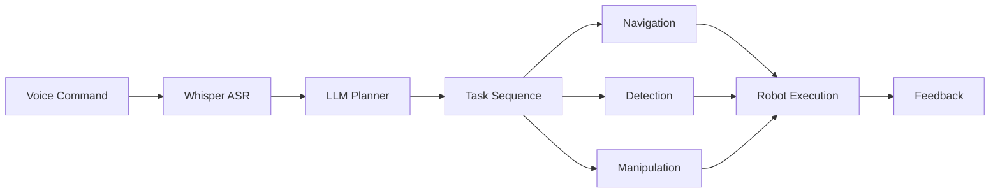
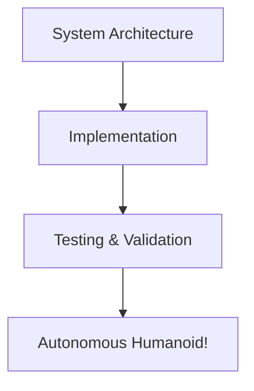

# Chapter 6: Capstone Project – The Autonomous Humanoid

Welcome to the capstone chapter! Here we bring together everything you've learned to build a complete autonomous humanoid robot system that responds to voice commands.

## Learning Objectives

By the end of this chapter, you will:

- Understand how all previous components integrate into a complete system
- Build an end-to-end pipeline: voice → plan → navigate → detect → manipulate
- Test and validate the complete autonomous system
- Deploy and demonstrate the working humanoid robot

## What We're Building

Our capstone project creates an autonomous humanoid robot that:

1. **Listens** to voice commands using Whisper ASR
2. **Plans** task sequences using LLM-based cognitive planning
3. **Navigates** to target locations using Nav2
4. **Detects** objects using computer vision
5. **Manipulates** objects through action servers



## Prerequisites

:::warning Required Knowledge
This chapter assumes you have completed **all previous chapters**:
- [Chapter 1: Physical AI Foundations](/docs/chapter-1-introduction) - Core concepts
- [Chapter 2: ROS 2 Fundamentals](/docs/chapter-2-ros2) - Node communication
- [Chapter 3: Simulation](/docs/chapter-3-simulation) - Gazebo/Unity environments
- [Chapter 4: NVIDIA Isaac](/docs/chapter-4-isaac) - Navigation and perception
- [Chapter 5: VLA Systems](/docs/chapter-5-vla) - Voice and language integration
:::

## System Requirements

### Software
- Ubuntu 22.04 LTS
- ROS 2 Humble
- Gazebo Sim (or Isaac Sim with RTX GPU)
- Python 3.10+
- OpenAI API key (or local Whisper/LLM)

### Hardware (Optional)
- NVIDIA RTX GPU for Isaac Sim
- Microphone for live voice input
- 16GB+ RAM recommended

## Chapter Roadmap



| Section | Topic | Key Deliverable |
|---------|-------|----------------|
| 6.1 | [System Architecture](./system-architecture) | Complete system design |
| 6.2 | [Implementation](./implementation) | Working launch files and configs |
| 6.3 | [Testing & Validation](./testing-validation) | Demo scenarios and tests |

## Expected Outcome

At the end of this chapter, you'll have a fully functional demo where you can:

```bash
# Speak to your robot
"Go to the kitchen and find the red cup"

# And watch it:
# 1. Parse your command
# 2. Plan the task sequence
# 3. Navigate to the kitchen
# 4. Detect the red cup
# 5. Report back its findings
```

## Let's Begin!

Ready to build your autonomous humanoid? Start with [System Architecture](./system-architecture) to understand how all the pieces fit together.
