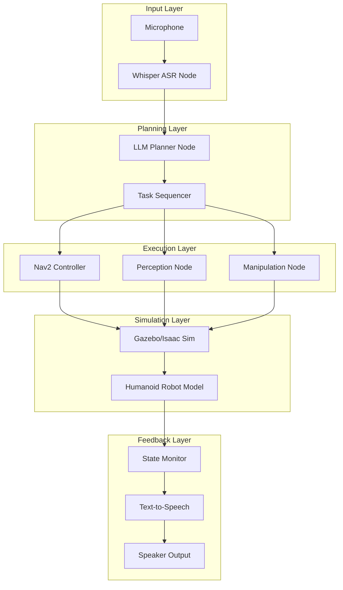
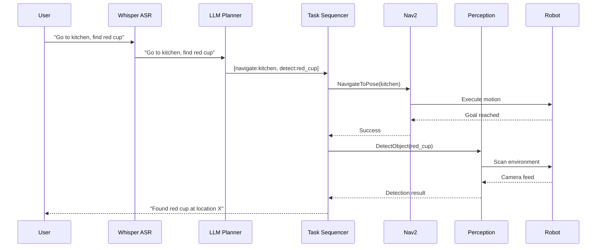
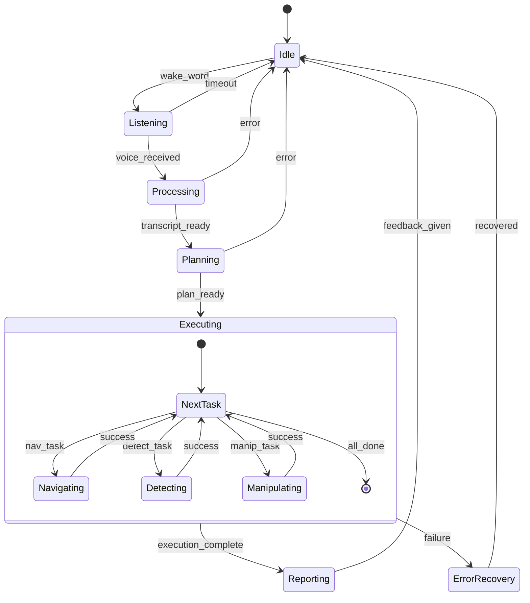
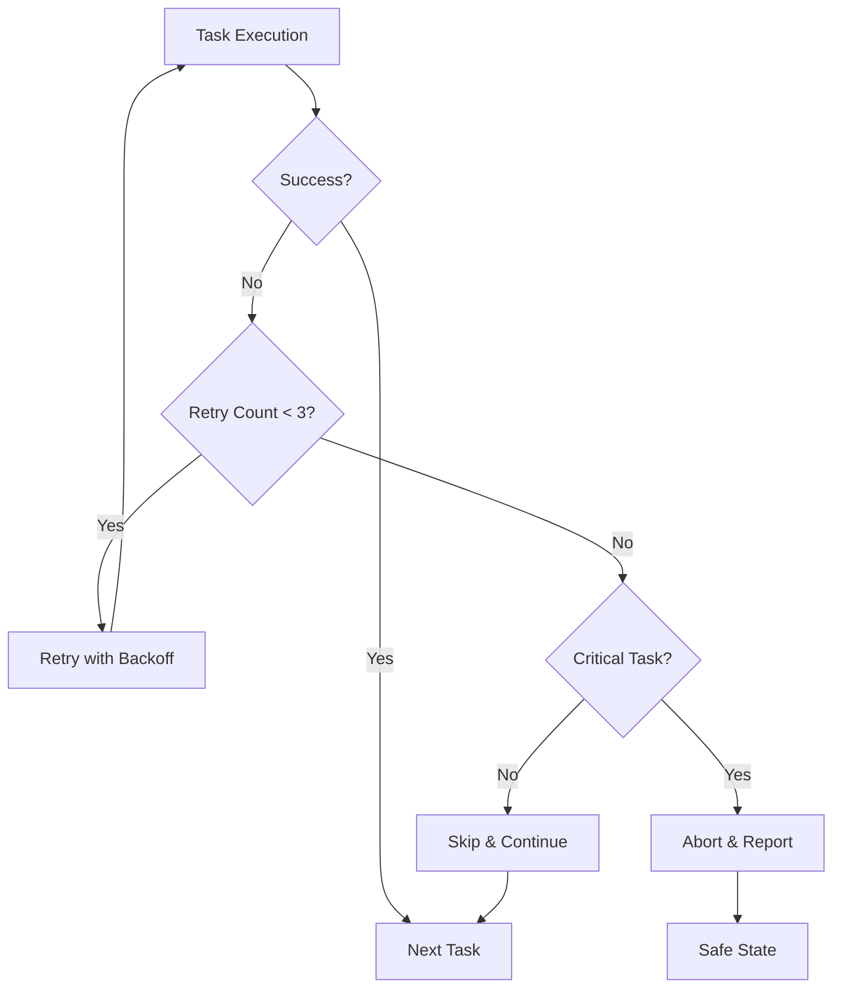

# System Architecture

This section presents the complete system architecture for our autonomous humanoid robot, showing how components from all previous chapters integrate together.

## Complete System Overview



## Component Integration Map

This table shows how each component from previous chapters integrates into the capstone:

| Component | Source | ROS 2 Interface | Purpose |
|-----------|--------|-----------------|---------|
| Whisper ASR | Ch 5 | `/voice/transcript` (String) | Speech to text |
| LLM Planner | Ch 5 | `/planning/task_sequence` (custom) | Task decomposition |
| Nav2 Stack | Ch 4 | `/navigate_to_pose` (action) | Autonomous navigation |
| Perception | Ch 3/4 | `/detections` (Detection2DArray) | Object detection |
| URDF Model | Ch 2 | `/robot_description` | Robot kinematics |
| TF2 | Ch 2 | `/tf`, `/tf_static` | Coordinate transforms |

## Data Flow Architecture



## State Machine Design

The system operates as a hierarchical state machine:



## Node Communication Graph

```
┌─────────────────────────────────────────────────────────────────────────────┐
│                          CAPSTONE SYSTEM NODES                               │
├─────────────────────────────────────────────────────────────────────────────┤
│                                                                             │
│  ┌──────────────┐     /voice/audio      ┌──────────────┐                   │
│  │   Audio      │ ─────────────────────▶│   Whisper    │                   │
│  │   Capture    │                        │   ASR Node   │                   │
│  └──────────────┘                        └──────┬───────┘                   │
│                                                  │                          │
│                              /voice/transcript   │                          │
│                                                  ▼                          │
│                                          ┌──────────────┐                   │
│                                          │  LLM Planner │                   │
│                                          │     Node     │                   │
│                                          └──────┬───────┘                   │
│                                                  │                          │
│                              /planning/tasks     │                          │
│                                                  ▼                          │
│  ┌──────────────┐            ┌──────────────────────────────┐              │
│  │   State      │◀───────────│      Task Sequencer          │              │
│  │   Monitor    │            │           Node               │              │
│  └──────────────┘            └──────────────┬───────────────┘              │
│                                      ┌──────┼──────┐                       │
│                                      │      │      │                       │
│                                      ▼      ▼      ▼                       │
│                              ┌───────┐ ┌────────┐ ┌──────────┐            │
│                              │ Nav2  │ │Percept.│ │ Manip.   │            │
│                              │Controller│ │ Node │ │ Node     │            │
│                              └───┬───┘ └───┬────┘ └────┬─────┘            │
│                                  │         │           │                   │
│                                  └────┬────┴───────────┘                   │
│                                       │                                    │
│                                       ▼                                    │
│                              ┌──────────────────┐                          │
│                              │  Gazebo/Isaac    │                          │
│                              │   Simulation     │                          │
│                              └────────┬─────────┘                          │
│                                       │                                    │
│                                       ▼                                    │
│                              ┌──────────────────┐                          │
│                              │  Humanoid Robot  │                          │
│                              │     Model        │                          │
│                              └──────────────────┘                          │
│                                                                             │
└─────────────────────────────────────────────────────────────────────────────┘
```

## Topic and Service Architecture

### Topics

```yaml
# Input topics
/audio/raw:
  type: audio_msgs/msg/Audio
  publisher: audio_capture_node
  subscribers: [whisper_node]

/voice/transcript:
  type: std_msgs/msg/String
  publisher: whisper_node
  subscribers: [llm_planner_node]

# Planning topics
/planning/task_sequence:
  type: capstone_msgs/msg/TaskSequence
  publisher: llm_planner_node
  subscribers: [task_sequencer_node]

/planning/current_task:
  type: capstone_msgs/msg/Task
  publisher: task_sequencer_node
  subscribers: [state_monitor_node]

# Perception topics
/camera/image_raw:
  type: sensor_msgs/msg/Image
  publisher: gazebo_ros_camera
  subscribers: [perception_node]

/detections:
  type: vision_msgs/msg/Detection2DArray
  publisher: perception_node
  subscribers: [task_sequencer_node]
```

### Action Servers

```yaml
# Navigation action
/navigate_to_pose:
  type: nav2_msgs/action/NavigateToPose
  server: bt_navigator
  client: task_sequencer_node

# Detection action
/detect_object:
  type: capstone_msgs/action/DetectObject
  server: perception_node
  client: task_sequencer_node

# Manipulation action (simplified)
/execute_manipulation:
  type: capstone_msgs/action/ExecuteManipulation
  server: manipulation_node
  client: task_sequencer_node
```

## Error Handling Strategy



### Error Recovery Behaviors

| Error Type | Recovery Action | Max Retries |
|------------|-----------------|-------------|
| Navigation failure | Re-plan path, try alternate route | 3 |
| Detection timeout | Rotate robot, adjust camera | 2 |
| LLM timeout | Use cached plan or ask for retry | 1 |
| Hardware fault | Emergency stop, safe state | 0 |

## Configuration Structure

```python title="capstone_config.py"
"""Configuration for the capstone humanoid system."""

SYSTEM_CONFIG = {
    # Voice processing
    "whisper": {
        "model": "base",  # or "small", "medium" for better accuracy
        "language": "en",
        "timeout_seconds": 10.0,
    },

    # LLM planner
    "llm_planner": {
        "model": "gpt-4",  # or local model
        "max_tokens": 500,
        "temperature": 0.1,  # Low for deterministic planning
        "timeout_seconds": 30.0,
    },

    # Navigation
    "navigation": {
        "goal_tolerance_xy": 0.25,  # meters
        "goal_tolerance_yaw": 0.1,  # radians
        "max_velocity": 0.5,  # m/s (conservative for humanoid)
    },

    # Perception
    "perception": {
        "detection_model": "yolov8n",
        "confidence_threshold": 0.5,
        "scan_timeout": 5.0,
    },

    # Task execution
    "task_sequencer": {
        "max_retries": 3,
        "retry_delay": 2.0,
        "task_timeout": 60.0,
    },
}
```

## Resource Requirements

| Component | CPU Cores | RAM | GPU | Notes |
|-----------|-----------|-----|-----|-------|
| Whisper ASR | 2 | 2GB | Optional | GPU accelerates inference |
| LLM Planner | 1 | 1GB | - | API-based, minimal local |
| Nav2 Stack | 2 | 2GB | - | Costmap computation |
| Perception | 2 | 4GB | Recommended | Object detection |
| Gazebo Sim | 4 | 4GB | Recommended | Physics simulation |
| **Total** | **11** | **13GB** | **GTX 1060+** | Minimum viable system |

:::tip Resource Optimization
For systems with limited resources:
1. Use smaller Whisper model ("tiny" or "base")
2. Use API-based LLM instead of local
3. Reduce camera resolution
4. Use Gazebo headless mode
:::

## Next Steps

With the architecture defined, proceed to [Implementation](./implementation) to build the system step by step.
