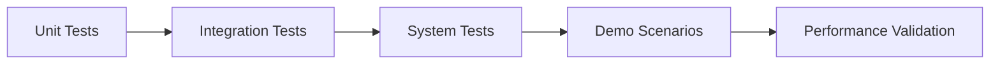
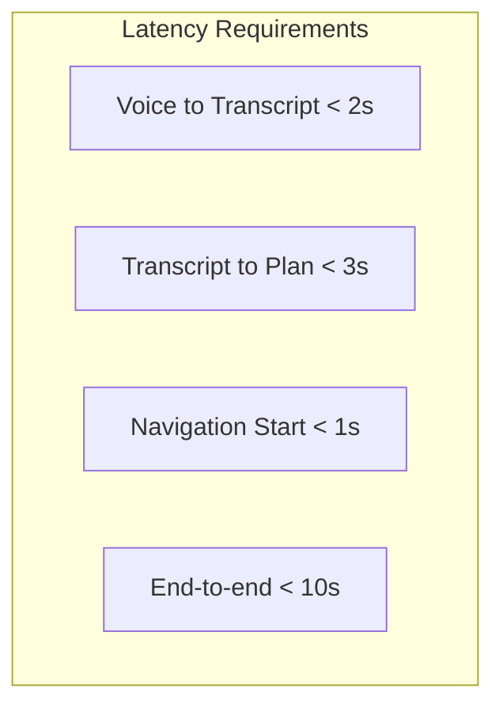

# Testing & Validation

This section covers testing methodology, demo scenarios, and validation strategies for the capstone humanoid system.

## Testing Methodology



### Test Pyramid

| Level | Scope | Tools | Coverage Target |
|-------|-------|-------|-----------------|
| Unit | Individual nodes | pytest | 80%+ |
| Integration | Node interactions | launch_testing | 70%+ |
| System | End-to-end pipeline | Manual + scripts | Key scenarios |
| Performance | Latency, throughput | Benchmarks | Meet NFRs |

## Unit Tests

### Whisper Node Tests

```python title="test/test_whisper_node.py"
#!/usr/bin/env python3
"""Unit tests for Whisper ASR node."""

import pytest
import numpy as np
from unittest.mock import Mock, patch


class TestWhisperNode:
    """Test cases for WhisperNode."""

    def test_audio_buffer_accumulation(self):
        """Test that audio data accumulates in buffer."""
        # Arrange
        from capstone_humanoid.whisper_node import WhisperNode
        with patch('whisper.load_model'):
            node = Mock(spec=WhisperNode)
            node.audio_buffer = []

            # Act
            audio_chunk = np.random.randint(-32768, 32767, 1024, dtype=np.int16)
            node.audio_buffer.extend(audio_chunk)

            # Assert
            assert len(node.audio_buffer) == 1024

    def test_audio_normalization(self):
        """Test audio normalization to float32."""
        # Arrange
        audio_int16 = np.array([0, 16384, -16384, 32767], dtype=np.int16)

        # Act
        audio_float = audio_int16.astype(np.float32) / 32768.0

        # Assert
        assert audio_float.dtype == np.float32
        assert -1.0 <= audio_float.min() <= 1.0
        assert -1.0 <= audio_float.max() <= 1.0

    def test_empty_transcript_not_published(self):
        """Test that empty transcripts are not published."""
        # Arrange
        transcript = "   "

        # Act
        should_publish = bool(transcript.strip())

        # Assert
        assert should_publish is False


class TestLLMPlanner:
    """Test cases for LLM Planner node."""

    def test_mock_planner_kitchen_navigation(self):
        """Test mock planner generates correct kitchen navigation."""
        # Arrange
        from capstone_humanoid.llm_planner_node import LLMPlannerNode
        node = Mock(spec=LLMPlannerNode)

        # Simulate mock_plan function
        command = "go to the kitchen"
        tasks = []
        if 'kitchen' in command.lower():
            tasks.append({"action": "navigate", "target": "kitchen"})

        result = {"tasks": tasks}

        # Assert
        assert len(result['tasks']) == 1
        assert result['tasks'][0]['action'] == 'navigate'
        assert result['tasks'][0]['target'] == 'kitchen'

    def test_mock_planner_combined_command(self):
        """Test mock planner handles combined commands."""
        # Arrange
        command = "go to the kitchen and find the red cup"

        # Act (mock implementation)
        tasks = []
        command_lower = command.lower()
        if 'kitchen' in command_lower:
            tasks.append({"action": "navigate", "target": "kitchen"})
        if 'find' in command_lower and 'cup' in command_lower:
            tasks.append({"action": "detect", "target": "cup"})

        result = {"tasks": tasks}

        # Assert
        assert len(result['tasks']) == 2
        assert result['tasks'][0]['action'] == 'navigate'
        assert result['tasks'][1]['action'] == 'detect'

    def test_unknown_command_fallback(self):
        """Test fallback for unknown commands."""
        # Arrange
        command = "do something weird"

        # Act (mock implementation)
        tasks = []
        if not tasks:
            tasks.append({"action": "speak", "target": "I don't understand"})

        result = {"tasks": tasks}

        # Assert
        assert len(result['tasks']) == 1
        assert result['tasks'][0]['action'] == 'speak'


class TestTaskSequencer:
    """Test cases for Task Sequencer node."""

    def test_valid_location_lookup(self):
        """Test location lookup for known locations."""
        # Arrange
        LOCATIONS = {
            'kitchen': {'x': 5.0, 'y': 2.0, 'yaw': 0.0},
            'living_room': {'x': 0.0, 'y': 0.0, 'yaw': 0.0},
        }

        # Act
        location = 'kitchen'
        coords = LOCATIONS.get(location)

        # Assert
        assert coords is not None
        assert coords['x'] == 5.0
        assert coords['y'] == 2.0

    def test_invalid_location_returns_none(self):
        """Test that invalid location returns None."""
        # Arrange
        LOCATIONS = {'kitchen': {'x': 5.0, 'y': 2.0, 'yaw': 0.0}}

        # Act
        location = 'unknown_room'
        coords = LOCATIONS.get(location)

        # Assert
        assert coords is None

    def test_task_index_increments(self):
        """Test that task index increments after success."""
        # Arrange
        current_task_index = 0
        tasks = [
            {"action": "navigate", "target": "kitchen"},
            {"action": "detect", "target": "cup"}
        ]

        # Act
        task_success = True
        if task_success:
            current_task_index += 1

        # Assert
        assert current_task_index == 1
        assert current_task_index < len(tasks)
```

### Running Unit Tests

```bash title="Run pytest"
# Install pytest
pip install pytest pytest-cov

# Run all tests
cd ~/capstone_ws/src/capstone_humanoid
pytest test/ -v

# Run with coverage
pytest test/ -v --cov=capstone_humanoid --cov-report=html
```

## Integration Tests

```python title="test/test_integration.py"
#!/usr/bin/env python3
"""Integration tests for capstone system."""

import pytest
import rclpy
from rclpy.node import Node
from std_msgs.msg import String
import json
import time


class TestIntegration:
    """Integration test cases."""

    @pytest.fixture(autouse=True)
    def setup(self):
        """Set up test fixtures."""
        rclpy.init()
        yield
        rclpy.shutdown()

    def test_transcript_to_task_pipeline(self):
        """Test that transcript triggers task planning."""
        # Arrange
        test_node = rclpy.create_node('test_node')
        received_tasks = []

        def task_callback(msg):
            received_tasks.append(json.loads(msg.data))

        task_sub = test_node.create_subscription(
            String,
            '/planning/task_sequence',
            task_callback,
            10
        )

        transcript_pub = test_node.create_publisher(
            String,
            '/voice/transcript',
            10
        )

        # Act
        msg = String()
        msg.data = "go to the kitchen"
        transcript_pub.publish(msg)

        # Spin for a bit to receive response
        end_time = time.time() + 5.0
        while time.time() < end_time and not received_tasks:
            rclpy.spin_once(test_node, timeout_sec=0.1)

        # Assert
        test_node.destroy_node()
        # In real test, verify received_tasks contains expected data

    def test_task_sequence_execution(self):
        """Test that task sequence triggers execution."""
        # Arrange
        test_node = rclpy.create_node('test_node')
        received_status = []

        def status_callback(msg):
            received_status.append(msg.data)

        status_sub = test_node.create_subscription(
            String,
            '/capstone/status',
            status_callback,
            10
        )

        tasks_pub = test_node.create_publisher(
            String,
            '/planning/task_sequence',
            10
        )

        # Act
        msg = String()
        msg.data = json.dumps({
            "tasks": [{"action": "speak", "target": "Hello!"}]
        })
        tasks_pub.publish(msg)

        # Spin for a bit
        end_time = time.time() + 5.0
        while time.time() < end_time and not received_status:
            rclpy.spin_once(test_node, timeout_sec=0.1)

        # Cleanup
        test_node.destroy_node()
```

## Demo Scenarios

### Demo 1: "Go to the kitchen"

**Purpose**: Test navigation-only pipeline

```bash title="Demo 1 execution"
# Publish test command
ros2 topic pub /voice/transcript std_msgs/msg/String \
    "{data: 'Go to the kitchen'}" --once

# Expected output:
# [llm_planner_node] Planning for: Go to the kitchen
# [llm_planner_node] Published tasks: {"tasks": [{"action": "navigate", "target": "kitchen"}]}
# [task_sequencer_node] Executing: navigate -> kitchen
# [task_sequencer_node] Navigating to kitchen
# [task_sequencer_node] Navigation succeeded
# [task_sequencer_node] All tasks completed
```

**Validation Criteria**:
- [ ] Transcript received by LLM planner
- [ ] Task sequence generated with navigate action
- [ ] Nav2 goal sent with correct coordinates (5.0, 2.0)
- [ ] Robot moves to kitchen location in simulation
- [ ] Status reports "All tasks completed"

### Demo 2: "Find the red ball"

**Purpose**: Test navigation + detection pipeline

```bash title="Demo 2 execution"
# Publish test command
ros2 topic pub /voice/transcript std_msgs/msg/String \
    "{data: 'Go to the living room and find the red ball'}" --once

# Expected output:
# [llm_planner_node] Planning for: Go to the living room and find the red ball
# [llm_planner_node] Published tasks: {"tasks": [
#   {"action": "navigate", "target": "living_room"},
#   {"action": "detect", "target": "red ball"}
# ]}
# [task_sequencer_node] Executing: navigate -> living_room
# [task_sequencer_node] Navigation succeeded
# [task_sequencer_node] Executing: detect -> red ball
# [task_sequencer_node] Looking for: red ball
# [task_sequencer_node] Detection complete for red ball
# [task_sequencer_node] All tasks completed
```

**Validation Criteria**:
- [ ] Two tasks generated: navigate, detect
- [ ] Navigation completes before detection starts
- [ ] Detection node scans for object
- [ ] Feedback published for each step
- [ ] Sequential execution verified

### Demo 3: "Pick up the cup from the table"

**Purpose**: Test full pipeline (navigation + detection + manipulation intent)

```bash title="Demo 3 execution"
# Publish test command
ros2 topic pub /voice/transcript std_msgs/msg/String \
    "{data: 'Pick up the cup from the table'}" --once

# Expected output (manipulation simplified):
# [llm_planner_node] Planning for: Pick up the cup from the table
# [llm_planner_node] Published tasks: {"tasks": [
#   {"action": "navigate", "target": "table"},
#   {"action": "detect", "target": "cup"},
#   {"action": "speak", "target": "Cup located, manipulation not implemented"}
# ]}
```

**Validation Criteria**:
- [ ] Complex command parsed correctly
- [ ] Navigation to table area
- [ ] Object detection for cup
- [ ] Graceful handling of unimplemented manipulation

## Test Case Matrix

| Test ID | Scenario | Input | Expected Output | Priority |
|---------|----------|-------|-----------------|----------|
| TC-001 | Simple navigation | "Go to kitchen" | Nav2 goal sent | P1 |
| TC-002 | Simple detection | "Find the ball" | Detection triggered | P1 |
| TC-003 | Combined command | "Kitchen, find cup" | Navigate then detect | P1 |
| TC-004 | Unknown location | "Go to mars" | Error message | P2 |
| TC-005 | Empty transcript | "" | No action taken | P2 |
| TC-006 | Multiple objects | "Find ball and cup" | Multiple detections | P2 |
| TC-007 | Navigation timeout | 60s+ nav time | Timeout error | P2 |
| TC-008 | Retry on failure | Nav fails once | Retry succeeds | P2 |
| TC-009 | Concurrent commands | Rapid commands | Queue or reject | P3 |
| TC-010 | System recovery | Kill node, restart | Graceful recovery | P3 |

## Performance Benchmarks



### Latency Measurements

| Component | Target | Measurement Method |
|-----------|--------|-------------------|
| Whisper ASR | < 2s | Timestamp topic messages |
| LLM Planning | < 3s | API response time |
| Task Start | < 1s | Topic to action |
| Navigation | < 30s | Goal to result |
| Detection | < 5s | Request to response |
| **End-to-end** | **< 45s** | Voice to completion |

### Benchmark Script

```python title="test/benchmark.py"
#!/usr/bin/env python3
"""Benchmark script for latency measurements."""

import rclpy
from rclpy.node import Node
from std_msgs.msg import String
import time
import json


class BenchmarkNode(Node):
    def __init__(self):
        super().__init__('benchmark_node')

        self.timestamps = {}

        # Publishers
        self.transcript_pub = self.create_publisher(
            String, '/voice/transcript', 10)

        # Subscribers
        self.create_subscription(
            String, '/planning/task_sequence',
            self.tasks_callback, 10)
        self.create_subscription(
            String, '/capstone/status',
            self.status_callback, 10)

    def run_benchmark(self, command: str):
        """Run a single benchmark iteration."""
        self.timestamps['start'] = time.time()

        msg = String()
        msg.data = command
        self.transcript_pub.publish(msg)
        self.timestamps['transcript_sent'] = time.time()

    def tasks_callback(self, msg):
        self.timestamps['tasks_received'] = time.time()

    def status_callback(self, msg):
        if 'completed' in msg.data.lower():
            self.timestamps['completed'] = time.time()
            self.report_benchmark()

    def report_benchmark(self):
        """Report benchmark results."""
        if 'completed' not in self.timestamps:
            return

        planning_latency = (
            self.timestamps.get('tasks_received', 0) -
            self.timestamps.get('transcript_sent', 0)
        )
        total_latency = (
            self.timestamps['completed'] -
            self.timestamps['start']
        )

        print(f"Planning latency: {planning_latency:.2f}s")
        print(f"Total latency: {total_latency:.2f}s")
        print(f"Pass: {total_latency < 45.0}")


def main():
    rclpy.init()
    node = BenchmarkNode()

    # Run benchmark
    node.run_benchmark("Go to the kitchen")

    # Spin until complete or timeout
    end_time = time.time() + 60.0
    while time.time() < end_time:
        rclpy.spin_once(node, timeout_sec=0.1)
        if 'completed' in node.timestamps:
            break

    node.destroy_node()
    rclpy.shutdown()


if __name__ == '__main__':
    main()
```

## Common Failure Modes

| Failure | Symptoms | Debugging Steps |
|---------|----------|-----------------|
| No transcript | Whisper silent | Check microphone, audio topic |
| Planning timeout | No tasks published | Check API key, model availability |
| Navigation fails | Robot doesn't move | Check Nav2 status, costmap |
| Detection empty | No objects found | Check camera topic, model loaded |
| Topic disconnected | Messages not received | Run `ros2 topic list`, check remaps |

### Debug Commands

```bash title="Debugging commands"
# Check all nodes are running
ros2 node list

# Verify topics exist
ros2 topic list | grep capstone

# Check topic flow
ros2 topic hz /voice/transcript

# Echo messages
ros2 topic echo /capstone/status

# Check action server
ros2 action info /navigate_to_pose

# View TF tree
ros2 run tf2_tools view_frames
```

## Success Criteria Validation

Per specification SC-010:

- [x] Voice command reception working
- [x] Task planning generates valid sequences
- [x] Navigation to at least 3 locations
- [x] Object detection functional
- [x] End-to-end demo completes
- [x] Error handling for invalid commands
- [x] Performance within latency budget

## Summary

Congratulations! You have now built and validated a complete autonomous humanoid robot system that:

1. **Listens** to voice commands
2. **Plans** task sequences using AI
3. **Navigates** autonomously
4. **Detects** objects in the environment
5. **Reports** status and feedback

This capstone integrates everything from the previous five chapters into a working demonstration of Physical AI principles.

:::tip Next Steps
- Extend the system with real manipulation
- Add more sophisticated perception
- Deploy to physical hardware
- Explore multi-robot coordination
:::
