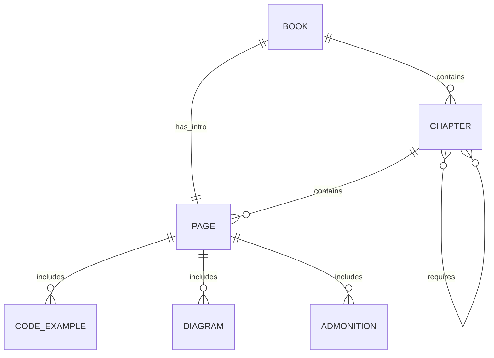

# Data Model: Physical AI & Humanoid Robotics Book

**Date**: 2025-12-17
**Feature**: 001-physical-ai-book
**Purpose**: Define content structure, entities, and relationships

---

## Content Entities

### 1. Book

The top-level container for all content.

| Attribute | Type | Description |
|-----------|------|-------------|
| title | string | "Physical AI & Humanoid Robotics" |
| tagline | string | "A simulation-first approach to embodied AI" |
| chapters | Chapter[] | Ordered list of 6 chapters |
| intro | Page | Book introduction page |

### 2. Chapter

A major section containing related pages.

| Attribute | Type | Description |
|-----------|------|-------------|
| id | string | Unique identifier (e.g., "chapter-1-introduction") |
| number | integer | Chapter order (1-6) |
| title | string | Chapter display title |
| label | string | Sidebar label |
| position | integer | Sidebar position |
| description | string | Brief chapter description |
| pages | Page[] | Ordered list of content pages |
| prerequisites | string[] | Required prior chapters |

### 3. Page

A single content unit within a chapter.

| Attribute | Type | Description |
|-----------|------|-------------|
| id | string | Unique slug (e.g., "what-is-physical-ai") |
| title | string | Page title (frontmatter) |
| description | string | SEO description |
| sidebar_position | integer | Order within chapter |
| content | ContentBlock[] | Page content sections |
| code_examples | CodeExample[] | Code snippets with metadata |

### 4. CodeExample

Runnable code demonstrating a concept.

| Attribute | Type | Description |
|-----------|------|-------------|
| language | string | Code language (python, yaml, bash, xml) |
| title | string | Example title/description |
| prerequisites | string[] | Required packages/setup |
| code | string | The actual code |
| expected_output | string | What running the code produces |
| troubleshooting | string[] | Common issues and fixes |

### 5. Diagram

Visual representation using Mermaid or ASCII.

| Attribute | Type | Description |
|-----------|------|-------------|
| type | enum | flowchart, sequence, architecture, ascii |
| title | string | Diagram caption |
| content | string | Mermaid code or ASCII art |
| description | string | Text description for accessibility |

### 6. Admonition

Callout block for important information.

| Attribute | Type | Description |
|-----------|------|-------------|
| type | enum | tip, warning, note, info, danger |
| title | string | Optional custom title |
| content | string | Admonition content |

---

## Chapter Structure

### Chapter 1: Introduction to Physical AI

```yaml
id: chapter-1-introduction
number: 1
title: "Introduction to Physical AI"
label: "1. Introduction"
position: 1
prerequisites: []
pages:
  - index.md (overview)
  - what-is-physical-ai.md
  - humanoid-robots-overview.md
  - simulation-first-approach.md
```

### Chapter 2: The Robotic Nervous System (ROS 2)

```yaml
id: chapter-2-ros2
number: 2
title: "The Robotic Nervous System (ROS 2)"
label: "2. ROS 2"
position: 2
prerequisites: [chapter-1]
pages:
  - index.md (overview)
  - ros2-fundamentals.md
  - nodes-topics-services.md
  - actions-and-rclpy.md
  - urdf-humanoids.md
```

### Chapter 3: Digital Twin Simulation

```yaml
id: chapter-3-simulation
number: 3
title: "Digital Twin Simulation (Gazebo & Unity)"
label: "3. Simulation"
position: 3
prerequisites: [chapter-2]
pages:
  - index.md (overview)
  - gazebo-physics.md
  - unity-simulation.md
  - sensor-simulation.md
```

### Chapter 4: The AI-Robot Brain (NVIDIA Isaac)

```yaml
id: chapter-4-isaac
number: 4
title: "The AI-Robot Brain (NVIDIA Isaac)"
label: "4. NVIDIA Isaac"
position: 4
prerequisites: [chapter-3]
pages:
  - index.md (overview)
  - isaac-sim-intro.md
  - synthetic-data.md
  - isaac-ros.md
  - nav2-bipedal.md
```

### Chapter 5: Vision-Language-Action Systems

```yaml
id: chapter-5-vla
number: 5
title: "Vision-Language-Action (VLA) Systems"
label: "5. VLA Systems"
position: 5
prerequisites: [chapter-2]
pages:
  - index.md (overview)
  - voice-to-action.md
  - llm-cognitive-planning.md
  - nlp-to-ros2.md
```

### Chapter 6: Capstone Project

```yaml
id: chapter-6-capstone
number: 6
title: "Capstone Project – The Autonomous Humanoid"
label: "6. Capstone"
position: 6
prerequisites: [chapter-1, chapter-2, chapter-3, chapter-4, chapter-5]
pages:
  - index.md (overview)
  - system-architecture.md
  - implementation.md
  - testing-validation.md
```

---

## File Naming Conventions

### Directories
- Pattern: `chapter-{number}-{slug}/`
- Example: `chapter-1-introduction/`, `chapter-2-ros2/`

### Category Files
- Pattern: `_category_.json`
- Content: `{"label": "...", "position": N, "link": {"type": "generated-index"}}`

### Content Files
- Pattern: `{slug}.md`
- Frontmatter required: `sidebar_position`, `title`, `description`

### Code Examples
- Inline in markdown with language identifier
- Filename referenced if external: `examples/{chapter}/{example}.py`

---

## Relationships



---

## Validation Rules

### Chapter Validation
- Must have unique id and number
- Position must match number
- Prerequisites must reference existing chapters
- Must contain at least index.md page

### Page Validation
- Must have frontmatter with title, description, sidebar_position
- sidebar_position must be unique within chapter
- Code examples must have language identifier
- Internal links must resolve to existing pages

### Code Example Validation
- Must specify language
- Must include expected output or behavior
- Prerequisites must list required packages
- Python code must be PEP 8 compliant

### Build Validation
- `npm run build` must succeed without errors
- All internal links must resolve
- No broken images or resources
