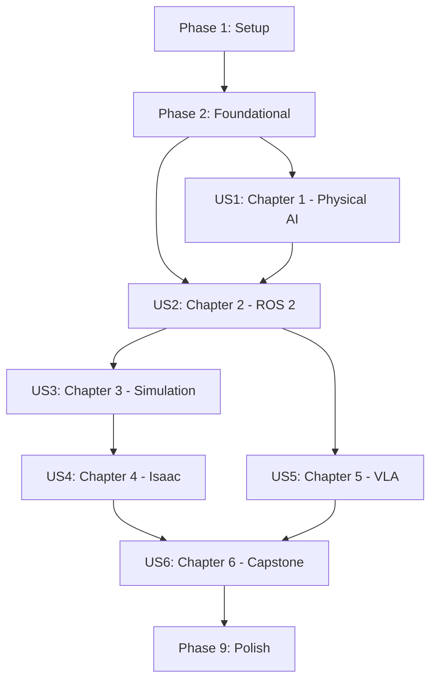

# Tasks: Physical AI & Humanoid Robotics Book

**Input**: Design documents from `/specs/001-physical-ai-book/`
**Prerequisites**: plan.md (required), spec.md (required), research.md, data-model.md, contracts/

**Tests**: Not requested - this is a documentation/content project. Validation is through Docusaurus build.

**Organization**: Tasks are grouped by user story (each chapter maps to a user story) to enable independent implementation and testing.

## Format: `[ID] [P?] [Story] Description`

- **[P]**: Can run in parallel (different files, no dependencies)
- **[Story]**: Which user story this task belongs to (US1=Ch1, US2=Ch2, etc.)
- Include exact file paths in descriptions

## Path Conventions

- **Docusaurus site**: `my-book/` at repository root
- **Content**: `my-book/docs/` for all chapter content
- **Config**: `my-book/docusaurus.config.ts`, `my-book/sidebars.ts`

---

## Phase 1: Setup (Docusaurus Configuration)

**Purpose**: Configure Docusaurus for the book and establish chapter structure

- [X] T001 Update site title and tagline in my-book/docusaurus.config.ts
- [X] T002 [P] Configure Mermaid diagram support in my-book/docusaurus.config.ts
- [X] T003 [P] Update navbar with chapter navigation in my-book/docusaurus.config.ts
- [X] T004 [P] Update footer with book information in my-book/docusaurus.config.ts
- [X] T005 Configure sidebar for auto-generated chapter navigation in my-book/sidebars.ts
- [X] T006 [P] Update homepage title and features in my-book/src/pages/index.tsx
- [X] T007 [P] Update HomepageFeatures component for book chapters in my-book/src/components/HomepageFeatures/index.tsx
- [X] T008 Create book introduction page in my-book/docs/intro.md
- [X] T009 Remove default tutorial content from my-book/docs/

**Checkpoint**: Docusaurus configured - book shell ready for chapter content

---

## Phase 2: Foundational (Chapter Directory Structure)

**Purpose**: Create all chapter directories and category files - MUST complete before chapter content

**⚠️ CRITICAL**: All chapter directories must exist before content creation

- [X] T010 Create chapter-1-introduction directory at my-book/docs/chapter-1-introduction/
- [X] T011 [P] Create _category_.json for Chapter 1 in my-book/docs/chapter-1-introduction/_category_.json
- [X] T012 [P] Create chapter-2-ros2 directory at my-book/docs/chapter-2-ros2/
- [X] T013 [P] Create _category_.json for Chapter 2 in my-book/docs/chapter-2-ros2/_category_.json
- [X] T014 [P] Create chapter-3-simulation directory at my-book/docs/chapter-3-simulation/
- [X] T015 [P] Create _category_.json for Chapter 3 in my-book/docs/chapter-3-simulation/_category_.json
- [X] T016 [P] Create chapter-4-isaac directory at my-book/docs/chapter-4-isaac/
- [X] T017 [P] Create _category_.json for Chapter 4 in my-book/docs/chapter-4-isaac/_category_.json
- [X] T018 [P] Create chapter-5-vla directory at my-book/docs/chapter-5-vla/
- [X] T019 [P] Create _category_.json for Chapter 5 in my-book/docs/chapter-5-vla/_category_.json
- [X] T020 [P] Create chapter-6-capstone directory at my-book/docs/chapter-6-capstone/
- [X] T021 [P] Create _category_.json for Chapter 6 in my-book/docs/chapter-6-capstone/_category_.json
- [X] T022 Verify Docusaurus build succeeds with empty chapter structure

**Checkpoint**: All chapter directories created - content authoring can begin

---

## Phase 3: User Story 1 - Learn Physical AI Foundations (Priority: P1) 🎯 MVP

**Goal**: Reader can explain Physical AI, embodied intelligence, and simulation-first approach

**Independent Test**: Build succeeds, Chapter 1 renders correctly, no broken links, 2+ Mermaid diagrams present

### Implementation for User Story 1 (Chapter 1)

- [X] T023 [US1] Create chapter overview in my-book/docs/chapter-1-introduction/index.md
- [X] T024 [P] [US1] Write Physical AI definition page in my-book/docs/chapter-1-introduction/what-is-physical-ai.md
- [X] T025 [P] [US1] Write humanoid robots overview in my-book/docs/chapter-1-introduction/humanoid-robots-overview.md
- [X] T026 [P] [US1] Write simulation-first approach page in my-book/docs/chapter-1-introduction/simulation-first-approach.md
- [X] T027 [US1] Add Mermaid diagram for Physical AI system components in what-is-physical-ai.md
- [X] T028 [US1] Add Mermaid flowchart for simulation-first cycle in simulation-first-approach.md
- [X] T029 [US1] Add comparison table for humanoid platforms in humanoid-robots-overview.md
- [X] T030 [US1] Add internal links to Chapter 2 from Chapter 1 pages
- [X] T031 [US1] Verify Chapter 1 build succeeds with no broken links

**Checkpoint**: Chapter 1 complete - readers can understand Physical AI foundations

---

## Phase 4: User Story 2 - Develop ROS 2 Robot Control Skills (Priority: P1)

**Goal**: Reader can create ROS 2 nodes, topics, services, actions, and define URDF for humanoid robot

**Independent Test**: Build succeeds, 8+ code examples render with syntax highlighting, URDF examples valid

### Implementation for User Story 2 (Chapter 2)

- [X] T032 [US2] Create chapter overview in my-book/docs/chapter-2-ros2/index.md
- [X] T033 [P] [US2] Write ROS 2 fundamentals page in my-book/docs/chapter-2-ros2/ros2-fundamentals.md
- [X] T034 [P] [US2] Write nodes/topics/services page in my-book/docs/chapter-2-ros2/nodes-topics-services.md
- [X] T035 [P] [US2] Write actions and rclpy page in my-book/docs/chapter-2-ros2/actions-and-rclpy.md
- [X] T036 [P] [US2] Write URDF humanoids page in my-book/docs/chapter-2-ros2/urdf-humanoids.md
- [X] T037 [US2] Add rclpy publisher code example in nodes-topics-services.md
- [X] T038 [US2] Add rclpy subscriber code example in nodes-topics-services.md
- [X] T039 [US2] Add service server/client code examples in nodes-topics-services.md
- [X] T040 [US2] Add action server code example in actions-and-rclpy.md
- [X] T041 [US2] Add action client code example in actions-and-rclpy.md
- [X] T042 [US2] Add simple humanoid URDF example in urdf-humanoids.md
- [X] T043 [US2] Add launch file example for URDF visualization in urdf-humanoids.md
- [X] T044 [US2] Add Mermaid diagram for ROS 2 architecture in ros2-fundamentals.md
- [X] T045 [US2] Add Mermaid diagram for pub/sub pattern in nodes-topics-services.md
- [X] T046 [US2] Add Mermaid diagram for action state machine in actions-and-rclpy.md
- [X] T047 [US2] Add prerequisites admonition at chapter start
- [X] T048 [US2] Verify Chapter 2 build succeeds with no broken links

**Checkpoint**: Chapter 2 complete - readers can build ROS 2 robot control applications

---

## Phase 5: User Story 3 - Simulate Robots in Digital Twin Environments (Priority: P2)

**Goal**: Reader can spawn robot in Gazebo, configure sensors, and integrate Unity with ROS 2

**Independent Test**: Build succeeds, 10+ code examples render, Gazebo launch files valid

### Implementation for User Story 3 (Chapter 3)

- [X] T049 [US3] Create chapter overview in my-book/docs/chapter-3-simulation/index.md
- [X] T050 [P] [US3] Write Gazebo physics page in my-book/docs/chapter-3-simulation/gazebo-physics.md
- [X] T051 [P] [US3] Write Unity simulation page in my-book/docs/chapter-3-simulation/unity-simulation.md
- [X] T052 [P] [US3] Write sensor simulation page in my-book/docs/chapter-3-simulation/sensor-simulation.md
- [X] T053 [US3] Add world SDF file example in gazebo-physics.md
- [X] T054 [US3] Add URDF spawn launch file example in gazebo-physics.md
- [X] T055 [US3] Add physics parameter tuning example in gazebo-physics.md
- [X] T056 [US3] Add ROS-TCP-Endpoint launch example in unity-simulation.md
- [X] T057 [US3] Add Unity C# subscriber example in unity-simulation.md
- [X] T058 [US3] Add Unity C# publisher example in unity-simulation.md
- [X] T059 [US3] Add LiDAR sensor plugin SDF example in sensor-simulation.md
- [X] T060 [US3] Add depth camera plugin example in sensor-simulation.md
- [X] T061 [US3] Add IMU plugin example in sensor-simulation.md
- [X] T062 [US3] Add RViz2 sensor visualization config in sensor-simulation.md
- [X] T063 [US3] Add Mermaid diagram for Gazebo-ROS 2 architecture in gazebo-physics.md
- [X] T064 [US3] Add Mermaid diagram for Unity-ROS 2 communication in unity-simulation.md
- [X] T065 [US3] Add warning admonition about Gazebo Classic deprecation
- [X] T066 [US3] Verify Chapter 3 build succeeds with no broken links

**Checkpoint**: Chapter 3 complete - readers can simulate robots in Gazebo and Unity

---

## Phase 6: User Story 4 - Implement Advanced Perception with NVIDIA Isaac (Priority: P2)

**Goal**: Reader can use Isaac Sim, generate synthetic data, configure VSLAM and Nav2 for humanoids

**Independent Test**: Build succeeds, 12+ code examples render, Gazebo fallbacks documented

### Implementation for User Story 4 (Chapter 4)

- [X] T067 [US4] Create chapter overview with GPU warning in my-book/docs/chapter-4-isaac/index.md
- [X] T068 [P] [US4] Write Isaac Sim intro page in my-book/docs/chapter-4-isaac/isaac-sim-intro.md
- [X] T069 [P] [US4] Write synthetic data page in my-book/docs/chapter-4-isaac/synthetic-data.md
- [X] T070 [P] [US4] Write Isaac ROS page in my-book/docs/chapter-4-isaac/isaac-ros.md
- [X] T071 [P] [US4] Write Nav2 bipedal page in my-book/docs/chapter-4-isaac/nav2-bipedal.md
- [X] T072 [US4] Add Isaac Sim launch and scripting examples in isaac-sim-intro.md
- [X] T073 [US4] Add URDF to USD conversion example in isaac-sim-intro.md
- [X] T074 [US4] Add Replicator randomization script in synthetic-data.md
- [X] T075 [US4] Add dataset export configuration in synthetic-data.md
- [X] T076 [US4] Add Isaac ROS Docker setup in isaac-ros.md
- [X] T077 [US4] Add cuVSLAM launch configuration in isaac-ros.md
- [X] T078 [US4] Add Nav2 humanoid parameters YAML in nav2-bipedal.md
- [X] T079 [US4] Add costmap configuration for humanoids in nav2-bipedal.md
- [X] T080 [US4] Add Nav2 launch file for Isaac Sim in nav2-bipedal.md
- [X] T081 [US4] Add Mermaid diagram for Isaac Sim architecture in isaac-sim-intro.md
- [X] T082 [US4] Add Mermaid diagram for synthetic data pipeline in synthetic-data.md
- [X] T083 [US4] Add Mermaid diagram for Isaac ROS stack in isaac-ros.md
- [X] T084 [US4] Add Mermaid diagram for Nav2 architecture in nav2-bipedal.md
- [X] T085 [US4] Add Gazebo fallback sections for each Isaac feature
- [X] T086 [US4] Verify Chapter 4 build succeeds with no broken links

**Checkpoint**: Chapter 4 complete - readers can use NVIDIA Isaac for advanced robotics

---

## Phase 7: User Story 5 - Build Voice-Controlled Robot Systems (Priority: P2)

**Goal**: Reader can process voice with Whisper, plan with LLMs, and execute ROS 2 actions

**Independent Test**: Build succeeds, 12+ code examples render, local model alternatives documented

### Implementation for User Story 5 (Chapter 5)

- [X] T087 [US5] Create chapter overview in my-book/docs/chapter-5-vla/index.md
- [X] T088 [P] [US5] Write voice-to-action page in my-book/docs/chapter-5-vla/voice-to-action.md
- [X] T089 [P] [US5] Write LLM cognitive planning page in my-book/docs/chapter-5-vla/llm-cognitive-planning.md
- [X] T090 [P] [US5] Write NLP to ROS 2 page in my-book/docs/chapter-5-vla/nlp-to-ros2.md
- [X] T091 [US5] Add Whisper API transcription example in voice-to-action.md
- [X] T092 [US5] Add local Whisper model example in voice-to-action.md
- [X] T093 [US5] Add PyAudio capture script in voice-to-action.md
- [X] T094 [US5] Add ROS 2 audio subscriber node in voice-to-action.md
- [X] T095 [US5] Add system prompt for robot planner in llm-cognitive-planning.md
- [X] T096 [US5] Add function calling schema in llm-cognitive-planning.md
- [X] T097 [US5] Add task decomposition example in llm-cognitive-planning.md
- [X] T098 [US5] Add safety validation code in llm-cognitive-planning.md
- [X] T099 [US5] Add action mapping dictionary in nlp-to-ros2.md
- [X] T100 [US5] Add ROS 2 action client for navigation in nlp-to-ros2.md
- [X] T101 [US5] Add multi-action sequencer node in nlp-to-ros2.md
- [X] T102 [US5] Add complete voice-to-navigation pipeline in nlp-to-ros2.md
- [X] T103 [US5] Add Mermaid diagram for voice-to-text pipeline in voice-to-action.md
- [X] T104 [US5] Add Mermaid diagram for LLM planning architecture in llm-cognitive-planning.md
- [X] T105 [US5] Add Mermaid diagram for NLP to ROS 2 flow in nlp-to-ros2.md
- [X] T106 [US5] Add warning admonition about LLM safety
- [X] T107 [US5] Add local model alternatives (Llama, Mistral, Vosk)
- [X] T108 [US5] Verify Chapter 5 build succeeds with no broken links

**Checkpoint**: Chapter 5 complete - readers can build voice-controlled robot systems

---

## Phase 8: User Story 6 - Integrate Complete Autonomous Humanoid System (Priority: P3)

**Goal**: Reader can run end-to-end humanoid: voice → plan → navigate → detect → manipulate

**Independent Test**: Build succeeds, system architecture diagram complete, 3 demo scenarios documented

### Implementation for User Story 6 (Chapter 6 - Capstone)

- [X] T109 [US6] Create chapter overview in my-book/docs/chapter-6-capstone/index.md
- [X] T110 [P] [US6] Write system architecture page in my-book/docs/chapter-6-capstone/system-architecture.md
- [X] T111 [P] [US6] Write implementation page in my-book/docs/chapter-6-capstone/implementation.md
- [X] T112 [P] [US6] Write testing and validation page in my-book/docs/chapter-6-capstone/testing-validation.md
- [X] T113 [US6] Add complete system architecture Mermaid diagram in system-architecture.md
- [X] T114 [US6] Add data flow Mermaid diagram in system-architecture.md
- [X] T115 [US6] Add state machine Mermaid diagram in system-architecture.md
- [X] T116 [US6] Add node communication ASCII diagram in system-architecture.md
- [X] T117 [US6] Add main launch file example in implementation.md
- [X] T118 [US6] Add configuration YAML files in implementation.md
- [X] T119 [US6] Add integration test script in implementation.md
- [X] T120 [US6] Add demo scenario 1: "Go to the kitchen" in testing-validation.md
- [X] T121 [US6] Add demo scenario 2: "Find the red ball" in testing-validation.md
- [X] T122 [US6] Add demo scenario 3: "Pick up the cup" in testing-validation.md
- [X] T123 [US6] Add pytest test cases in testing-validation.md
- [X] T124 [US6] Add test case matrix table in testing-validation.md
- [X] T125 [US6] Add component integration table referencing all chapters
- [X] T126 [US6] Add prerequisites admonition linking all previous chapters
- [X] T127 [US6] Verify Chapter 6 build succeeds with no broken links

**Checkpoint**: Chapter 6 complete - capstone integrates all previous chapters

---

## Phase 9: Polish & Cross-Cutting Concerns

**Purpose**: Final validation and improvements across all chapters

- [X] T128 Run full Docusaurus build to verify no errors
- [X] T129 [P] Validate all internal links between chapters
- [X] T130 [P] Verify all code examples have language identifiers
- [X] T131 [P] Verify all Mermaid diagrams render correctly
- [X] T132 [P] Check all admonitions use correct Docusaurus syntax
- [X] T133 Verify sidebar navigation shows chapters in correct order (1-6)
- [X] T134 Test homepage renders with chapter feature cards
- [X] T135 Verify progressive complexity is maintained across chapters
- [X] T136 Final review of technical accuracy per constitution
- [X] T137 Run production build and verify page load performance

**Checkpoint**: Book complete and validated - ready for deployment

---

## Dependencies & Execution Order

### Phase Dependencies

- **Setup (Phase 1)**: No dependencies - start immediately
- **Foundational (Phase 2)**: Depends on Setup - BLOCKS all chapter content
- **US1/Chapter 1 (Phase 3)**: Depends on Foundational - MVP entry point
- **US2/Chapter 2 (Phase 4)**: Depends on Foundational, links to US1
- **US3/Chapter 3 (Phase 5)**: Depends on US2 (ROS 2 knowledge required)
- **US4/Chapter 4 (Phase 6)**: Depends on US3 (simulation knowledge required)
- **US5/Chapter 5 (Phase 7)**: Depends on US2 (ROS 2 required), parallel with US3/US4
- **US6/Chapter 6 (Phase 8)**: Depends on ALL previous chapters (US1-US5)
- **Polish (Phase 9)**: Depends on all chapters complete

### User Story Dependencies



### Parallel Opportunities

- **Phase 1**: T002, T003, T004, T006, T007 can run in parallel
- **Phase 2**: All _category_.json files (T011-T021) can run in parallel after directories created
- **Phase 3-8**: Within each chapter, content pages can be written in parallel
- **Chapter parallelism**: US3 and US5 can be written in parallel (both depend only on US2)

---

## Parallel Example: Chapter 2 Content

```bash
# After T032 (index.md) is complete, launch all content pages in parallel:
Task: "[US2] Write ROS 2 fundamentals page in my-book/docs/chapter-2-ros2/ros2-fundamentals.md"
Task: "[US2] Write nodes/topics/services page in my-book/docs/chapter-2-ros2/nodes-topics-services.md"
Task: "[US2] Write actions and rclpy page in my-book/docs/chapter-2-ros2/actions-and-rclpy.md"
Task: "[US2] Write URDF humanoids page in my-book/docs/chapter-2-ros2/urdf-humanoids.md"
```

---

## Implementation Strategy

### MVP First (Chapter 1 Only)

1. Complete Phase 1: Setup
2. Complete Phase 2: Foundational
3. Complete Phase 3: User Story 1 (Chapter 1)
4. **STOP and VALIDATE**: Build succeeds, Chapter 1 reads well
5. Deploy preview if ready

### Incremental Delivery

1. Setup + Foundational → Book shell ready
2. Add Chapter 1 → Conceptual foundation (MVP!)
3. Add Chapter 2 → ROS 2 skills
4. Add Chapter 3 → Simulation skills
5. Add Chapter 4 → Isaac skills (parallel with Ch5)
6. Add Chapter 5 → VLA skills
7. Add Chapter 6 → Complete integration
8. Polish → Production ready

### Recommended Reading Order (Matches User Stories)

| Priority | Chapter | User Story | Can Start After |
|----------|---------|------------|-----------------|
| P1 | Chapter 1 | US1: Physical AI Foundations | Foundational |
| P1 | Chapter 2 | US2: ROS 2 Skills | Chapter 1 |
| P2 | Chapter 3 | US3: Simulation | Chapter 2 |
| P2 | Chapter 4 | US4: NVIDIA Isaac | Chapter 3 |
| P2 | Chapter 5 | US5: VLA Systems | Chapter 2 |
| P3 | Chapter 6 | US6: Capstone | All Chapters |

---

## Summary

| Metric | Count |
|--------|-------|
| **Total Tasks** | 137 |
| **Phase 1 (Setup)** | 9 tasks |
| **Phase 2 (Foundational)** | 13 tasks |
| **US1/Chapter 1** | 9 tasks |
| **US2/Chapter 2** | 17 tasks |
| **US3/Chapter 3** | 18 tasks |
| **US4/Chapter 4** | 20 tasks |
| **US5/Chapter 5** | 22 tasks |
| **US6/Chapter 6** | 19 tasks |
| **Phase 9 (Polish)** | 10 tasks |
| **Parallel Opportunities** | 60+ tasks marked [P] |

---

## Notes

- [P] tasks = different files, no dependencies on incomplete tasks
- [Story] label maps task to specific chapter/user story
- Each chapter is independently completable and testable via Docusaurus build
- Verify build after each chapter completion
- Commit after each task or logical group
- Stop at any checkpoint to validate chapter independently
- Constitution principles must be followed for all content
